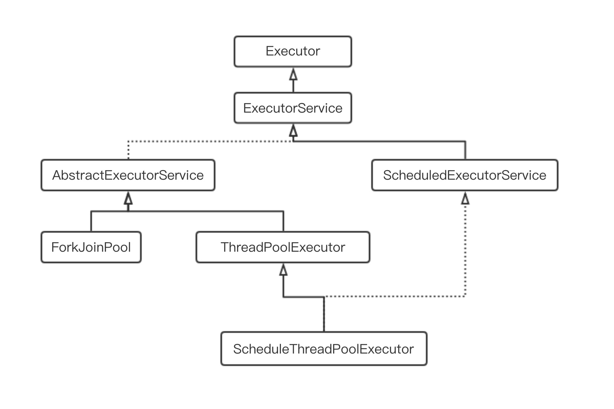

## 线程池

### 一、线程池的好处

#### 1、线程自身问题

* **资源的浪费：**线程创建会开辟虚拟机栈、本地方法栈和程序计数器等线程私有的内存空间，线程执行结束系统会回收这些资源，频繁的创建销毁线程、会带来资源的浪费。过多的线程可能会带来频繁的上下文切换和等待。

* **不可控：**随着系统负载过高时，让新的线程等待或者友好的拒绝服务会防止系统的奔溃。

#### 2、线程池的作用

* 管理并复用线程，控制最大并发
* 实现任务线程队列缓存策略和拒绝机制
* 实现某些与时间相关的功能，如定期执行、周期执行
* 隔离线程环境。例如：部署在同一台服务器上的两个服务，一个系统资源需求大，一个需求小，则可以通过配置两个不同的线程池，减小两个服务之间的影响。

### 二、线程池的创建方式

#### 1、ThreadPoolExecutor

ThreadPoolExecutor的构造方法：
```java
public ThreadPoolExecutor(int corePoolSize, // 核心线程数
                          int maximumPoolSize, // 最大线程数
                          long keepAliveTime, // 线程空闲时间
                          TimeUnit unit, // 线程空闲时间单位
                          BlockingQueue<Runnable> workQueue, // 任务缓存队列
                          ThreadFactory threadFactory, // 线程工厂方法
                          RejectedExecutionHandler handler) { // 任务拒绝策略
    // 线程池maximumPoolSize最小为1，且必须大于等于corePoolSize
    if (corePoolSize < 0 ||
        maximumPoolSize <= 0 ||
        maximumPoolSize < corePoolSize ||
        keepAliveTime < 0)
        throw new IllegalArgumentException();
    if (workQueue == null || threadFactory == null || handler == null)
        throw new NullPointerException();
    this.corePoolSize = corePoolSize;
    this.maximumPoolSize = maximumPoolSize;
    this.workQueue = workQueue;
    this.keepAliveTime = unit.toNanos(keepAliveTime);
    this.threadFactory = threadFactory;
    this.handler = handler;
}
```

**核心线程数：**表示当线程空闲时，不会被关闭的线程数。
> 可以通过allowCoreThreadTimeOut(true)方式是使核心线程空闲时也会被关闭

**线程池的大小：**表示当前线程池最大创建的线程数量。

**线程空闲时间：**控制非核心线程销毁的时间。

**线程空闲时间单位：**通常为TimeUnit.SECONDS。

**任务缓存队列：**当任务到达时，当前线程数大于或等于核心线程数且没有空闲的线程，任务会进入缓存对列中。

**线程工厂方法：**线程池创建线程的工厂方法，可以设置创建线程的名称，方便问题排查。

**拒绝策略：**当任务到达时，线程池中的线程创建已经到达最大值，且任务队列已满，则会对该任务执行拒绝策略。
> 友好的拒绝策略是：
> * 保存到数据库进行削峰填谷。在空闲的时间取出来执行。
> * 转向某个提示页面
> * 打印日志

#### 2、Executors



Executors是线程池的静态工厂方法。通过Executors工厂方法可以创建ForkJoinPool、ThreadPoolExecutor和ScheduleThreadPoolExecutor。

Executors的核心方法有五个：
* **Executors.newWorkStealingPool：**JDK8引入，创建持有足够线程的线程池支持给定的并行度，并通过使用多个队列来减少竞争，此构造方法中把CPU数量设置为默认的并行度。

```java
public static ExecutorService newWorkStealingPool() {
    return new ForkJoinPool
        (Runtime.getRuntime().availableProcessors(),
         ForkJoinPool.defaultForkJoinWorkerThreadFactory,
         null, true);
}
```
* **Executors.newCachedThreadPool：**最大线程数为Integer的最大值，存在OOM的风险。回收工作线程。

```java
public static ExecutorService newCachedThreadPool() {
    return new ThreadPoolExecutor(0, Integer.MAX_VALUE,
                                  60L, TimeUnit.SECONDS,
                                  new SynchronousQueue<Runnable>());
}
```

* **Executors.newScheduledThreadPool：**最大线程数为Integer的最大值，存在OOM的风险。支持定期和周期执行任务。不回收工作线程。

```java
// Executors类下方法
public static ScheduledExecutorService newScheduledThreadPool(int corePoolSize) {
    return new ScheduledThreadPoolExecutor(corePoolSize);
}


// ScheduledThreadPoolExecutor类的构造方法
public ScheduledThreadPoolExecutor(int corePoolSize) {
    super(corePoolSize, Integer.MAX_VALUE, 0, NANOSECONDS,
          new DelayedWorkQueue());
}
```

* **Executors.newSingleThreadExecutor：**线程池之创建一个线程来执行任务，任务队列是无界队列，串行执行所有的任务，保证任务的提交顺序一次执行。

```java
public static ExecutorService newSingleThreadExecutor() {
    return new FinalizableDelegatedExecutorService
        (new ThreadPoolExecutor(1, 1,
                                0L, TimeUnit.MILLISECONDS,
                                new LinkedBlockingQueue<Runnable>()));
}
```

* **Executors.newFixedThreadPool：**输入的参数就是核心线程数，也就是最大线程数。

```java
public static ExecutorService newFixedThreadPool(int nThreads) {
    return new ThreadPoolExecutor(nThreads, nThreads,
                                  0L, TimeUnit.MILLISECONDS,
                                  new LinkedBlockingQueue<Runnable>());
}
```

> new LinkedBlockingQueue<Runnable>() 是创建一个无界队列，默认大小为Integer.MAX_VALUE，存在OOM风险

> 除了Executors.newWorkStealingPool之外的创建线程池的方式都会存在资源耗尽的风险

### 三、拒绝策略

ThreadPoolExecutor内部定义了四个内部静态类：
* **AbortPolicy**（默认）：丢弃任务，抛出RejectedExecutionException异常。
* **DiscardPolicy**：丢弃任务，但不抛出异常。（不推荐）
* **DiscardOldestPolicy**：抛弃队列中等待最长的任务，然后把当前任务加入到队列中。
* **CallerRunsPolicy**：调用任务的run()方法，绕过线程池直接执行。

### 四、ThreadPoolExecutor源码解析

#### 1、线程池的状态

在ThreadPoolExecutor的属性定义中，频繁的使用位运算来表示线程池的状态。

```java
private final AtomicInteger ctl = new AtomicInteger(ctlOf(RUNNING, 0));

// Integer有32为，左三位表示线程状态，右29位表示工作线程数
// 注：简单来说，3为二进制数可以表示0-7的8个不同的数值
private static final int COUNT_BITS = Integer.SIZE - 3;

// 000-11111111111111111111111111111，类似于子网掩码，用于位的与运算
// 得到左边3位，还是右边29位
private static final int CAPACITY   = (1 << COUNT_BITS) - 1;

// 111-00000000000000000000000000000
// 此状态表示线程池可以接受新任务
private static final int RUNNING    = -1 << COUNT_BITS;

// 000-00000000000000000000000000000
// 此状态表示线程池不能接受新任务，但可以执行队列中的任务
private static final int SHUTDOWN   =  0 << COUNT_BITS;

// 001-00000000000000000000000000000
// 此状态全面拒绝，并中断正在处理的任务
private static final int STOP       =  1 << COUNT_BITS;

// 010-00000000000000000000000000000
// 此状态表示所有任务都已经终止
private static final int TIDYING    =  2 << COUNT_BITS;

// 011-00000000000000000000000000000
// 此状态表示已经清理完毕现场
private static final int TERMINATED =  3 << COUNT_BITS;

// 与运算，比如 001-000000000000000000000000100011，表示67个工作线程
// 掩码取反:   111-000000000000000000000000000000，即得到左边三位 001，
// 表示当前状态为stop状态
private static int runStateOf(int c)     { return c & ~CAPACITY; }

// 同理掩码 000-11111111111111111111111111111，得到右边29位，表示工作线程数
private static int workerCountOf(int c)  { return c & CAPACITY; }

// 将左边3位与右边29位按或运算，合并成一个数
private static int ctlOf(int rs, int wc) { return rs | wc; }
```

线程池的状态用高3位表示，其中包括了符号位。五种状态的十进制大小排序为：RUNNING < SHUTDOWN < STOP < TIDYING < TERMINATED。这样做的好处是可以通过比大小来判断当前线程池的状态。例如：
```java
private static boolean isRunning(int c) {
    return c < SHUTDOWN;
}
```

#### 2、execute()方法

```java
public void execute(Runnable command) {
    // 返回包含线程池状态和工作线程数的Integer类型的数值
    int c = ctl.get();
    // 当工作线程数小于核心线程数时，创建新的线程并执行任务
    if (workerCountOf(c) < corePoolSize) {
        // 增加工作线程并执行任务
        if (addWorker(command, true))
            return;
        // 当创建失败，为了防止外部已经创建了新的工作线程，这边要重新获取
        c = ctl.get();
    }
    // 判断当前线程池状态是否为运行状态，然后将任务置于队列中
    if (isRunning(c) && workQueue.offer(command)) {
        int recheck = ctl.get();
        // 如果线程不是运行状态，则移出队列中的任务，并执行拒绝策略
        if (! isRunning(recheck) && remove(command))
            reject(command);
        // 如果之前线程被消费完，则创建一个线程
        else if (workerCountOf(recheck) == 0)
            addWorker(null, false);
    }
    // 核心线程和队列都已经满了，创建新的线程来执行
    else if (!addWorker(command, false))
        // 创建失败执行拒绝策略
        reject(command);
}
```

**有三处addWorker操作：**
* 当前线程池的工作线程数量小于核心线程数
* 当核心线程数已满，将任务加入队列后，如果工作线程数量为空，则进行addWorker
* 当核心线程数已满，且队列已满，进行addWorker操作

**有两处reject操作：**
* 线程池不是运行状态。
* 等待队列已满

#### 3、addWorker()方法

```java
/**
 * 
 **/
private boolean addWorker(Runnable firstTask, boolean core) {
    retry:
    for (;;) {
        int c = ctl.get();
        int rs = runStateOf(c);

        if (rs >= SHUTDOWN &&
            ! (rs == SHUTDOWN &&
               firstTask == null &&
               ! workQueue.isEmpty()))
            return false;

        for (;;) {
            int wc = workerCountOf(c);
            if (wc >= CAPACITY ||
                wc >= (core ? corePoolSize : maximumPoolSize))
                return false;
            if (compareAndIncrementWorkerCount(c))
                break retry;
            c = ctl.get();  // Re-read ctl
            if (runStateOf(c) != rs)
                continue retry;
        }
    }

    boolean workerStarted = false;
    boolean workerAdded = false;
    Worker w = null;
    try {
        w = new Worker(firstTask);
        final Thread t = w.thread;
        if (t != null) {
            final ReentrantLock mainLock = this.mainLock;
            mainLock.lock();
            try {
                int rs = runStateOf(ctl.get());

                if (rs < SHUTDOWN ||
                    (rs == SHUTDOWN && firstTask == null)) {
                    if (t.isAlive()) // precheck that t is startable
                        throw new IllegalThreadStateException();
                    workers.add(w);
                    int s = workers.size();
                    if (s > largestPoolSize)
                        largestPoolSize = s;
                    workerAdded = true;
                }
            } finally {
                mainLock.unlock();
            }
            if (workerAdded) {
                t.start();
                workerStarted = true;
            }
        }
    } finally {
        if (! workerStarted)
            addWorkerFailed(w);
    }
    return workerStarted;
}
```