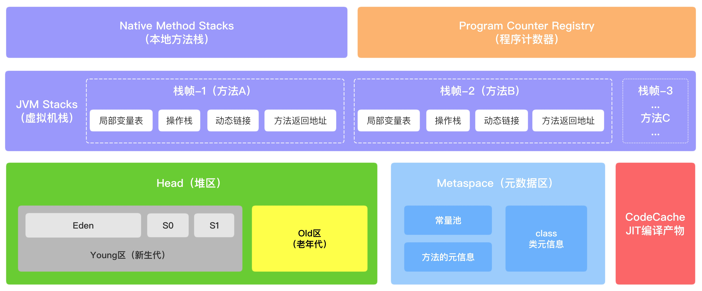
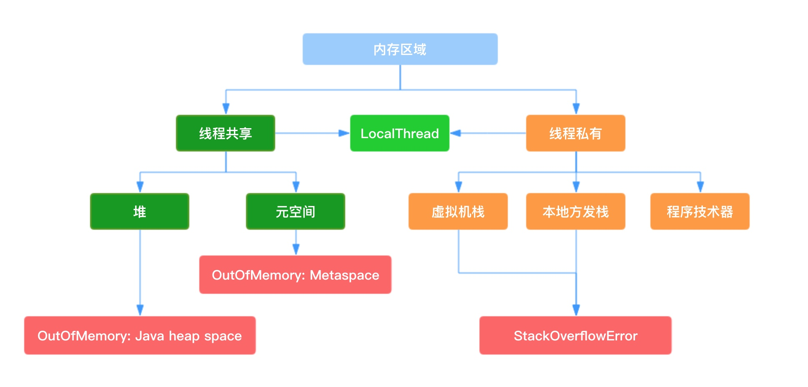
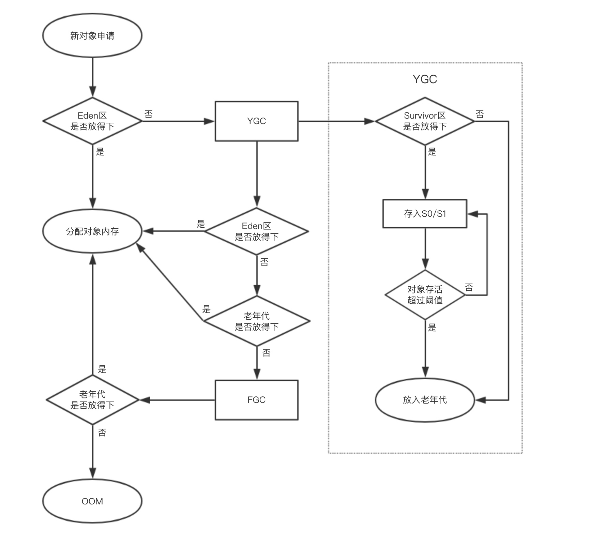

# 内存布局

**JVM运行时数据区**


**从线程私有和功效角度来看JVM运行时内存区域机构图**



### 1、Heap（堆内存）

堆区存放着所有的实例对象，由各个子线程共享使用。

通常情况下它是所有内存区域中占用空间最大的。可通过参数`-Xms:1024m` `-Xmx:1024m`设置堆区的内存初始值和最大值。`-X`代表是JVM运行时参数,`ms`表示`memory start`，mx表示`memory max`。

> 线上服务设置建议两个值设置为一样大小，防止GC之后调整堆大小时带来额外压力

堆区分为新生代和老年代两大块，对象产生时存入新生代，对象暮年时将进入老年代。新生代无法容纳的超大对象产生时，也将存入老年代。
> 可通过参数`-XX:NewRatio`设置新生代和老年代内存大小比例。值为4则代表新生代:年老代=1:4,即新生代占堆内存的1/5。

新生代包含一个Eden区和两个Survivor区。当Eden存满时，会触发YGC。将没有引用到的对象直接回收，激活一个Survivor区（每次只有一个Survivor区处于激活状态），讲存活的对象放入激活的S区内。将Eden区和另一个Survivor区内存全部清空。如果存在Survivor区无法容纳的对象直接进入老年代。
>可通过参数`-XX:SurvivorRatio`这是Eden区和Survivor内存比例。

存活的对象不是一直在Survivor区内，每个对象都会有一个计数器，每次YGC的时候都会增加1。当计数器到达指定的数时还存活，则将此对象移入老年代。默认为15，可以在Survivor区内交换14此。可以通过参数`-XX:MaxTenuringThreshold`设置大小。

当新增对象首先在Eden区分配，如果内存不够则会触发YGC。YGC后再次尝试在Eden区内分配空间，如果还是内存不够则会尝试在老年代分配空间。如果老年代内存空间不够，则会触发FGC。FGC之再次尝试在老年代分配内存，如果内存不够则报OOM。简易流程图如下：


### 2、MetaSpace（元空间）

MetaSpace在jdk1.8及之后划分的区域，他的前身是Perm区（永久代），它是线程共享的内存区域。

Perm区在启动时固定大小，很难调优。在FGC时，可能会移动类元信息。当动态加载类过多时，会抛出OOM（PermGen space）。因此需要加上启动参数`-XX:MaxPermSize=1280m`来指定永久代大小。除此之外，永久代在垃圾回收阶段也存在诸多问题。

在jdk1.8及之后采用元空间替代永久代。区别永久代，元空间是在本地内存中分配。将Perm区的字符串常量池移至堆内存中，其他内容包括类元信息、字段、静态属性、方法、常量等移至元空间。

### 3、JVM Stacks（虚拟机栈）

> 栈是一个先进后出的数据结构。

JVM是基于栈结构的运行环境。栈结构移至性更好，可控性更强。JVM中虚拟机栈是描述方法Java方法执行的内存区域，是线程私有的。栈中的元素是用来支持虚拟机进行方法的调用，每个方法从执行开始到执行结束，就是栈帧入栈和出栈的过程。每个活动的线程，只有其虚拟机栈栈顶的栈帧是有效的，称为当前栈栈，运行的方法称为当前方法。在执行引擎运行时，所有的指令只能对当前栈帧有效。栈帧是方法运行的基本结构。

当虚拟机栈内存不够用时，会报StackOverflowError。

虚拟机栈通过压栈和出栈的方式，对每个方法的活动栈进行运算处理。当方法正常运行结束会做出栈操作，跳转到另一个方法。当发生异常时，执行异常回溯，通过异常表来找到返回地址。

每个栈帧内包括：局部变量表、操作栈、动态链接、方法返回地址等

#### 1）局部变量表

局部变量表是存在方法的参数和局部变量的区域。相对于类变量的准备阶段和初始化阶段，局部变量是没有准备阶段的，所以局部变量必须显示的初始化。如果方法不是静态方法的话，在index[0]的位置存放方法所属对象的实例引用，之后存储的是方法的参数和局部变量。字节指令码STORE是将操作栈执计算完成的局部变量写会局部变量表。

> 局部变量表slot从0开始

#### 2）操作栈

操作栈是一个初始化为空的桶式机构栈。在方法的执行过程中，通过各种指令往栈中写入和去除数据。JVM是的执行引擎是栈结构的执行引擎，这里的栈指的就是方法的操作栈。字节码指令集的定义都是基于栈结构的。栈的深度定义在方法元信息中stack属性中。

下面是一段java的方法代码：
```java
public int simpleMethod() {
    int x = 13;
    int y = 14;
    int z = x + y;

    return z;
}
```

这是上面代码编译之后通过`javap`指令得到的解析
```java
 public int simpleMethod();
    descriptor: ()I
    flags: ACC_PUBLIC
    Code:
      stack=2, locals=4, args_size=1    // 栈的深度为2，局部变量表大小为4
         0: bipush        13            // 将常量13压入栈中
         2: istore_1                    // 保存到局部变量表slot_1中
         3: bipush        14            // 将常量14压入栈中
         5: istore_2                    // 保存到局部变量表slot_2中
         6: iload_1                     // 将局部变量表slot_1的值压入栈中
         7: iload_2                     // 将局部变量表slot_2的值压入栈中
         8: iadd                        // 将中元素取出，在cpu中加一下压入栈中
         9: istore_3                    // 保存到局部变量slot_3中
        10: iload_3                     // 讲slot_3中值压入栈中
        11: ireturn                     // 返回栈定元素
      LineNumberTable:
        line 18: 0
        line 19: 3
        line 20: 6
        line 22: 10
      LocalVariableTable:   // 常量表
        Start  Length  Slot  Name   Signature
            0      12     0  this   Lcom/yuesheng/practice/java/Demo; // 当前方法所属对象的实例引用
            3       9     1     x   I
            6       6     2     y   I
           10       2     3     z   I

```

> ++i 和 i++ 区别（不是原子性操作，是线程不安全的）
```java
// a=i++
0:iload_1
1:iinc 1,1
4:istore_2
// a=++i
0:iinc 1,1
3:iload_1
4:istore_2
```

#### 3）动态链接

每个栈帧都包含一个常量池对当前方法的引用，目的是支持方法调用过程中的动态链接

#### 4）方法返回地址

方法执行时有两种退出情况：第一，正常退出。就是执行到退出的字节码指令，例如：return，ireturn，areturn等。第二，异常退出。无论哪种退出，都会返回到当前方法被调用的地方。方法的退出的过程相当于当前栈出栈，退出可能有三种：
* 将返回值压入上层调用栈
* 将异常信息抛给能够处理的栈帧
* PC计数器指向方法调用的下一条指令

### 4、Native Method Stacks（本地方法栈）

本地方法栈是为Native方法服务的，也是线程私有的。针对JVM来说，虚拟机栈是“主内”，本地方法栈是“主外”。本地方法通过JNI（Java Native Interface）可以访问JVM运行是数据区。

JNI可以利用系统的特性，重复使用非java代码。当出现内存不足时，会报错native heap OutOfMemory。本地方法报错对于JVM来说是黑盒操作，不方便排错。大量的本地方法出现，会削弱JVM对系统的控制力，也会影响系统的移植能力。

如果非要用JNI方法，可以使用中间框架，这样即使本地方法崩溃也不会影响到JVM系统。如果要求极高的执行效率和偏底层的夸进程操作，也可以考虑设计JNI调用方式。

### 5、Program Counter Register（程序计数寄存器）

程序计数寄存器是源于CPU寄存器的，CPU只有将数据装载到寄存器内才能执行。CPU是通过分配之间偏来执行线程的，当确定的某一个时刻，一个处理器或者多核CPU中的一个核只能执行某个线程的一个指令。线程为了保证下次正确的执行，会在创建的时候，会产生自己的程序计数器用来存储当前执行的指令的偏移量和行号等，线程执行或恢复都是靠程序计数寄存器。此区域是线程私有的，也是唯一不会发生内存溢出的。

