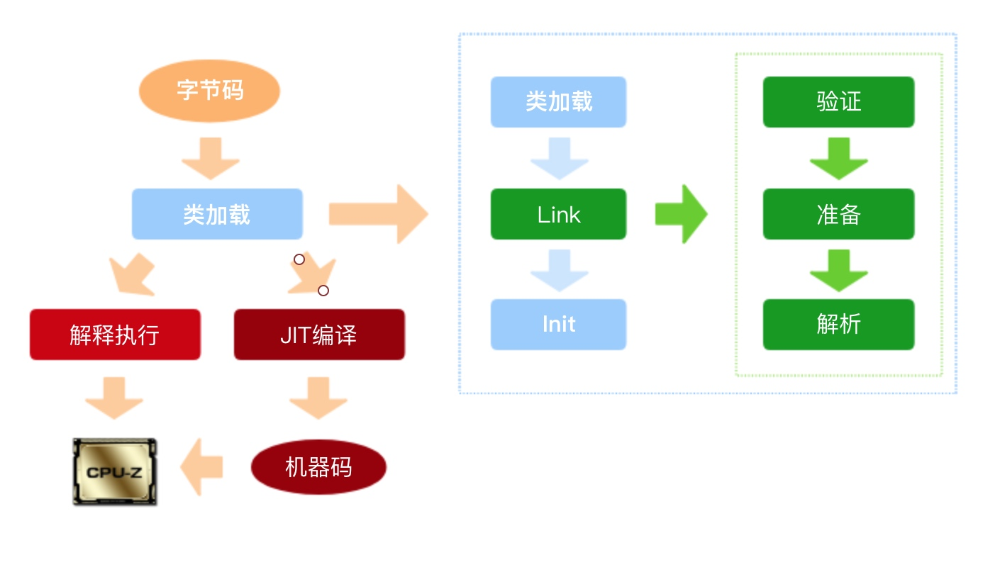
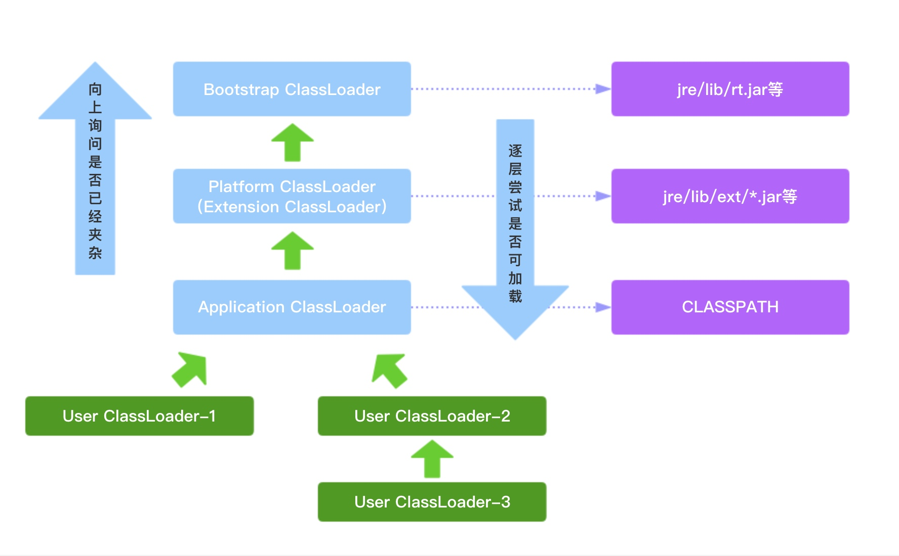

# 类的加载

在冯·诺伊曼定义的计算机模型中，任何程序都需要加载到内存中，才能和CPU交流。Java中，字节码class文件也需要加载到内存中，生成Class对象，才可以实例化对象。ClassLoader就是加载class文件的类，它是采用双亲委派加载模型加载class文件到内存。

### 一、类的加载过程

Java的类加载模型分为三个步骤，Load（加载）、Link（链接）和Init（初始化）。其中Link又分为验证、准备和解析。

* **加载：**读取类文件转化为二进制流，并转换为特殊的数据结构，初步校验cafe babe魔法字、常量池、文件长度、是否有父类等，然后创建对应的java.lang.Class实例。
* **链接：**包括验证、准备和解析三个过程，验证是更加详细的校验，比如final是否合规，类型是否正确，静态变量是否合理等；准备阶段是给静态变量设置默认值，及零值。解析类与类之间相互引用的正确性，完成内存结构布局。
* **初始化：**执行类的构造器<clinit>方法，如果赋值运算采用到其他类的静态方法来完成的，则会马上解析另一个类，在虚拟机栈中执行完毕后通过返回结果赋值。

类加载过程是对.class字节码实例化成Class对象并进行相关初始化过程。在这个过程中，JVM会初始化继承树上所有未被初始化过程的父类，执行他们的静态代码块和静态变量的赋值操作。

> new和Class.newInstance()的区别：new是强类型校验，可以调用任何构造方法，在使用new的时候，这个类可以不需要被加载。newInstance()方法是弱类型校验，只能调用无参构造函数，如果不存在，则报InstantiationException，如果次构造方法没有访问权限，则报IllegalAccessException异常。JDK9中已经把newInstance()置为过时的方法，推荐采用Class.getDeclaredConstructor().newInstance()的方式。

> 还可以通过Class的方法的方式来获取其他声明，例如注解、方法等。在修改private修饰的变量时，设置`setAccess(true)`即可修改。

### 二、双亲委派加载模型

jdk中类加载器分层级关系，最高一层加载器为Bootstrap，由JVM启动时创建，通常是操作系统本地代码实现，是最根基的类加载器，负责加载最核心的类，例如Object、System、String等；第二层在jdk9中，称为Platform ClassLoader（平台加载器），用于加载一些扩展的系统类，比如XML、加密、压缩相关的功能，JDK9之前的加载器为Extension ClassLoader；第三层为Application ClassLoader的应用类加载器，负责加载用户定义的CLASSPATH下面的类。

> 第二层和第三层是使用java定义的。

当需要加载一个类时，当前加载器会查看自己是否已经加载此类，如果没有，则向上询问父加载器是否加载此类，如果没有，则依次向上询问是否加载此类型，直到顶级加载器Bootstrap。如果都没有加载过此类，则从顶级加载器开始尝试加载此类，如果无法加载，则依次向下尝试加载，如果都不能加载，则使用当前类加载器加载此类。

> 低层次的类加载器是不能负载高层次类加载器加载的类

> Bootstrap加载的路劲是可以追加的，但是不建议修改或是删除原来加载路径。增加JVM启动参数`-Xbootclasspath/a:/Users/yuesheng/src`

> 可以增加`-XX:+TraceClassLoading`参数查看启动时加载了哪个jar包中的哪个类。在解决类冲突的时候常用。

> 安全性、统一性

### 三、自定义类加载器

#### 1、使用场景

* **隔离加载类：**在某些框架内进行中间件与应用模块隔离，把类加载到不同环境。比如，通过自定义的类加载器确保应用依赖的jar不会影响中间件依赖的jar包。
* **修改类加载方式：**类的加载模型并非强制，除了Bootstrap外，其他的加载并非一定要引入，或者根据情况，在某个时间节点按需进行动态加载。
* **扩展加载源：**比如从数据库、网络，甚至是电视机机顶盒中进行加载。
* **防止源码泄露：**为了防止Java代码泄露，进行编译加密。那么类的加载器就需要自定义，还原加密的字节码

#### 2、使用方法

继承ClassLoader类，重写findClass()方法，调用defineClass()方法。