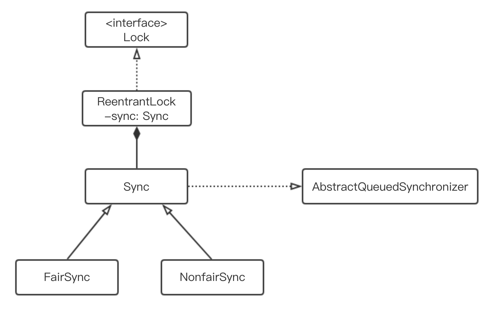

# 锁

计算机锁的发展，从一开始的悲观锁，发展到现在的乐观锁、偏向锁、分段锁等。锁主要提供了两种特性：==互斥性==和==不可见性==。

### Java中常见锁的方式

#### 锁的分类

1）乐观锁和悲观锁
**乐观锁**：认为锁并发冲突不会经常发生，当发生的时候可以有解决措施。常见的乐观锁有：CAS、数据库的version。

优点：不会产生锁，当并发冲突低时，效率高。
缺点：当并发冲突高时，需要判断的过多，效率会有影响。

> 使用场景：写少读多

**悲观锁**：认为每次操作都会产出竞争，所有操作都会加锁，包括读、写。 

优点：相对于乐观锁，在并发冲突高时，不需要做过多的判断，效率高
缺点：锁会增加开销，可能会产生死锁。降低锁的并行数量。

> 使用场景：写多读少

#### 1）用并发包中的锁类

并发包中的类族中，Lock是JUC包的顶级接口，它的实现逻辑没有使用synchronized关键字，而是利用volatile的可见性。

上图为Lock的继承关系，ReentrantLock对Lock的实现主要依赖于Sync，Sync是AbstractQueuedSynchronizer（AQS）的实现。AQS是JUC包内同步的基础工具，内部定义了一个`volatile int state`变量作为共享变量，如果线程获取资源失败了，则进入同步FIFO队列等待；如果成功获取资源就执行临界区代码，执行完成后释放资源，通知同步队列中的等待线程来获取资源后出队执行。

AQS是抽象类，内置自旋实现的同步队列，封装入队和出队的操作，提供独占、共享、中断等特性的方法。AQS的子类可以定义不同的资源实现不同性质的方法。

ReentrantLock，定义state默认值为0，只有status为0时才能获取锁，每次获取锁后，state进行加1操作，每次释放锁时，进行减一操作。

CountDownLatch，初始化时定义state=count，countDown()不断的将status减1，直到state=0时，才可以获得锁，释放后，state一直为0，调用await()方法也不会等待。CountDownLatch是一次性的，每次使用都要重新创建。

Semphore，初始化定义state=permits，当state>0时可以获得锁，并将state减1，当线程释放资源时，state减一。当state=0时，线程需要等待。当permits=1时，就相当于一个互斥锁。当permits>1时，想到与共享锁。

#### 2）使用同步代码块

同步代码块一般采用java的synchronized关键字来实现。有两种实现方式：第一，使用synchronized修饰方法；第二，使用synchronized(类或对象)。锁的使用原则是锁的范围尽量小，锁的时间尽量短。能锁对象，不锁类；能锁代码块，不锁方法。

synchronized的特性是JVM负责实现的，JVM底层是通过监视器锁来实现的。每个对象在创建的时候，都会创建一个隐藏的字段，monitor。使用synchronized时，线程会根据当前锁对象的monitor状态来进行加、解锁的判断。

方法元信息会采用ACC_SYNCHRONIZED标示该方法是一个同步的方法。同步代码块采用的字节码指令monitorenter和monitorexit来获取核释放monitor对象。当monitor为0时，通过monitorenter获取monitor对象，并对monitor进行加1，如果当前线程已经持有monitor对象，则再次进入时，monitor继续加1。释放锁时，执行monitorexit，并对monitor进行减1。

JVM对synchronized提供三种锁的实现，偏向锁、轻量级锁和重量级锁。每个对象的对象头中会维护着一个ThreadId属性，当线程需要获取对象锁时，会先去判断锁对象的ThreadId是否为空。如果为空，说明该对象没有被其他线程持有，然后当前线程尝试进行讲锁对象的ThreadId改为自己的id，如果修改成功，则获取该对象锁。此时对象锁为偏向锁，即当前线程如果再次获取该对象锁，会先判断ThreadId是否和自己id相等，如果相等，则不会再重复获取锁，从而提高的程序的运行效率。当另一个线程尝试去获取对象锁是，如果ThreadId不为空且和自己不同，则会将该对象的偏向锁升级为轻量级锁，如果竞争激烈，则轻量级锁会升级成重量级锁。

> 偏向锁可以降低无竞争开销，它不是互斥锁，不存在线程竞争的情况，省去再次同步判断的操作，提升了性能。

