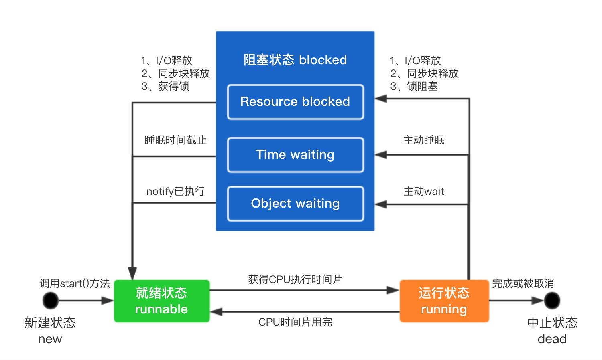

# 线程安全

### 一、线程
线程是CPU调度和分派的基本单位，为了更充分的利用CPU资源，一般采用多线程进行处理。多线程可以提高任务平均执行速度，但也会增加程序的理解难度，编程更加复杂。

线程可以拥有自己的操作栈，程序计数器，局部变量表等资源，他与同一进程内其他线程共享该进程的所有资源。

线程在其生命周期内，存在多种状态。有new（新建状态）、runnable（就绪状态）、running（运行状态）、blocked（阻塞状态）、dead（中止状态）。


#### 1）new（新建状态）

线程被创建且未启动的状态。

线程创建方式有三种：第一种，继承Thread类；第二种，实现Runnable接口；第三种，实现Callable接口。

Callable和Runnable有两个不同点。第一，Callable可以有通过call()获取返回值，Runnable没有返回值。前两种创建方式想要获取线程执行结果，只能借助共享变量来获取，而Callable和Future则可以很好的解决这个问题。第二，call()可以抛出异常，Runnable主线程如果想捕获子线程的异常，则要通过`setDefaultUncaughtExceptionHandler()`来捕获子线程异常。
```java
// 主线程不过子线程异常
Thread thread = new Thread();
thread.setUncaughtExceptionHandler(new UncaughtExceptionHandler() {
    @Override
    public void uncaughtException(Thread t, Throwable e) {
        System.out.println("捕获异常" + t.getName());
    }
});
thread.start();

// 使用Callable+Future
FutureTask task = new FutureTask(new Callable() {
    @Override
    public Object call() throws Exception {
        throw new RuntimeException();
    }
});
try {
    new Thread(task).start();
    task.get(); // 不调用get()方法阻塞，异常不会捕获
} catch (Exception e) {
    System.out.println("捕获异常");
}
```

#### 2）runnable（就绪状态）

是调用start()之后，运行之前的状态。线程的start()方法不能被多次调用，否则会报异常IllegalStateException。

#### 3）running（运行状态）

是run()方法正在执行的线程状态。线程可能会因为某些原因退出running状态，如时间、异常、锁、调度等。

#### 4）blocked（阻塞状态）

有以下情况会出现此状态：
* 同步阻塞：锁被其他线程占用。
* 主动阻塞：调用Thread某些方法，使得当前线程主动让出CPU的执行权，比如sleep()、join()等。
* 等待阻塞：执行了wait()

#### 5）dead（中止状态）

run()方法执行结束，或者因异常退出状态。此状态不可逆。

### 二、线程安全

由于线程轮流使用CPU的计算能力，所以会出现一个线程在没有完成操作的时候被中断，容易引起线程不安全。为了保证线程安全，在多线程并发的竞争共享资源时，通常采用同步机制去协调各个线程的执行，以确保得到正确的结果。

#### 1、线程安全的考虑维度

线程安全只有在多线程的环境下才有可能发生，单线程是不存在线程安全问题的。保证高并发场景下线程安全问题，可以通过以下四个维度去考虑：

##### 1）数据单线程内可见

单线程总是安全的，通过限制数据旨在线程内可见，可以避免数据被其他线程篡改。最典型的就是线程内的局部变量，他存在虚拟机栈帧的局部变量表中，其他线程是无法访问的。ThreadLocal就是使用这种方式来实现线程安全的。

##### 2）只读对象

只读对象总是线程安全的，他的特性是允许复制、拒绝写入。最典型的只读对象是String、Integer等。符合只读对象的条件是：通过final修饰类，避免被继承。通过private final修饰属性，不提供任何更新方法，方法返回只读对象。

##### 3）线程安全类

某些线程安全类是内部有非常明确的线程安全机制，使用起来也是线程安全的。例如StringBuffer，内部使用了synchronized机制进行同步，保证线程安全。

##### 4）使用同步和锁机制

如果想要对某个对象进行并发更新操作，但又不属于上面三类，则需要自己实现线程安全机制，可以通过同步或者锁的机制实现。

#### 2、解决线程安全的类族

解决线程安全的核心概念就是”要么只读，要么加锁“。合理的使用JDK提供的并发包（J.U.C）可以更简单的编写线程安全代码。并发包主要分为下面几个类族：

##### 1）线程同步类

这些类是线程间的协调更加容易，支持更丰富的线程协调场景，逐步淘汰使用Object的wait()和notify()的同步方式。主要有：CountDownLatch、Semaphore、CyclicBarrier等。

##### 2）并发集合类

集合的并发操作要求执行速度快，查询数据准。典型的有ConcurrentHashMap，他不断的优化，从一开始的分段锁，到现在的CAS，不断的提升性能。其他还有ConcurrentSkipListMap、CopyOnWriteArrayList、BlockingQueue等。

##### 3）线程管理类

根据不同的场景，提供了很多创建线程池的快捷方式。可以通过Executors静态工厂或者ThreadPoolExecutor等。另外，可以通过ScheduledExecutorService来执行定时任务。

##### 4）锁相关的类

锁以Lock为核心，派生出一些实际场景中进行互斥操作的锁的相关类，例如ReentrantLock。