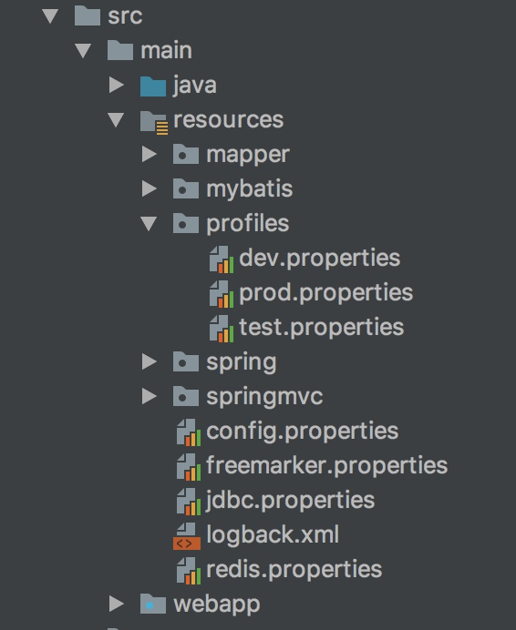

# 打不同环境的包

目录结构为下图


pom文件
```xml
<profiles>
    <profile>
        <id>dev</id>
        <properties>
            <env>dev</env>
        </properties>
        <activation>
            <activeByDefault>true</activeByDefault>
        </activation>
    </profile>
    <profile>
        <id>test</id>
        <properties>
            <env>test</env>
        </properties>
    </profile>
    <profile>
        <id>prod</id>
        <properties>
            <env>prod</env>
        </properties>
    </profile>
</profiles>

<build>
    <filters>
        <filter>src/main/resources/profiles/${env}.properties</filter>
    </filters>
    <resources>
        <resource>
            <directory>src/main/resources</directory>
            <filtering>true</filtering>
            <excludes>
                <exclude>profiles/*</exclude>
            </excludes>
        </resource>
        ...
    </resources>
</build>
```
打包时将profiles配置文件排除在外，使用命令`mvn clean package -Pprod`就可以打部署包了