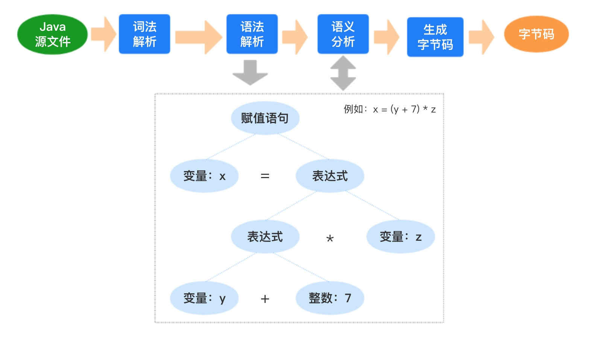
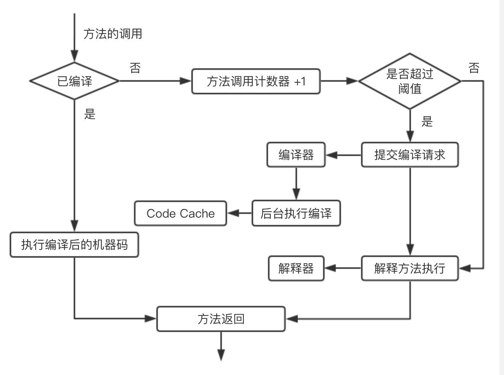

# 字节码

**源码编译过程：**

字节码必须通过类加载过程加载到JVM环境后，才可以执行。执行有三种方式：第一，解释执行；第二，JIT编译执行；第三，JIT编译和解释混合执行（主流JVM默认执行模式）。

混合模式的优势在于解释器在启动的时候先解释执行，省去了编译时间。随着时间的推进，JVM根据热点代码统计分析，识别高频的方法调用、循环体、公共模块等，基于强大的JIT动态编译技术，将热点代码转换成机器码，直接交给CPU执行。

**简要流程：**

### 一、加载或者存储指令

在某个帧栈中，通过指令操作数据在虚拟机栈的局部变量表和操作栈之间来回传输

#### 1）将局部变量加载到操作栈中

iload: 将 int 类型的局部变量压入操作栈
aload: 讲对象引用的局部变量压入操作栈

#### 2）从操作栈顶存储到局部变量表中

istore、astore

#### 3）将常量加载到操作栈顶

* **iconst**: 加载的是 -1 ~ 5 的数（iconst和bipush的边界）
* **bipush**: 即 Byte Immediate PUSH，加载 -128 ~ 127 之间的数
* **sipush**: 即 Short Immediate PUSH，加载 -32768 ~ 32787 之间的数
* **ldc**: 即 Load Constant，在 -2147483648 ~ 2147783647 或者是字符串时，JVM 采用 LDC 指令压入栈中。

### 二、运算指令

对操作栈上的值进行运行，并把结果写入操作栈顶，如 iadd、imul 等。

### 三、类型转换指令

显示的转换两种不同的数值类型。如 i2l、d2f 等。

### 四、对象创建于访问

根据类进行对象的创建、初始化、方法的调用相关指令

#### 1）创建对象指令

new、newarray

#### 2）访问属性指令

getfield、putfield、getstatic

#### 3）检查实例类型指令

instanceof、checkcast

### 五、操作栈管理指令

#### 1）出栈操作

pop即一个元素，pop2即两个元素

#### 2）复制栈顶元素并压入栈

dup

### 六、方法调用与返回指令

#### 1）调用对象的实例方法

invokevirtual

#### 2）调用实例初始化方法、私有方法、父类方法等

invokespecial

#### 3）调用类静态方法

invokestatic

#### 4）返回void类型

return

### 七、同步指令

JVM 使用方法结构中的 ACC_SYNCHRONIZED 标志同步方法，指令集中有 MONITORENTER 和 MONITOREXIT 支持 synchronized 语义。

除了字节码指令外，还包含一些额外的信息。例如：linenumber存储了字节码与源码行号的对应关系，方便调试的时候正确的定位到代码的所在行。localvariable存储当前方法使用到的局部变量表。
