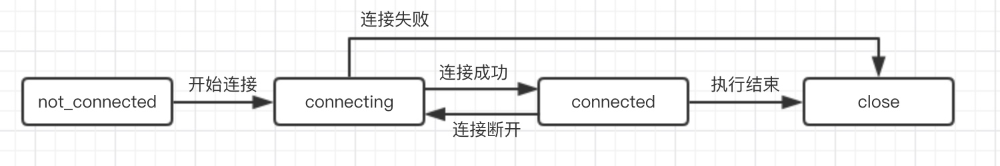

# zk基本知识

### 一、Zookeeper起源
单进程服务发生共享资源竞争问题时，如果是Java，可以通过synchronized或者JUC下提供的锁机制来解决。当多进程发送共享资源竞争问题时，是无法通过这种方式去解决。这时候就需要通过一种机制来协调进程间访问顺序，保证共享资源的安全性。

Zookeeper是分布式协调服务，最初被设计出来是做分布式锁，来解决进程间共享资源竞争问题。当多个服务发送资源竞争时，先通过Zookeeper来获取资源锁，只有获得锁的服务才能访问资源，执行结束后释放锁。其他服务通过Zookeeper的watch机制再次进行竞争Zookeeper锁。

### 二、为什么使用Zookeeper
* 协议地址的维护
* 负载均衡机制
* 服务动态上下线感知

**应用场景：**
* 注册中心
* 配置中心（开关）
    * 监听watcher机制，不需要主动去拿，可以做到动态感知
    * ==Zookeeper本身节点的特性，一些安全机制==
    * Zookeeper性能很高
* 负载均衡：基于Zookeeper的特性去实现
    * 知道机器状态
    * 选举master（kafka选举）
        * 注册节点，节点最小为master
* 分布式锁

### 三、Zookeeper使用

#### 1、Zookeeper的安装部署

> 下载地址：http://mirror.bit.edu.cn/apache/zookeeper/

* **通过tar -zxvf 解压**

```shell
sh zkServer.sh start        # 启动
sh zkServer.sh stop         # 停止
sh zkServer.sh restart      # 重启
sh zkServer.sh status       # 状态 在集群环境下可以查看角色 leader、follower

sh zkCli.sh -timeout 0 -r -server ip:port # 客户端连接
```

* **配置文件zoo.cfg**

将zoo_sample.cfg文件copy为zoo.cfg，Zookeeper服务启动时默认会去读取。

zoo.cfg内配置项：
```properties
tickTime=2000               # 时间单位
initLimit=10                # 最大的初始化时间 10个tickTime
syncLimit=5                 # leader和follower最大的心跳延迟 5个tickTime
dataDir=/temp/zookeeper     # 数据存储
clientPort=2181             # 客户端的接口
```

* **ACl**

权限控制，定义了五种：CREATE、READ、WRITE、DELETE、ADMIN


##### 1）单机模式配置
无需配置，默认为单机模式

##### 2）集群模式配置
为了避免单点故障，提高服务可用性，做到高可用，需要对Zookeeper做集群部署。

在zoo.cfg内配置集群内所有服务信息，样例如下：
```
server.1=192.168.1.2:2888:3888
server.2=192.168.1.3:2888:3888
server.3=192.168.1.4:2888:3888
```

格式为`server.id=ip:port1:port2`，其中port1是用来做数据通信的端口，port2是用来重新选举leader端口。id为本机的id，在zoo.cfg内dataDir对应的目录下创建myid文件，并设置本机的id到myid文件内。

> id和ip一定要对应，否则会出错

**集群内节点角色：**
* leader：处理事务请求，增加、修改、删除
* follower：
* observer：监视，不会参与leader选举，提高写性能，不参与投票


#### 2、Zookeeper使用基本命令

```shell
set path data [version]                 # 修改
ls path [watch]                         # 查看路径下的子节点
delete path [version]                   # 删除
get path [watch]                        # 查询
create [-s] [-e] path data acl          # 创建  -e:临时节点 -s:有序节点
```

### 四、数据模型
Zookeeper是基于key/value的树形的存储结构。

#### 1、节点特性
* 同级节点唯一性
* 临时节点和持久化节点
    * 临时节点在当前会话关闭时，会删除节点
* 临时节点不能存在子节点
* 有序节点和无序节点
    * 有序节点会自动创建类似于`0000000001`的节点，依次递增


**每个节点所包含的数据** 

> 通过`get path`命令获取节点信息：

```
0
cZxid = 0x1000188b0                     # 创建节点时产生的事务id
ctime = Mon Nov 05 14:38:43 CST 2018    # 创建时间
mZxid = 0x1000188b0                     # 更新节点时产生的事务id
mtime = Mon Nov 05 14:38:43 CST 2018    # 修改时间
pZxid = 0x1000188b0                     # 此节点的子节点最后修改的事务id
# 版本号，采用了乐观锁的概念，控制数据的并发
cversion = 0                            # 当前节点子节点的版本号
dataVersion = 0                         # 数据内容的版本号
aclVersion = 0                          # 当前节点权限变更的版本号
ephemeralOwner = 0x0                    # 只有临时节点才会有，存储会话信息
dataLength = 1                          # 当前数据长度
numChildren = 0                         # 当前子节点的数量
```

#### 2、会话生命周期


#### 3、watcher机制
客户端通过watcher机制和服务端建立连接，服务端改变数据时会通知客户端

