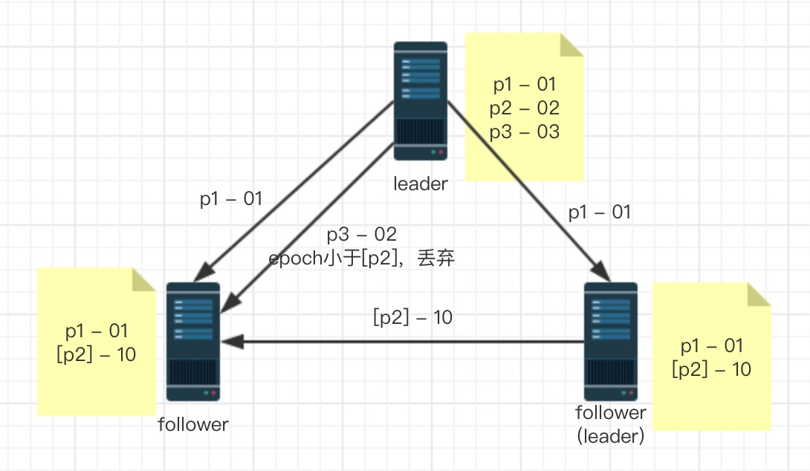

# zk原理

> 雅虎开发，后捐献给Apache

场景
* 各个节点数据一致性
* 怎么保证任务只在一个节点上运行
* 如何保证运行的节点挂了之后，其他节点可以接替开始
* 存在共享资源，互斥性、安全性

Zookeeper的节点特性中存在有序节点，这样我们就可以通过节点的有序性，设置最小的节点可以执行任务，后面的节点订阅前一个节点，当最小节点断开连接后，后续最小节点开始工作。这就解决了上面第二和第三个问题。

### 一、Zookeeper设计猜想

#### 1、方式单点故障
采用集群方式

#### 2、数据是一致性
集群中采用leader、follower机制来同步数据
分布式事务：基于2PC做数据同步

#### 3、leader挂了如何、数据如何恢复
选取机制、数据如何恢复

### 二、Zookeeper集群

> 必须要2n+1的节点，基数节点。偶数节点没有意义。

**请求处理过程（改进版2PC）：**
1、如果是读请求，可以在任意节点去处理数据
2、如果是事务请求，那么请求会转发给leader去处理
3、leader将事务转发给所有follower
4、follower反馈给ack
5、过半的follower成功，则leader发起commit请求
6、leader将数据同步到observer，并将执行结果返回

**各节点的职责：**
1、leader
是整个Zookeeper的核心，起到了主导整个集群的作用。比如：事务请求的调度和处理，保证集群中事务处理的顺序性。

2、follower
1）处理客户端的非事务请求，转发事务请求给leader服务器。
2）参与整个事务的投票过程。
3）参与leader选取的投票。

3、observer
一个观察者的角色。能了解集群中的状态变化、对这些状态进行同步。他和follower区别是不参与事务请求及leader选举的投票，提高写性能。

> 为了提高Zookeeper集群的可用性，我们将引入更多的节点进入。但是每增加一个follower，就意味着在事务和leader的投票将多一个节点进行，增加传输的成本。observer的引入就是为了在不降低写性能的前提下，提高集群的可用性。

### 三、ZAB协议

> 支持==崩溃恢复==的==原子广播==协议，主要用于实现数据一致性。

当整个集群第一次启动的时候，或者leader节点出现网络中断或者崩溃之后，这时ZAB协议会进入恢复模式，从集群重新去选举新的leader。当集群中过半的机器与leader同步之后，整个集群就进入正常运行阶段。

#### 1、消息广播

* 对每个消息生成一个zxid（64自增id），通过zxid的大小可以实现数据的因果有序的特性。
* leader为每个follower准备一个FIFO的队列（tcp协议实现），把带有zxid的消息作为一个proposal分发给集群中每个follower节点。
* follower节点收到消息后，把proposal这个事务写入磁盘，写入成功后会返回ack给leader。
* 当leader收到过半数量的请求ack以后，再发起commit请求。

> 整个投票过程中observer不参与，但是必须要和leader保持数据一致

#### 2、崩溃恢复（对数据层来说）

**崩溃恢复发送情况：**
* 当leader失去过半follower节点的联系
* 当leader节点崩溃

**对于数据恢复来说：**

需要满足一下两条：

1）已经被处理的消息不能丢失

当leader收到合法数量的follower的ack之后，就会向各个follower广播消息（commit），同时自己也会commit这条事务消息。如果follower收到commit命令之前，leader节点挂了，会导致一部分节点收到commit命令，一部分没有收到。ZAB协议需要保证已经被处理的消息不能丢失。

2）被丢弃的消息不能再次出现

当leader还没有发起事务投票时就挂了，ZAB协议要保证新选举出来的leader和所有节点都要放弃这条消息。

**zab的设计思想：**
* zxid最大
    * zxid最大则为新选取的leader
    * zxid最大则说明当前节点消息是最新的，如果选取最新的zxid为leader，就能保证已经被处理的消息不丢失
* epoch概念
    * 每产出一个新的leader，那么新的leader的epoch会+1
    * zxid是64位的数据，低32位表示消息的计数器（自增），高32位表示epoch编号
    * 新的leader选取之后，消息会从0开始epoch会+1，这要好处在于原来的leader在恢复过来之后，也不会比新的leader的zxid大。
    * 新的leader选取之后，会丢弃没有被commit的消息

> 查看日志
`java -cp :/opt/zookeeper-3.4.12/lib/slf4j-api-1.7.25.jar:/opt/zookeeper-3.4.12/zookeeper-3.4.12.jar org.apache.zookeeper.server.LogFormatter /opt/zookeeper/version-2/log.100000001`

**理解zab协议**

集群有三个节点，一个leader两个follower。
1、当leader发起p1的commit之后挂了，两个follower都会完成commit。
2、假设右边follower选举为leader了，epoch+1，发起了[p2]请求后挂了，原leader恢复
3、原leader还有两个请求没有提交，这时提交之后会发现小于新leader的epoch，会被丢弃

### 四、leader选举

> 节点状态：LOOKING、LEADING、FOLLOWING、OBSERVING
> 初始化是每个节点都是LOOKING状态

**集群启动时leader选举过程：**
1、服务启动后，初始化状态为LOOKING状态
2、将本地epoch+1，选举自己为leader，并发送广播
3、循环判断自己状态是否为LOOKING，不是则跳出循环，是则继续
4、从消息队列中获取消息
5、判断新消息节点状态，如果是LOOKING状态则进入下一步。
6、更新epoch
7、更新选举的leader节点（规则如下）
8、发送广播
9、将节点放置本地集合中
10、判断选举是否结束，如果没有结束，重复循环

**选举时，leader节点的判断规则依次是**
* epoch大的是leader
* epoch相同，zxid大的是leader
* epoch和zxid都相同，服务对应的id（myid）大的是leader

