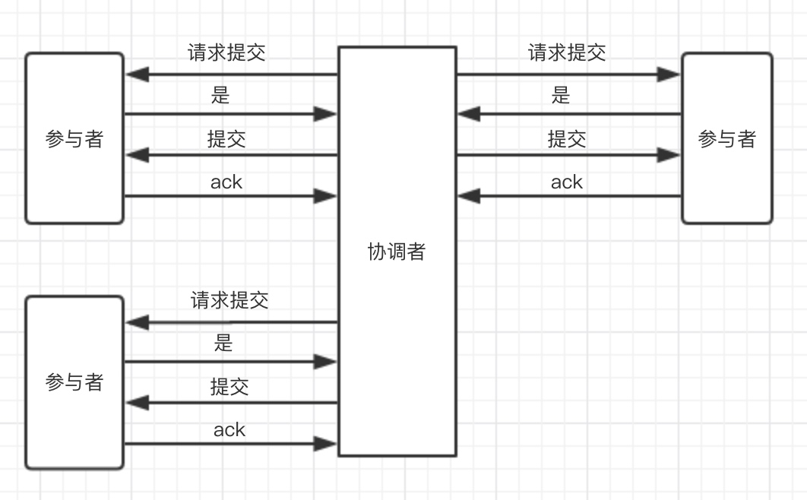
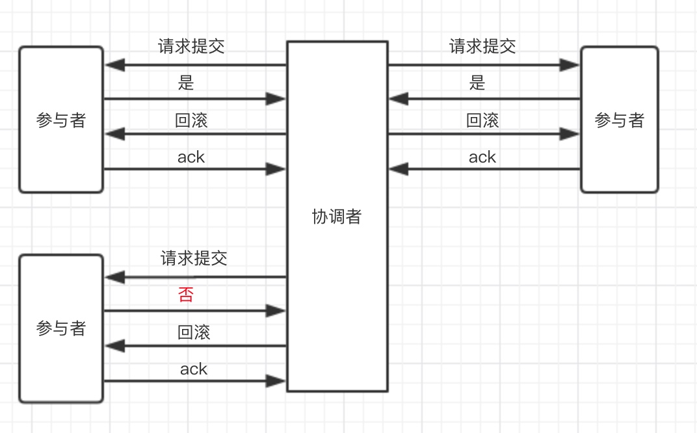

# 2PC理论

### 一、定义

2PC（Two Phase Commitment Protocol）提交是保证分布式事务的一种方式。当一个事务操作需要跨越多个分布式节点时，为了保证事务的ACID特性，需要引入一个“协调者”（TM）来统一协调所有分布式节点的执行逻辑，这些被调度的节点成为AP。TM负责调度AP的行为，并最终决定这些AP是否把事务提交，因为整个事务分为两个阶段提交，因此叫做2PC提交。

### 二、过程

**阶段一：提交事务请求**

1、事务询问
协调者向所有参与者发送事务内容，询问是否可以执行事务提交操作，并开始等待参与者的反馈。

2、执行事务
各个参与者节点执行事务操作，并将Undo和Redo信息记录到事务日志中，尽量把事务提交操作中所有耗时操作都提前完成，确保后面100%成功提交事务。

3、反馈结果
如果各参与者成功执行事务操作，那么反馈给协调者yes的响应；如果参与者执行事务操作失败，则反馈给协调者no的响应。这个过程很像协调者组织所有参与者进行一次事务操作投票的过程，因此也称作“投票阶段”，即各参与者投票表明是否是否继续接下来的事务提交操作。

**阶段二：执行事务提交**

此阶段根据所有收到的反馈来判断最终是否提交事务的操作，会有两种结果：提交事务；中止事务。当收到所有参与者的反馈结果为yes时，发起事务提交命令给参与者进行提交事务；当有参与者反馈结果为no时，发起回滚命令，中止事务。