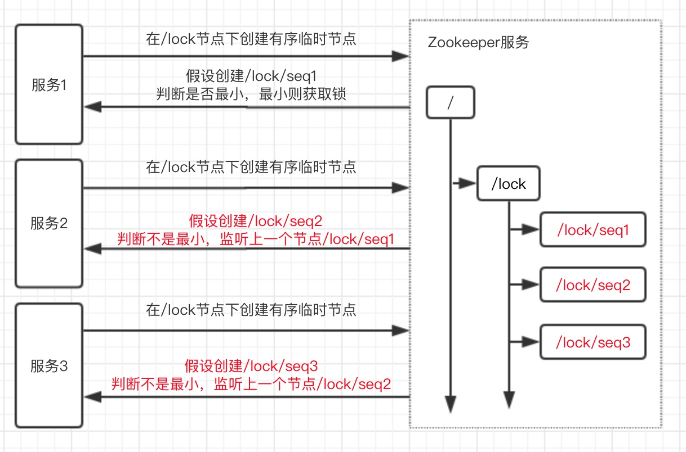
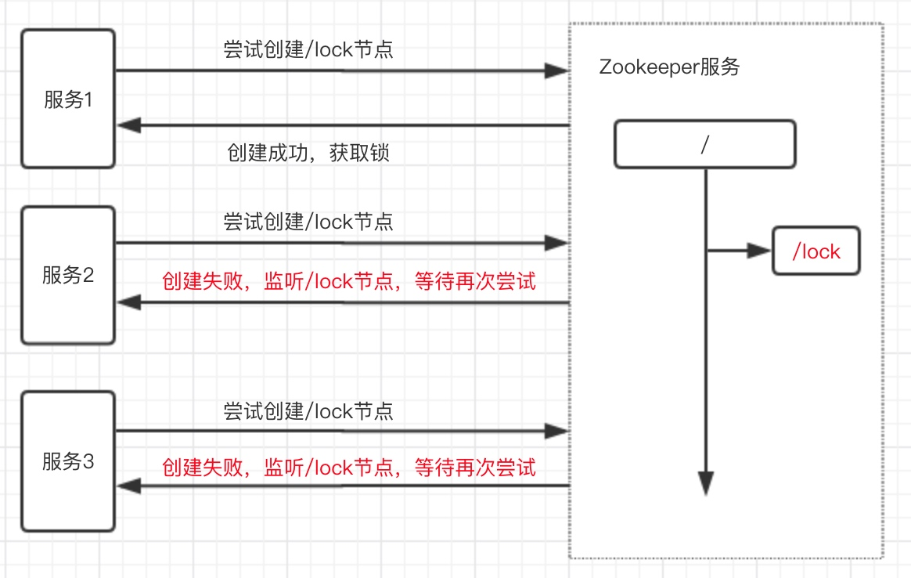
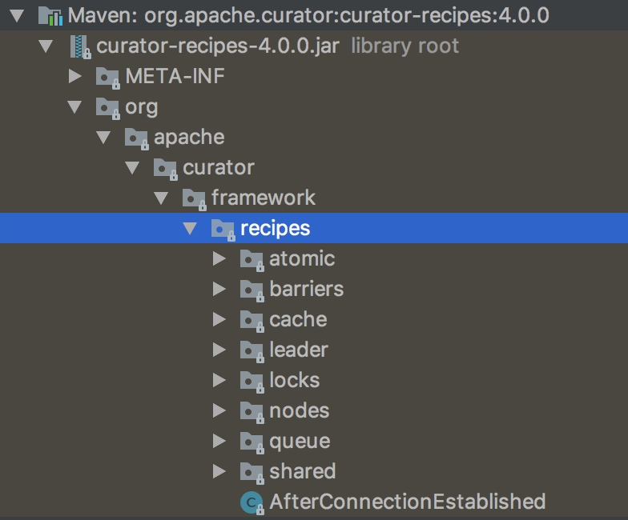

# zk实现分布式锁

### 一、zk原生实现

#### 1、有序临时节点

利用Zookeeper节点的临时有序性，可以再同一个节点下创建临时有序节点，节点最小的服务获取锁，其他服务等待，并监听比自己小的上一个节点。

#### 2、同写一个节点

利用Zookeeper同一层级的节点不可重复性，多个服务同时去写同一个节点，如果写成功就获取锁；写失败则监听此节点，锁被释放后重新尝试获取。

### 二、Curator实现

> curator-recipes包内封装了Zookeeper原生API，实现了多重分布式锁。

InterProcessMutex：可重入互斥锁
InterProcessReadWriteLock：可重入读写锁