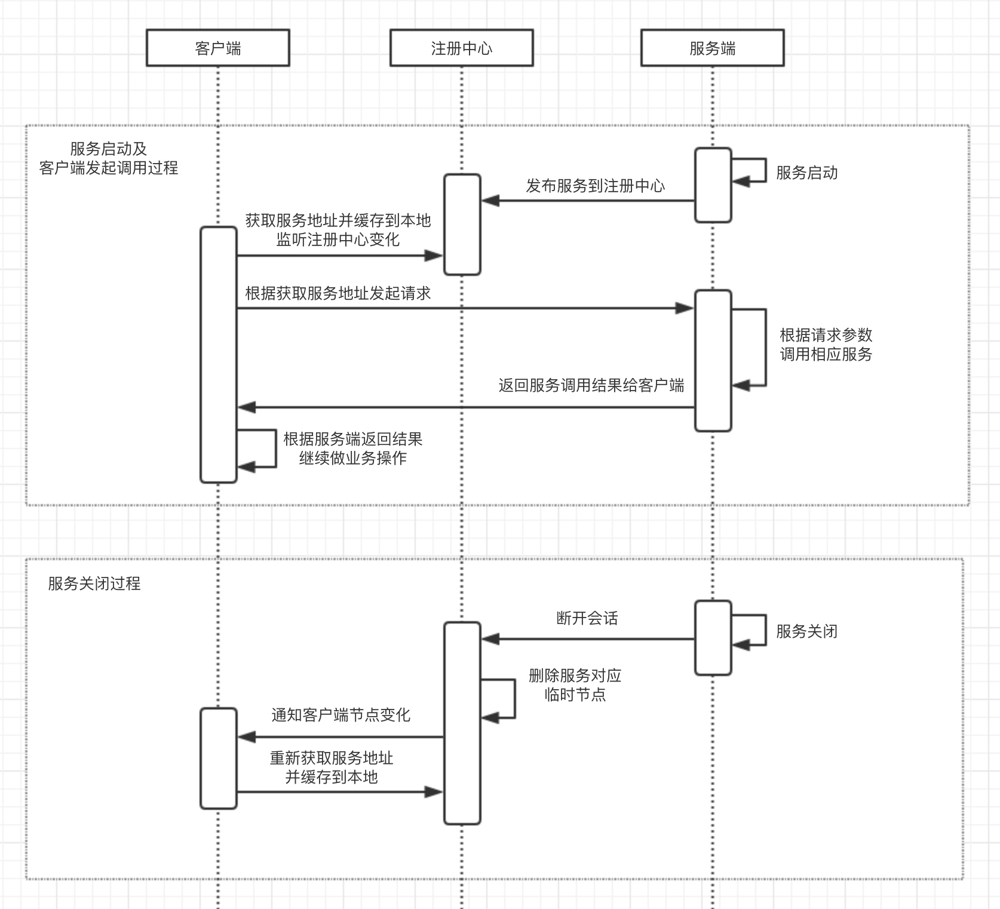

# RPC框架

### 一、RPC定义

RPC（remote procedure call protocol）远程过程调用协议，通过网络向远程计算机上请求某种服务。

### 二、步骤

1、客户端组装请求
2、客户端调用本地系统发送网络请求
3、消息传递到远程主机
4、服务器得到请求消息
5、服务器根据请求消息进行相应的服务调用
6、服务器获得响应
7、服务器调用本地系统发送网络请求
8、消息传递到客户端主机
9、客户端得到响应消息
10、客户端处理相应业务

### 三、流程图

含有注册中心的调用流程图

