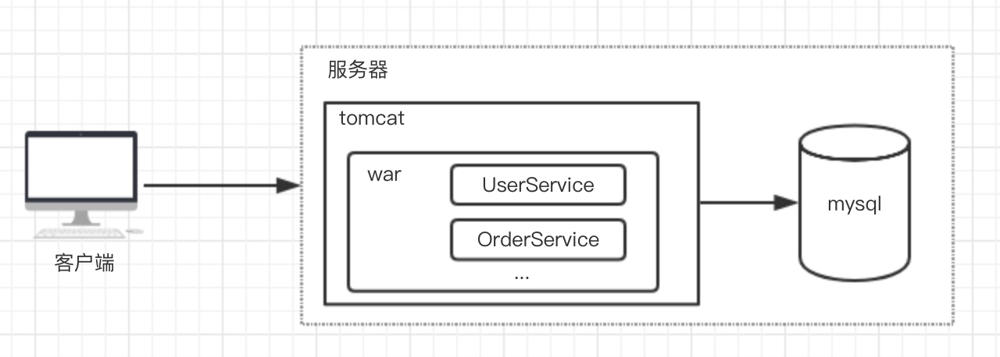
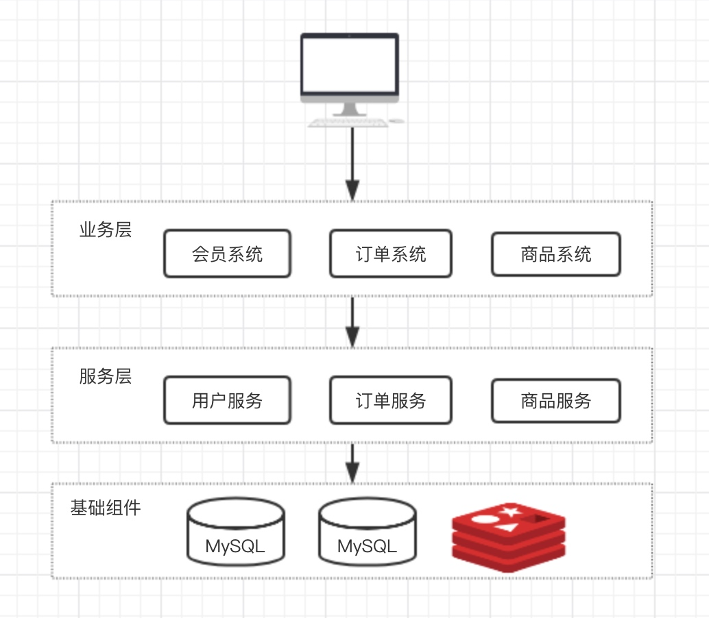
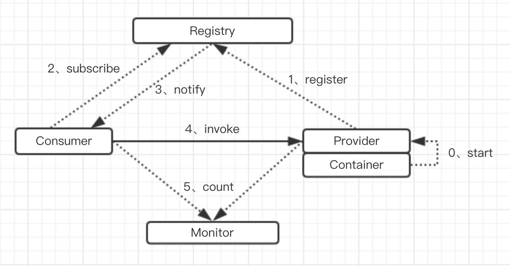

# Dubbo基础知识

### 一、dubbo由来

#### 1、早期架构
早期软件架构十分简单，典型的有LAMP（Linux + Apache + MySQL + Php）架构。

如图，这是早期的架构1.0版本，在业务量比较小的初期可以满足需求。这个架构在开发和部署方面都比较简单方便。

#### 2、分层架构
随着业务的发展，系统访问量的增加，单机已经无法满足业务需求了，此时就需要对系统架构做一次升级。对服务的拆分和多节点部署，对数据库进行分库分表，加入缓存、消息中间件等。

如图，分层架构。将系统拆分成多层结构，服务之间各自调用达到业务需求。针对关键服务还可以做集群部署。这种架构相对之前来说，可支撑的业务量更大，但是也带来了随之而来的问题。服务变多，服务之间调用关系复杂，部署复杂，开发、调试、测试都变的比原来复杂。

另外，服务之间如何调用成为了关键问题。服务之间可以通过RMI、webService等方式进行调用。每个服务都需要知道自己依赖的服务的地址、端口等信息。随着业务不断上涨，节点不断增多，急需解决的问题如下：
* 服务地址的维护
* 服务上下线动态感知
* 服务的限流、容错、降级
* 服务监控

为了解决这些问题，服务治理的框架被各大公司开发出来，dubbo是由阿里巴巴开发的一个服务治理的框架，现已成为Apache的孵化项目。

### 二、dubbo的设计框架

#### 1、架构

上图为dubbo架构图，由服务提供者（Provider）启动后将自己的信息注册到注册中心（Registry）上去。消费者（Consumer）想要调用服务提供者的服务时，要先到注册中心去订阅相关服务信息，拿到服务提供者信息后调用服务。当服务提供者变化时（上线或下线），注册中心会通知服务消费者。监控中心监控着服务的提供和消费次数。

#### 2、健壮性
* 注册中心负责服务地址的注册与查找，相当于目录服务，服务提供者和消费者只在启动时与注册中心交互，注册中心不转发请求，压力较小
* 监控中心负责统计各服务调用次数，调用时间等，统计先在内存汇总后每分钟一次发送到监控中心服务器，并以报表展示
* 服务提供者向注册中心注册其提供的服务，并汇报调用时间到监控中心，此时间不包含网络开销
* 服务消费者向注册中心获取服务提供者地址列表，并根据负载算法直接调用提供者，同时汇报调用时间到监控中心，此时间包含网络开销
* 注册中心，服务提供者，服务消费者三者之间均为长连接，监控中心除外
* 注册中心通过长连接感知服务提供者的存在，服务提供者宕机，注册中心将立即推送事件通知消费者
* 注册中心和监控中心全部宕机，不影响已运行的提供者和消费者，消费者在本地缓存了提供者列表
* 注册中心和监控中心都是可选的，服务消费者可以直连服务提供者

#### 3、伸缩性
* 服务的注册中心为对等集群，可以动态添加机器部署实例，所有的客户端将自动发现新的注册中心
* 服务的提供是无状态的，可动态增加部署实例，注册中心将推送给调用者

### 三、dubbo的基本使用

> dubbo原生支持spring。

#### 1、服务提供者

在spring项目中，可通过如下配置发布服务：
```xml
<!--提供方信息-->
<dubbo:application name="dubbo-server" owner="yuesheng"/>
<!-- 注册中心 -->
<dubbo:registry address="zookeeper://192.168.56.2:2181" />
<!-- 协议 -->
<dubbo:protocol name="dubbo" port="20881" />
<!-- 发布的服务 -->
<dubbo:service interface="com.yuesheng.practice.dubbo.server.api.UserService" ref="userService"/>
<!-- 对应的实现 -->
<bean id="userService" class="com.yuesheng.practice.dubbo.server.service.UserServiceImpl" />
```
如果不需要注册中心，可将`dubbo:registry`节点设置为
```xml
<dubbo:registry address="N/A" />
```


#### 2、消费者

```xml
<!--提供方信息-->
<dubbo:application name="dubbo-client" owner="yuesheng"/>
<!--注册中心-->
<dubbo:registry address="zookeeper://192.168.56.2:2181?register=false" check="false" file="/Users/yuesheng/work/workspace/workspace-personal/yuesheng/practice/practice-dubbo/practice-dubbo-client/dubbo-server"/>
<!--所依赖的服务-->
<dubbo:reference id="userService" interface="com.yuesheng.practice.dubbo.server.api.UserService"/>
```
其中`dubbo:registry`标签内的`file`属性是设置缓存注册中心内的服务提供者地址的缓存，使用和Spring Bean相同。

如果不需要注册中心，可将`dubbo:registry`节点地址设置为`N/A`，并且`dubbo:reference`节点提供发布地址url
```xml
<dubbo:registry address="N/A" />
<dubbo:reference id="userService" interface="com.yuesheng.practice.dubbo.server.api.UserService" url="dubbo://127.0.0.1:20880/com.yuesheng.practice.dubbo.server.api.UserService"/>
```

#### 3、注册中心
dubbo如果设置注册中心，则会在Zookeeper的根节点`/`下创建`/dubbo`子节点，注册的服务都会放在`/dubbo`节点下。

当服务注册到注册中心后，会创建`/dubbo/interface`节点，其中`interface`为服务设置的接口，`/dubbo/interface`节点面下还有有四个子节点分别是：`providers`、`routers`、`configurators`、`consumers`。所有服务提供者的url存在放`/dubbo/interface/providers`下，当前服务的消费者存放在`/dubbo/interface/consumers`下。

#### 4、dubbo支持的容器
dubbo启动是基于容器的，支持的容器有：Spring、Jetty、Log4j、Logback。默认启动的是Spring container。
```java
// 可启动多个容器，需要依赖对应的包和引入对应的配置文件
com.alibaba.dubbo.container.Main.main(new String[]{"spring","logback"});
```

下面是Spring容器部分代码，由此可见如果使用spring容器启动时，默认的配置文件路径为`classpath*:META-INF/spring/*.xml`
```java
public class SpringContainer implements Container {

    public static final String SPRING_CONFIG = "dubbo.spring.config";
    // 默认配置文件路径
    public static final String DEFAULT_SPRING_CONFIG = "classpath*:META-INF/spring/*.xml";
    private static final Logger logger = LoggerFactory.getLogger(SpringContainer.class);
    static ClassPathXmlApplicationContext context;

    public static ClassPathXmlApplicationContext getContext() {
        return context;
    }

    public void start() {
        String configPath = ConfigUtils.getProperty(SPRING_CONFIG);
        if (configPath == null || configPath.length() == 0) {
            configPath = DEFAULT_SPRING_CONFIG;
        }
        context = new ClassPathXmlApplicationContext(configPath.split("[,\\s]+"));
        context.start();
    }
    ...
}
```

#### 5、dubbo多协议支持
支持的协议：dubbo（默认）、RMI、hessian、webservice、http、thirft。

好处：
1）项目迁移至dubbo时，多协议的支持可以做到平滑的迁移
2）不同协议具有不同特性，可以针对不同接口做不同协议

> 不同协议需要添加相应的依赖

服务提供者和消费者需要增加`protocal`属性指定具体协议
```xml
<dubbo:reference id="userService" interface="com.yuesheng.practice.dubbo.server.api.UserService" protocal="hessian"/>
```

可以实现一个接口发布不同协议：
```xml
<dubbo:protocol name="dubbo" port="20881" />
<dubbo:protocol name="hessian" port="8080" />
<dubbo:service id="userService" ref="userService" interface="com.yuesheng.practice.dubbo.server.api.UserService" protocal="dubbo,hessian"/>
```

#### 6、多注册中心
不同服务发布到不同注册中心，服务接口通过`registry`属性指定注册中心。
```xml
<dubbo:registry id="zk1" address="zookeeper://192.168.56.2:2181" />
<dubbo:registry id="zk2" address="zookeeper://192.168.56.3:2181" />
<dubbo:service id="userService" ref="userService" interface="com.yuesheng.practice.dubbo.server.api.UserService" registry="zk1"/>
```

#### 7、循环依赖
服务提供者可以能是服务消费者，当启动服务时，服务提供者没有启动的时候，服务消费者对于的服务会启动失败。可以通过`check`属性来设置启动时是否检查服务是否启动。

```xml
<dubbo:reference id="userService" interface="com.yuesheng.practice.dubbo.server.api.UserService" check="false"/>
```

#### 8、集群的访问
对于服务提供者的集群，服务消费者默认是通过随机负载均衡算法。

