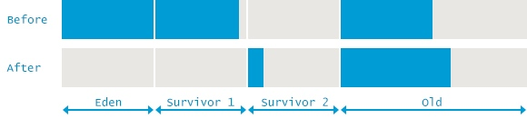

# GC日志

```log
Java HotSpot(TM) 64-Bit Server VM (25.131-b11) for linux-amd64 JRE (1.8.0_131-b11), built on Mar 15 2017 01:23:40 by "java_re" with gcc 4.3.0 20080428 (Red Hat 4.3.0-8)
Memory: 4k page, physical 32948708k(2608756k free), swap 0k(0k free)
CommandLine flags: -XX:InitialHeapSize=1073741824 -XX:MaxHeapSize=2147483648 -XX:MaxMetaspaceSize=268435456 -XX:MetaspaceSize=268435456 -XX:+PrintGC -XX:+PrintGCDateStamps -XX:+PrintGCDetails -XX:+PrintGCTimeStamps -XX:+UseCompressedClassPointers -XX:+UseCompressedOops -XX:+UseParallelGC
2018-11-08T17:14:33.691+0800: 1.489: [GC (Allocation Failure) [PSYoungGen: 262144K->32236K(305664K)] 262144K->32316K(1005056K), 0.0278435 secs] [Times: user=0.09 sys=0.01, real=0.03 secs]
2018-11-08T17:14:34.340+0800: 2.138: [GC (Allocation Failure) [PSYoungGen: 294380K->39595K(567808K)] 294460K->39683K(1267200K), 0.0324181 secs] [Times: user=0.14 sys=0.03, real=0.03 secs]
2018-11-08T17:14:35.575+0800: 3.373: [GC (Allocation Failure) [PSYoungGen: 563883K->43506K(567808K)] 563971K->85979K(1267200K), 0.0790530 secs] [Times: user=0.31 sys=0.02, real=0.08 secs]
2018-11-08T17:14:36.758+0800: 4.556: [GC (Allocation Failure) [PSYoungGen: 567794K->43499K(655360K)] 610267K->141024K(1354752K), 0.0697435 secs] [Times: user=0.19 sys=0.03, real=0.07 secs]
2018-11-08T17:14:39.267+0800: 7.065: [GC (Allocation Failure) [PSYoungGen: 655339K->40491K(652800K)] 752864K->138104K(1352192K), 0.0339700 secs] [Times: user=0.14 sys=0.04, real=0.03 secs]
2018-11-08T17:14:45.472+0800: 13.269: [GC (System.gc()) [PSYoungGen: 516573K->34369K(522752K)] 614186K->131997K(1222144K), 0.0197994 secs] [Times: user=0.08 sys=0.01, real=0.02 secs]
2018-11-08T17:14:45.492+0800: 13.289: [Full GC (System.gc()) [PSYoungGen: 34369K->0K(522752K)] [ParOldGen: 97628K->33775K(699392K)] 131997K->33775K(1222144K), [Metaspace: 36481K->36481K(1081344K)], 0.0679497 secs] [Times: user=0.25 sys=0.00, real=0.07 secs]
2018-11-08T17:14:47.129+0800: 14.926: [GC (Allocation Failure) [PSYoungGen: 476672K->10020K(486912K)] 510447K->43796K(1186304K), 0.0101460 secs] [Times: user=0.06 sys=0.00, real=0.01 secs]
2018-11-08T17:14:49.352+0800: 17.150: [GC (Allocation Failure) [PSYoungGen: 486692K->16044K(586752K)] 520468K->49828K(1286144K), 0.0111525 secs] [Times: user=0.06 sys=0.01, real=0.01 secs]
2018-11-08T17:14:50.386+0800: 18.184: [GC (Allocation Failure) [PSYoungGen: 489644K->40006K(514048K)] 523428K->73798K(1213440K), 0.0274864 secs] [Times: user=0.15 sys=0.00, real=0.03 secs]
2018-11-08T17:14:51.235+0800: 19.033: [GC (Allocation Failure) [PSYoungGen: 513606K->51597K(582144K)] 547398K->95775K(1281536K), 0.0408595 secs] [Times: user=0.14 sys=0.00, real=0.04 secs]
2018-11-08T17:14:52.158+0800: 19.955: [GC (Allocation Failure) [PSYoungGen: 528269K->64286K(579072K)] 572447K->118114K(1278464K), 0.0474790 secs] [Times: user=0.09 sys=0.00, real=0.04 secs]
2018-11-08T17:14:53.198+0800: 20.996: [GC (Allocation Failure) [PSYoungGen: 540958K->58593K(595456K)] 594786K->114626K(1294848K), 0.0374648 secs] [Times: user=0.10 sys=0.00, real=0.04 secs]
2018-11-08T17:14:55.200+0800: 22.998: [GC (Allocation Failure) [PSYoungGen: 550625K->18474K(594432K)] 606658K->77359K(1293824K), 0.0228499 secs] [Times: user=0.13 sys=0.01, real=0.02 secs]
2018-11-08T17:14:56.057+0800: 23.854: [GC (Allocation Failure) [PSYoungGen: 510506K->10114K(594432K)] 569391K->74594K(1293824K), 0.0116523 secs] [Times: user=0.05 sys=0.00, real=0.01 secs]
2018-11-08T17:14:57.730+0800: 25.528: [GC (Allocation Failure) [PSYoungGen: 502658K->11128K(594944K)] 567138K->82296K(1294336K), 0.0157183 secs] [Times: user=0.09 sys=0.00, real=0.01 secs]
2018-11-08T17:14:59.408+0800: 27.205: [GC (Allocation Failure) [PSYoungGen: 503672K->6872K(594944K)] 574840K->83696K(1294336K), 0.0110392 secs] [Times: user=0.05 sys=0.00, real=0.01 secs]
2018-11-08T17:16:16.724+0800: 104.522: [GC (Allocation Failure) [PSYoungGen: 501976K->11279K(595456K)] 578800K->93931K(1294848K), 0.0146914 secs] [Times: user=0.08 sys=0.00, real=0.02 secs]
```


上面的GC日志暴露了JVM中的一些信息。事实上，这个日志片段中发生了 2 次垃圾回收事件(Garbage Collection events)。其中一次清理的是年轻代(Young generation), 而第二次处理的是整个堆内存。下面我们来看，如何解读第一次GC事件，发生在年轻代中的小型GC(Minor GC):

2015-05-26T14:45:37.987-02001:151.1262:[GC3(Allocation Failure4)
151.126: [DefNew5:629119K->69888K6(629120K)7
, 0.0584157 secs]1619346K->1273247K8(2027264K)9,0.0585007 secs10]
[Times: user=0.06 sys=0.00, real=0.06 secs]11

2015-05-26T14:45:37.987-0200 – GC事件(GC event)开始的时间点.
151.126 – GC时间的开始时间,相对于JVM的启动时间,单位是秒(Measured in seconds).
GC – 用来区分(distinguish)是 Minor GC 还是 Full GC 的标志(Flag). 这里的 GC 表明本次发生的是 Minor GC.
Allocation Failure – 引起垃圾回收的原因. 本次GC是因为年轻代中没有任何合适的区域能够存放需要分配的数据结构而触发的.
DefNew – 使用的垃圾收集器的名字. DefNew 这个名字代表的是: 单线程(single-threaded), 采用标记复制(mark-copy)算法的, 使整个JVM暂停运行(stop-the-world)的年轻代(Young generation) 垃圾收集器(garbage collector).
629119K->69888K – 在本次垃圾收集之前和之后的年轻代内存使用情况(Usage).
(629120K) – 年轻代的总的大小(Total size).
1619346K->1273247K – 在本次垃圾收集之前和之后整个堆内存的使用情况(Total used heap).
(2027264K) – 总的可用的堆内存(Total available heap).
0.0585007 secs – GC事件的持续时间(Duration),单位是秒.
[Times: user=0.06 sys=0.00, real=0.06 secs] – GC事件的持续时间,通过多种分类来进行衡量: 
user – 此次垃圾回收, 垃圾收集线程消耗的所有CPU时间(Total CPU time).
sys – 操作系统调用(OS call) 以及等待系统事件的时间(waiting for system event)
real – 应用程序暂停的时间(Clock time). 由于串行垃圾收集器(Serial Garbage Collector)只会使用单个线程, 所以 real time 等于 user 以及 system time 的总和.
通过上面的分析, 我们可以计算出在垃圾收集期间, JVM 中的内存使用情况。在垃圾收集之前, 堆内存总的使用了 1.54G (1,619,346K)。其中, 年轻代使用了 614M(629,119k)。可以算出老年代使用的内存为: 967M(990,227K)。

下一组数据( -> 右边)中蕴含了更重要的结论, 年轻代的内存使用在垃圾回收后下降了 546M(559,231k), 但总的堆内存使用(total heap usage)只减少了 337M(346,099k). 通过这一点,我们可以计算出, 有 208M(213,132K) 的年轻代对象被提升到老年代(Old)中。

这个GC事件可以用下面的示意图来表示, 上方表示GC之前的内存使用情况, 下方表示结束后的内存使用情况:

这里写图片描述

