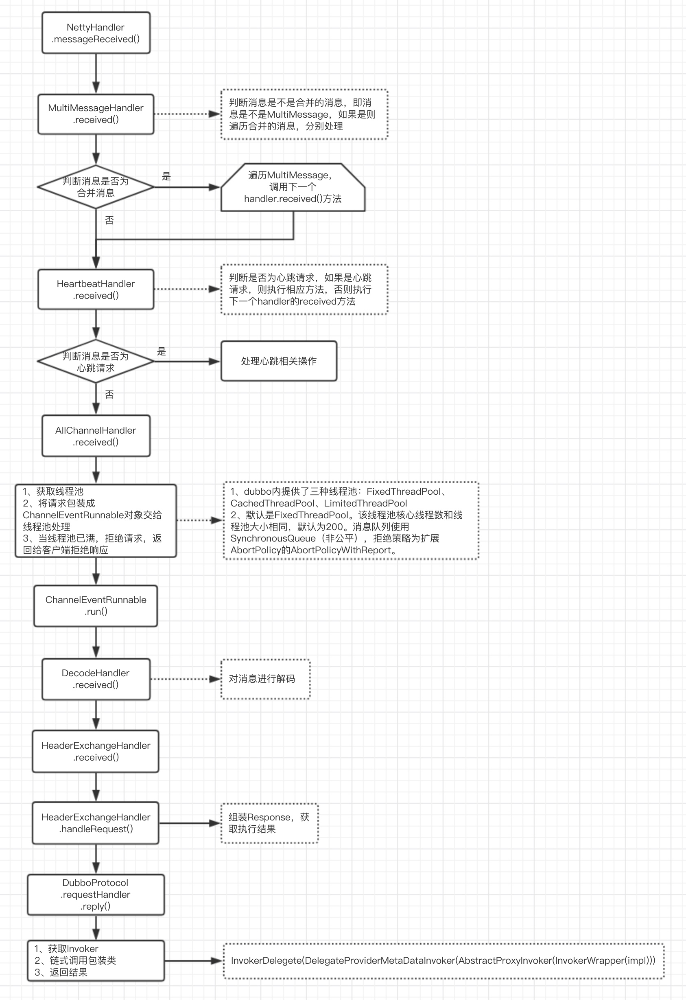

# Dubbo服务发布和响应过程

> 基于Spring容器来说明dubbo发布和响应过程

### 一、服务启动过程

#### 1、服务启动入口
启动dubbo服务可以通过`com.alibaba.dubbo.container.Main#main`方法来启动，参数为指定的容器类型，dubbo支持的容器有四种：`SpringContainer`（缺省值）、`JettyContainer`、`Log4jContainer`、`LogbackContainer`。使用Spring容器启动需要增加相应的配置文件，配置文件路径为`classpath*:META-INF/spring/*.xml`。具体调用方法如下：
```java
public class Application {

    public static void main(String[] args) {
        Main.main(new String[]{"spring"});
    }
}
```

如果使用Severlet容器启动，并使用Spring框架，则可以不需要显示的启动dubbo。在容器启动时，Spring扫描到dubbo的配置文件后，会自动启动dubbo服务。

dubbo通过扩展了Spring的`NamespaceHandler`和`BeanDefinitionParse`类来实现Spring加载dubbo自身的配置文件。dubbo创建了`/META-INF/spring.handlers`文件，内部存储着schema对应的地址，和dubbo中`NamespaceHandler`的实现类。内容如下：
```
http\://code.alibabatech.com/schema/dubbo=com.alibaba.dubbo.config.spring.schema.DubboNamespaceHandler
```

在Spring扫描dubbo配置文件的不同标签后，会通过dubbo实现的不同`BeanDefinitionParse`来进行对应的解析。具体代码如下（`DubboNamespaceHandler`类内）：
```java
public class DubboNamespaceHandler extends NamespaceHandlerSupport {

    static {
        Version.checkDuplicate(DubboNamespaceHandler.class);
    }

    public void init() {
        registerBeanDefinitionParser("application", new DubboBeanDefinitionParser(ApplicationConfig.class, true));
        registerBeanDefinitionParser("module", new DubboBeanDefinitionParser(ModuleConfig.class, true));
        registerBeanDefinitionParser("registry", new DubboBeanDefinitionParser(RegistryConfig.class, true));
        registerBeanDefinitionParser("monitor", new DubboBeanDefinitionParser(MonitorConfig.class, true));
        registerBeanDefinitionParser("provider", new DubboBeanDefinitionParser(ProviderConfig.class, true));
        registerBeanDefinitionParser("consumer", new DubboBeanDefinitionParser(ConsumerConfig.class, true));
        registerBeanDefinitionParser("protocol", new DubboBeanDefinitionParser(ProtocolConfig.class, true));
        registerBeanDefinitionParser("service", new DubboBeanDefinitionParser(ServiceBean.class, true));
        registerBeanDefinitionParser("reference", new DubboBeanDefinitionParser(ReferenceBean.class, false));
        registerBeanDefinitionParser("annotation", new DubboBeanDefinitionParser(AnnotationBean.class, true));
    }

}
```

其中`ServiceBean`为对应的`<dubbo:service />`标签的实现类。`ServiceBean`实现了Spring的不同生命周期接口，如：`InitializingBean`、`DisposableBean`、`ApplicationContextAware`、`ApplicationListener`、`BeanNameAware`。

其中`InitializingBean#afterPropertiesSet`方法在`ServiceBean`初始化后会被调用。这也就是dubbo服务的启动入口。

#### 2、dubbo服务启动流程

##### 1）服务启动时序图


##### 2）服务启动流程

1、解析dubbo配置文件，创建`ServiceBean`实例。
2、判断是否延迟加载，最终会调用`ServiceConfig.doExport()`。(解析1)
3、获取注册中心集合、协议集合
4、遍历协议集合，针对不同协议发布服务
5、组装服务的URL
6、根据协议设置的范围来做不同发布（默认为null）。（解析2）
7、调用`ServiceConfig.exportLocal()`发布本地服务
8、包装接口实现类，返回代理对象。（解析3）
9、包装处理类`ExchangeHandler`，并启动Netty服务。（解析4）
10、如果设置了注册中心，则讲服务相关信息注册到服务中心

**解析1：**因为`ServiceBean`实现了`InitializingBean`，会在实例化`ServiceBean`后调用`afterPropertiesSet()`，`afterPropertiesSet()`内会调用`ServiceConfig.export()`。如果是延迟加载，因为`ServiceBean`实现了`ApplicationListener<ContextRefreshedEvent>`，所以当Spring容器启动后，`ServiceBean`会监听到`ContextRefreshedEvent`事件，触发`ServiceConfig.export()`调用。在`ServiceConfig.export()`中，判断是否为延迟加载，如果是延迟加载，则会使用定时任务线程池来根据配置的延迟时间来拖迟执行`ServiceConfig.doExport()`方法。

**解析2：**协议范围为none不发布服务，如果不是remote则暴露本地服务，如果不是local则暴露远程服务。一般不配置

**解析3：**服务的具体实现类的实例被包装成`InvokerDelegete(DelegateProviderMetaDataInvoker(AbstractProxyInvoker(InvokerWrapper(impl)))`

**解析4：**`ExchangeHandler`被包装成`MultiMessageHandler(HeartbeatHandler(AllChannelHandler(DecodeHandler(HeaderExchangeHandler(ExchangeHandlerAdapter)))))`

`MultiMessageHandler`：复合消息处理
`HeartbeatHandler`：心跳消息处理，接收心跳请求并发送心跳响应
`AllChannelHandler`：业务线程转换处理器，把接受到的消息封装成`ChannelEventRunnable`可执行任务给线程池处理
`DecodeHandler`：业务解码处理器
`HeaderExchangeHandler`：根据响应message做不同处理
`ExchangeHandlerAdapter`：DubboProtocol定义的具体处理类

### 二、服务的响应过程

当客户端发起请求时，服务端会在`NettyHandler.messageReceived()`内处理请求。通过handler的一系列链式处理，包括消息拆分、是否为心跳消息、加入线程池处理、消息解码、根据消息找到不同处理方式、最终调用在DubboProtocol内定义的ExchangeHandler的reply方法处理。在reply方法内，获取Invoker对象链，调用对象链的invoke方法，进行链式处理，最终返回处理结果给客户端。




