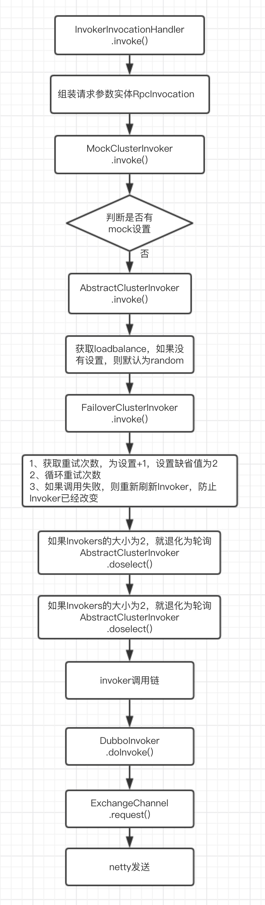

# Dubbo消费端初始化和消费过程

### 一、客户端初始化过程

#### 1、初始化入口

入口说明见服务发布过程，客户端从ReferenceBean开始

#### 2、消费端启动流程

**启动过程：**

1、Spring实例化`ReferenceBean`，并调用`ReferenceConfig`获取服务代理对象。
2、如果代理对象存在，直接结束。否则创建实例对象
3、获取注册中心ZookeeperRegistry
4、创建注册目录服务RegistryDirectory
5、监听注册中心
6、组装的消费者请求相应的Invoker：`MockClusterInvoker(FailoverClusterInvoker(InvokerDelegete(ProtocolFilterWrapper.Invoker(ConsumerContextFilter(ListenerInvokerWrapper(DubboInvoker()))))))`
7、`ProxyFactory`创建实例对象代理`Proxy`，并设置请求处理类`InvokerInvocationHandler(Invoker)`。

RegistryDirectory:
1、整合多个Invoker
2、监听注册中心变化，刷新本地List<Invoker>

Cluster:

#### 3、消费端消费过程

请求的处理类为`InvokerInvocationHandler`，请求处理为一个链式处理处理过程：
`MockClusterInvoker` -> `AbstractClusterInvoker` -> `FailoverClusterInvoker` -> `InvokerWrapper` -> `ProtocolFilterWrapper.Invoker` -> `ConsumerContextFilter` -> `FutureFilter` -> `MonitorFilter` -> `ListenerInvokerWrapper` -> `DubboInvoker`

1、`InvokerInvocationHandler`内组装请求对象`RpcInvocation`实例，传递给`MockClusterInvoker`。
2、`MockClusterInvoker`判断是否存在mock设置。如果存在，则失败后调用mock实例。传递到`AbstractClusterInvoker`。
3、`AbstractClusterInvoker`内获取负载算法，dubbo内置四种loadbalance算法：`RandomLoadBalance`（默认）、`RoundRobinLoadBalance`、`LeastActiveLoadBalance`、`ConsistentHashLoadBalance`。传递给`FailoverClusterInvoker`。
4、`FailoverClusterInvoker`内通过负载均衡算法获取选择执行器`Invoker`，并调用，即进入`ProtocolFilterWrapper.Invoker`。
5、`ProtocolFilterWrapper.Invoker`内，调用Filter扩展点的`@Active(group={Constants.CONSUMER})`的Filter类进行过滤操作，最后进入`DubboInvoker`内
6、`DubboInvoker`内，调用传输层`ExchangeClient`发送消息到服务端，底层使用netty框架

