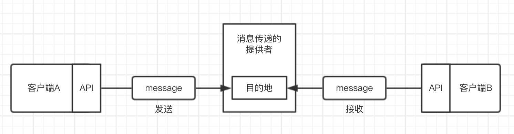

# JMS（Java Message Service）

Java消息服务，是Java平台中关于面向消息中间件的API，用于两个应用程序或者分布式系统中发送消息，进行异步通信。

JMS是一个与具体平台无关的API，绝大多数MOM（Message Oriented Middleware，面向消息中间件）提供商都会JMS提供了支持。

MOM是面向消息的中间件，使用消息传递提供者来协调消息传递操作。客户端使用API调用，把消息传递到有提供者管理的目的地。在消息发送之后，客户端会继续执行其他工作，并且在接收方收到这条消息确认之前，提供者一直保留该消息。

MOM特点：
1、消息异步接收，发送者不需要等待接收者响应
2、消息可靠接收，确保消息在中间件的可靠保存。只有接收者收到后才能删除消息

JMS规范最初被设计就是使Java可以访问现有的MOM系统，解决了不同消息中间件之间协作问题。引入该规范后，被许多MOM厂商采用并凭借自身的功能实现异步消息传送系统。

JMS规范设计时，保留了消息传送的精髓：
1、不同消息传送模式或域，例如：发布/订阅消息传送、点对点消息传送
2、提供同步接收和异步接收消息的工具
3、对可靠性消息传递的支持
4、常见的消息格式。例如：流、文本、字节

JMS体系结构

JMS的基本功能

1、消息传递域

**点对点（Point to Point）（Queue）**：每个消息只有一个消费者；消息的生产者和消费者没有时间上的相关性。无论消费者在消费者发送消息的时候是否处于生产状态，消费者都能提取到消息。

**发布/订阅（Publish / Subscribe）（Topic）**：每个消息都有多个消费者；消息的生产者和消费者有时间上的相关性。订阅一个主题后，消费者只能消费在其订阅后发布的消息。
> JMS规范允许消费者创建持久订阅，这在一定程度上减小了时间的相关性。持久订阅允许消费者消费在他处于未激活状态时发送的消息。（持久订阅之前的消息依然收不到）

2、消息的数据结构

消息头：

消息体：

消息的属性：

3、消息可靠性

4、消息持久化