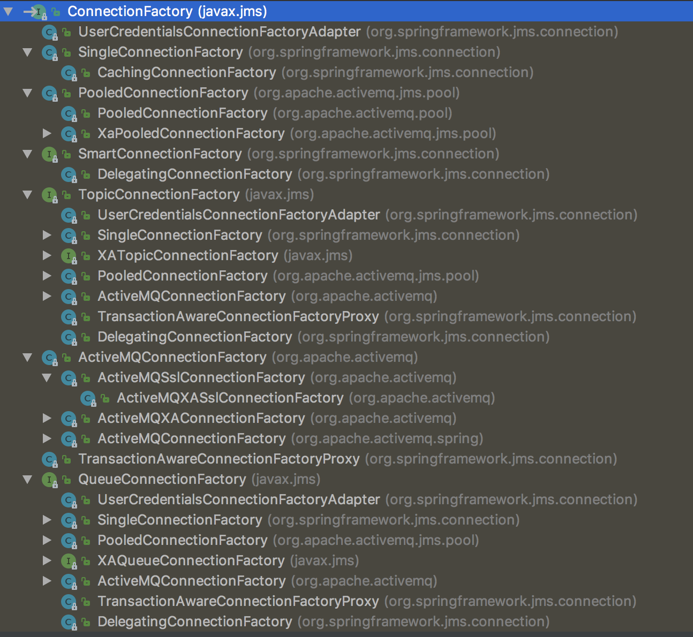

# ActiveMQ使用方式

### 一、创建连接
```java
ConnectionFactory connectionFactory = new ActiveMQConnectionFactory("tcp://192.168.56.2:61616");
Connection connection = connectionFactory.createConnection();
connection.start();
```
> 其中`tcp://192.168.56.2:61616`为ActiveMQ服务地址，TCP协议，默认端口为`61616`

首先需要创建`ConnectionFactory`（连接工厂），由连接工厂创建`Connection`连接并启动。

连接工厂有多种实现：



### 二、创建Session（会话）
```java
Session session = connection.createSession(Boolean.TRUE, Session.AUTO_ACKNOWLEDGE);
```

创建Session方法需要传入两个参数，如下：
```java
public interface Connection {
    Session createSession(boolean transacted, int acknowledgeMode)
        throws JMSException;
    ...
}
```

transacted：创建的Session所做的操作是否为事务操作。如果设置为`true`，则代表为事务操作；设置为`false`则不是事务操作。

acknowledgeMode：消息的应答模式。有三种模式：`Session.AUTO_ACKNOWLEDGE`（自动确认）、`Session.CLIENT_ACKNOWLEDGE`（客户端确认）、`Session.DUPS_OK_ACKNOWLEDGE`（延迟确认）。

消息的事务和确认模式是==JMS规范中消息可靠性==的一种保证机制。

JMS的`Session`提供了`commit()`和`rollback()`两个方法。事务的提交意味着生产的所有消息被发送，消费的所有消息被确认；事务的回滚意味着生产的所有消息被销毁，消费的所有消息被恢复并重新提交（除非消息已经过期）。事务性的会话总是牵扯到事务处理处理中，`commit()`或`rollback()`被执行就意味着一个事务的结束。关闭事务性会话将回滚其中的事务。

**事务性会话**
在事务状态下进行发送操作，消息并未被真正投递到消息中间件中，只有等执行`session.commit()`操作之后，消息才会被发送到消息中间件，再转发到适当的消费者进行处理。如果调用`session.rollback()`操作，则当前事务内所有的消息会被销毁，不会被发送的消息中间件中。事务与非事务是通过创建Session（会话）时`transacted`参数设置的，`true`为事务性会话，`false`为非事务性会话。在事务性会话中，消息的确认是自动的，也就是调用`session.commit()`操作之后，消息会自动确认。
> 必须保证发送端和消费端都是事务性会话

**非事务性会话**
消息何时被确认取决于创建会话时所设置的应答模式。有三种模式：
* `Session.AUTO_ACKNOWLEDGE`（自动确认模式）：当消费端从`receive()`返回时，或者`MessageListener.onMessage()`返回时，会话自动确认消费端收到消息。
* `Session.CLIENT_ACKNOWLEDGE`（客户端确认模式）：消费端通过调用`Message.acknowledge()`来确认消息。在这种模式下，消息确认是在会话层面上的，确认一个被消费的消息将自动确认所以之前已经被会话消费的消息。
* `Session.DUPS_OK_ACKNOWLEDGE`（延迟确认模式）：指定消息提供者在消息消费者没有确认发送重新发送消息，这种模式下不在乎消费者是否收到重复消息。

### 三、创建Destination（目的地）
```java
// 点对点方式（point-to-point）
Destination queueDestination = session.createQueue("demo1");
// 发布/订阅（publish/subscribe ）
Destination topicDestination = session.createTopic("demo1");
```

JMS定义了两种操作域：点对点方式、发布/订阅。类似于QQ聊天单聊和群聊，分别对应上面两种设置。

**点对点方式：**
1、每个消息只有一个消费者。
2、消息的生产者和消费者没有时间上的相关性。无论消费者在生产者发送消息的时候是否处于运行状态，消费者都可以提取消息。

**发布/订阅：**
1、每个消息可以有多个消费者。
2、消息的生产者和消费者具有时间的相关性。订阅一个主题的消费者只能消费自它订阅之后的消息。

> JMS规范允许消费者进行持久化订阅，即允许消费者在其持久化订阅后，消费在它未激活状态时发送的消息。具体操作见下面介绍。

### 三、创建生产者或者消费者

#### 1、生产者发送消息

##### 1）创建需要发送的消息
```java
// 创建文本消息
TextMessage textMessage = session.createTextMessage();
textMessage.setText("我是生产者");
```

**消息类型**
JMS规范定义了五种消息：`TextMessage`、`StreamMessage`、`MapMessage`、`ObjectMessage`、`BytesMessage`。
* `TextMessage`：java.lang.String对象，如xml文件内容
* `StreamMessage`：Java中的输入输出流
* `MapMessage`：键值对key/value集合，其中key为String对象，value可以为Java任何基本类型
* `ObjectMessage`：Java中可序列化的对象
* `BytesMessage`：字节流

**消息结构组成**
JMS消息由消息头、属性、消息体组成。
1、消息头：包含该消息的识别信息和路由信息

```java
// 设置消息发送的目的地，Queue或者Topic
message.setJMSDestination(destination);
// 设置消息的存储方式，持久化还是非持久化
message.setJMSDeliveryMode(DeliveryMode.PERSISTENT);
// 设置消息的优先级，范围[0-9]，缺省值为4（JMS provider不一定保证按照优先级顺序提交消息）
message.setJMSPriority(Message.DEFAULT_PRIORITY);
// 唯一识别每个消息的标示
message.setJMSMessageID(String.valueOf(UUID.randomUUID()));
```

2、属性：按类型可以分为应用设置的属性、标准属性和消息中间件定义的属性

1）应用设置的属性

```java
// 生产者发送消息时设置
message.setStringProperty("type", "task");

// 消费者获取方式
Enumeration propertyNames = message.getPropertyNames();
while (propertyNames.hasMoreElements()) {
    String name = String.valueOf(propertyNames.nextElement());
    if ("type".equals(name)) {
        System.out.println(message.getStringProperty(name));
    }
}
```

2）JMS定义的属性
```java
// 返回所有连接支持的JMSX属性的名字（使用“JMSX”作为属性名的前缀）
Enumeration names = connection.getMetaData().getJMSXPropertyNames();
while (names.hasMoreElements()) {
    String name = String.valueOf(names.nextElement());
    System.out.println(name);
}
```

3）JMS provider特定的属性


##### 2）创建消息生产者并发送消息
```java
// 获取生产者，并发送文本消息
MessageProducer producer = session.createProducer(destination);
producer.send(textMessage);
// 如果是事务会话，则需要提交（非事务操作不需要，直接提交）
session.commit();
```

**消息的存储方式：**

消息存储方式有两种，持久化和非持久化（默认为非持久化），是通过设置消息生产者的`deliveryMode`属性。
```java
// 持久化
producer.setDeliveryMode(DeliveryMode.PERSISTENT);
// 非持久化（默认，一般可不设置）
producer.setDeliveryMode(DeliveryMode.NON_PERSISTENT);
```
非持久化的消息被存储在内存中，当消息中间件停止后，消息会被销毁；持久化的消息会被存储到指定的介质中，例如：文件、数据库等，在消息中间件重启后会被恢复。

#### 2、消费者消费消息

##### 1）创建消费者
```java
MessageConsumer consumer = session.createConsumer(destination);
```

##### 2）接收消息
接收消息方式有两种：同步接收、异步接收。

**同步接收（阻塞方法）**
```java
Message message = consumer.receive();
// 接收消息需要判断类型，调用具体方法。这里以TextMessage为例
if (message instanceof TextMessage) {
    System.out.println(((TextMessage) message).getText());
}
```

**异步接收：监听`MessageListener`**
```java
onsumer.setMessageListener(new MessageListener() {
    @Override
    public void onMessage(Message message) {
        if (message instanceof TextMessage) {
            try {
                System.out.println(((TextMessage) message).getText());
            } catch (JMSException e) {
                e.printStackTrace();
            }
            try {
                session.commit();
            } catch (JMSException e) {
                e.printStackTrace();
            }
        }
    }
});
```

**确认消息**
事务性会话在提交后会自动确认消息。

非事务性会话中，在客户端确认模式下，需要调用消息的确认方法来确认消息
```java
message.acknowledge();
```

##### 3）持久化订阅
JMS规范支持持久性订阅来减少发布/订阅模式下消息的生产者和消费者之间的时间相关性。具体设置如下：

1、给Connection（连接）设置`clientId`
```java
connection.setClientID("client-01");
```

2、创建目的地时使用`Topic`接口，而非`Destination`接口
```java
Topic topicDestination = session.createTopic("demo1");
```

3、采用`Session.createDurableSubscriber(Topic topic, String name)`创建消费者，其中`name`为当前连接的`clientId`
```java
TopicSubscriber consumer = session.createDurableSubscriber(topic, "client-01");
```

接收消息方式和非持久性订阅相同，详情见上面接收消息。
