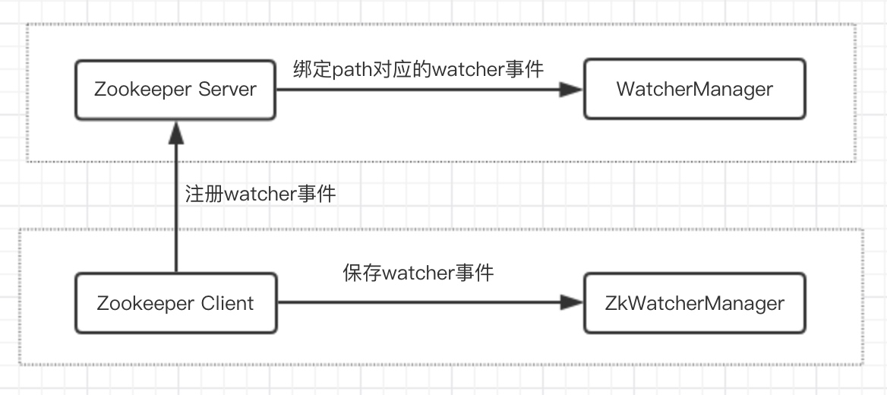
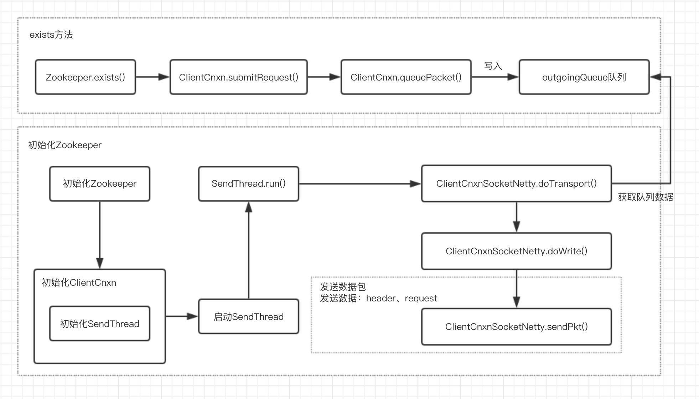
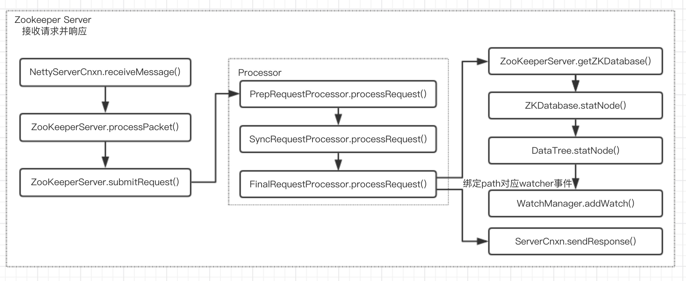
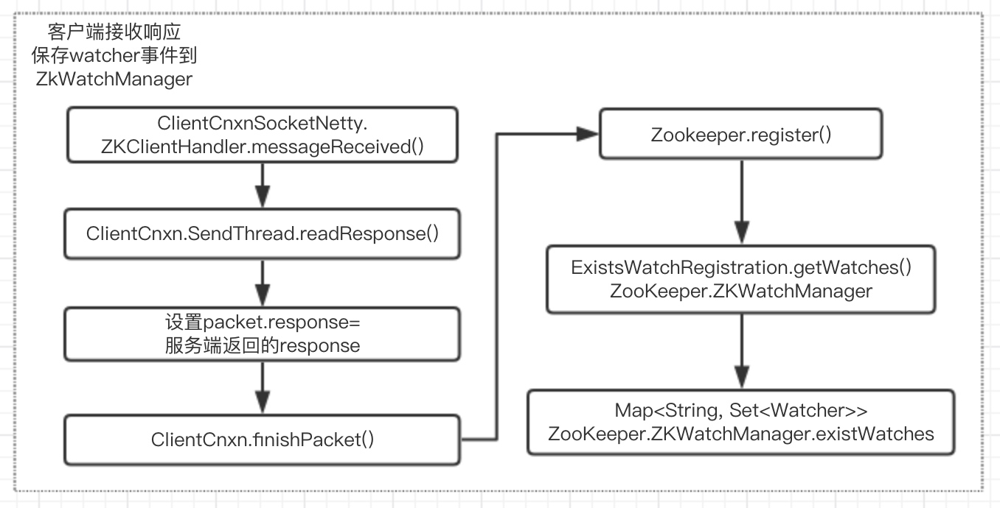

# zk的Watcher机制

#### 3、事件机制
1）watcher机制特性

当数据发生变化时，zookeeper会产生一个watcher事件，并且发送给客户端。但是客户端只能获取一次通知，如果后续这个节点再次发送变化时，那么之前设置watcher的客户端不会再次收到通知消息（watcher事件是一次性的）。如果希望一直收到通知，可以通过循环监听。

2）节点注册事件方式

getData、exists、getChildren。只有事务操作才能触发事件，create、delete、update。

```java
public class WatcherDemo {

    public static void main(String[] args) {
        final CountDownLatch countDownLatch = new CountDownLatch(1);
        String connectString = "192.168.56.2:2181,192.168.56.3:2181,192.168.56.4:2181";
        final ZooKeeper zooKeeper;
        try {
            zooKeeper = new ZooKeeper(connectString, 4000, new Watcher() {

                public void process(WatchedEvent event) {
                    if (Event.KeeperState.SyncConnected == event.getState())  {
                        countDownLatch.countDown();
                    }
                    System.out.println(event.getType() + " -> " + event.getPath());
                }
            });
            countDownLatch.await();
            zooKeeper.create("/ys-persistent", "0".getBytes(), ZooDefs.Ids.OPEN_ACL_UNSAFE, CreateMode.PERSISTENT);

            // watch参数设置为true代表使用默认（初始化ZooKeeper客户端时设置的watcher事件）
            zooKeeper.exists("/ys-persistent", true);
            Stat stat = zooKeeper.exists("/ys-persistent", new Watcher() {
                public void process(WatchedEvent event) {
                    System.out.println(event.getType() + " -> " + event.getPath());
                    try {
                        // 设置循环监听
                        zooKeeper.exists("/ys-persistent", true);
                    } catch (KeeperException e) {
                        e.printStackTrace();
                    } catch (InterruptedException e) {
                        e.printStackTrace();
                    }
                }
            });
            stat = zooKeeper.setData("/ys-persistent", "1".getBytes(),stat.getVersion());
            zooKeeper.delete("/ys-persistent", stat.getVersion());
        } catch (IOException e) {
            e.printStackTrace();
        } catch (InterruptedException e) {
            e.printStackTrace();
        } catch (KeeperException e) {
            e.printStackTrace();
        }

    }
}
```

3）事件类型
```java
public enum EventType {
    None (-1),  // 客户端连接状态发生变化
    NodeCreated (1), // 节点创建事件
    NodeDeleted (2), // 节点删除事件
    NodeDataChanged (3), // 节点修改事件
    NodeChildrenChanged (4); // 子节点创建、删除事件
    ...
}
```

**操作对应事件：**

|  | "/ys"监听 | "/ys/xx"监听  |
| --- | --- | --- |
| create("/ys") | NodeCreate(exists/getData) | 无 |
| delete("/ys") | NodeDeleted(exists/getData) | 无 |
| setData("/ys") | NodeDataChange(exists/getData) | 无 |
| create("/ys/xx") | NodeChildrenChanged(getChildren) | NodeCreate(exists/getData) |
| delete("/ys/xx") | NodeChildrenChanged(getChildren) | NodeDeleted(exists/getData) |
| setData("/ys/xx") | 无 | NodeDataChanage(exists/getData) |

### 三、深入Watcher机制

客户端向zookeeper服务端注册watcher事件，客户端自己保存事件到ZkWatcherManager中，服务端绑定path对应的watcher事件到WatcherManager中


#### 1、客户端注册事件及发送请求数据包


#### 2、服务端绑定watcher事件及返回响应



其中`RequestProcessor`采用了异步方式处理请求，首先加入`LinkedBlockingQueue`队列，然后通过线程去消费队列信息。同时还采用了Pipe设计思想，分步处理请求，`PrepRequestProcessor` -> `SyncRequestProcessor` -> `FinalRequestProcessor`

#### 3、客户端接收响应



#### 4、客户端触发事务操作`setData`

#### 5、服务端触发watcher事件

#### 6、客户端接收响应，并回调设置的watcher事件