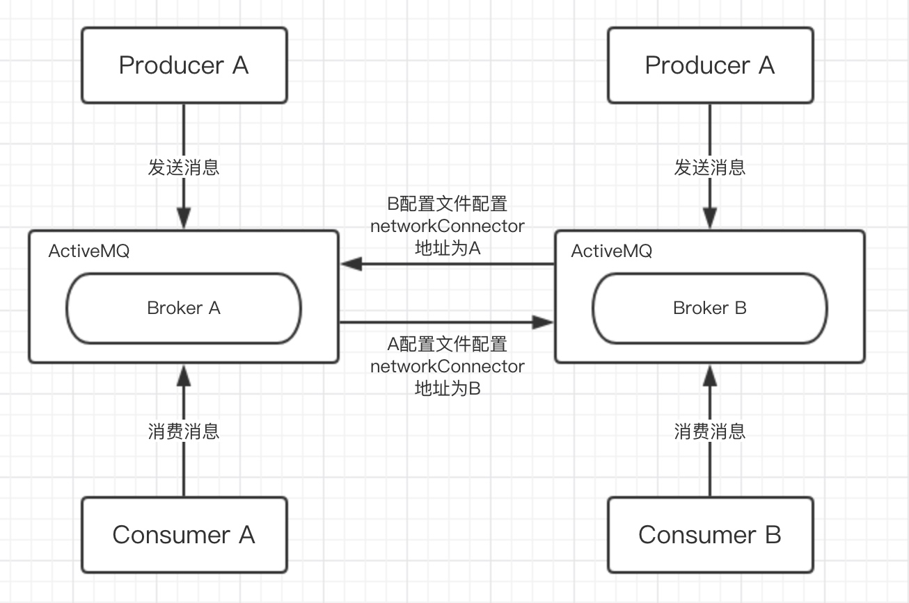
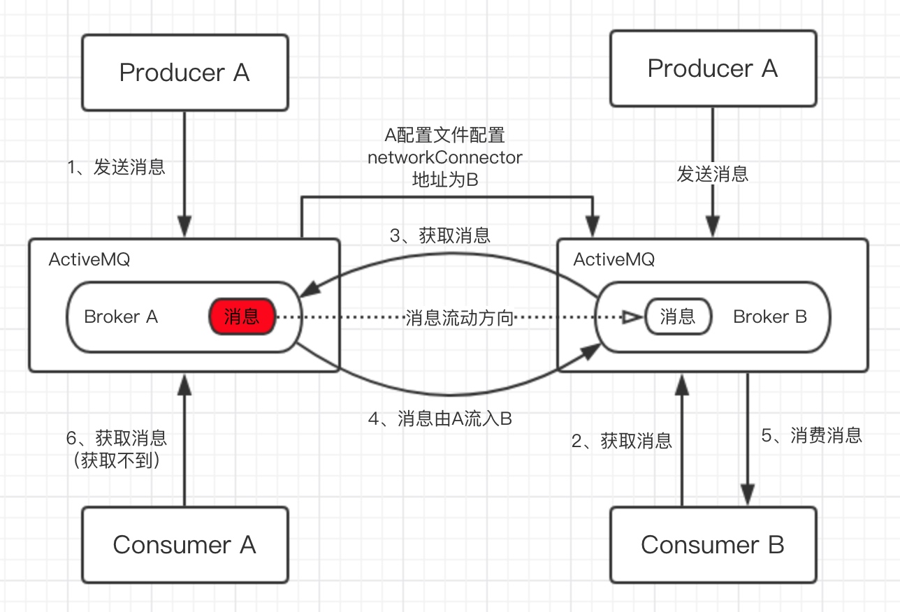

# ActiveMQ高可用高性能方案

### 一、高可用和高性能设计思想
解决ActiveMQ的高可用和高性能的思想就是：提供一个稳定的数据不丢失情况下确保ActiveMQ集群的吞吐量达到一个比较优的一个条件，而且确保ActiveMQ集群处理单条消息时间更短，还需要ActiveMQ集群能够容纳更多的客户端，提供一个稳定的连接。

### 二、解决手段

#### 1、静态网络桥接

##### 1.1、配置方式


**服务A配置网络桥接并uri指向服务B**：Consumer B（消费端）连接服务B，但是可以消费服务A的消息。Consumer A无法消费服务B的消息。

> 配置桥接是单向的，如需双向则要每个服务配置文件都要配置

具体配置如下：在conf/activemq.xml内，`broker`节点下配置`networkConnector`节点，可配置多个。
```xml
<broker xmlns="http://activemq.apache.org/schema/core" brokerName="localhost" dataDirectory="${activemq.data}">
    <networkConnectors>
        <networkConnector uri="static://(tcp://192.168.56.2:61616,tcp://192.168.56.2:61616)" />
    </networkConnectors>
</broker>
```

##### 1.2、原理


**当服务A配置网络桥接并uri指向服务B情况下**
1、`生产者A`发送消息到`服务A`
1、`消费者B`通过`服务B`获取消息。
2、`服务B`会获取`服务A`中消息，并存入自己服务中。
3、`消费者B`消费`服务B`获取的消息。

这个过程也就可以看做`消费者B`消费了`服务A`的消息。

**消息回流**
由于这种消息的流动是一次性的，当`消费者B`没有消费完`服务B`拿到的消息时，`消费者A`也是无法消费剩下的消息的。为了解决这个问题，ActiveMQ在5.6版本开始，在`destinationPoliy`上新增一个属性`replayWhenNoConsumers`，这个属性可以解决当消息被流出之后未被消费的消息回流回原始的broker。同时为了防止回流回来的消息被认为是重复消息而不被分发，需要配置`enableAuit`，设置为`false`。

```xml
<policyEntry topic=">" enableAuit="false">
    <networkBridgeFilterFactory>
        <conditionalNetworkBridgeFilterFactory replayWhenNoConsumers="true"/>
    </networkBridgeFilterFactory>
</policyEntry>
```

#### 2、基于Zookeeper+leveDB的HA集群

> 官方不推荐使用LeveDB，由于精力有限，官方不维护。推荐KahaDB、JDBC方式

需要三台ActiveMQ服务组成一个Master、两个Slave集群

配置：
directory：表示LevelDB所在的主工作目录
replicas:表示总的节点数。比如我们的及群众有3个节点，且最多允许一个节点出现故障，那么这个值可以设置为2，也可以设置为3. 因为计算公式为 (replicas/2)+1. 如果我们设置为4， 就表示不允许3个节点的任何一个节点出错。
bind：当当前的节点为master时，它会根据绑定好的地址和端口来进行主从复制协议
zkAddress：zk的地址
hostname：本机IP
sync：在认为消息被消费完成前，同步信息所存储的策略。

### 三、ActiveMQ优缺点

ActiveMQ采用消息推送方式，所以最适合的场景是默认消息都可以在短时间内被处理。数据量越大，查找和消息消费就会越慢，消息的挤压程度和消息的消费速度成反比。

优点：
1、容易上手
符合JMS规范，API简单，容易上手
2、可控性比较好
有较好的监控机制和界面

缺点：
1、吞吐量低
由于ActiveMQ需要建索引，导致吞吐量的下降。这是无法克服的缺点，只要使用完全符合JMS规范的消息中间件，就需要接受这个级别的TPS。
2、无分片功能
这是一个缺失的功能，JMS并没有规定消息中间件的集群、分片机制。而由于ActiveMQ是伪企业级开发设计的消息中间件，初中不是处理海量消息和高并发请求。如果一台服务器不能承受更多消息，则需要航向扩展拆分。ActiveMQ官方不提供分片机制，需要自己手动实现。

> 不适用场景：消息量巨大的场景。（由于不支持分片，当一台服务器不能处理全部消息时，需要自己开发消息分片功能）

