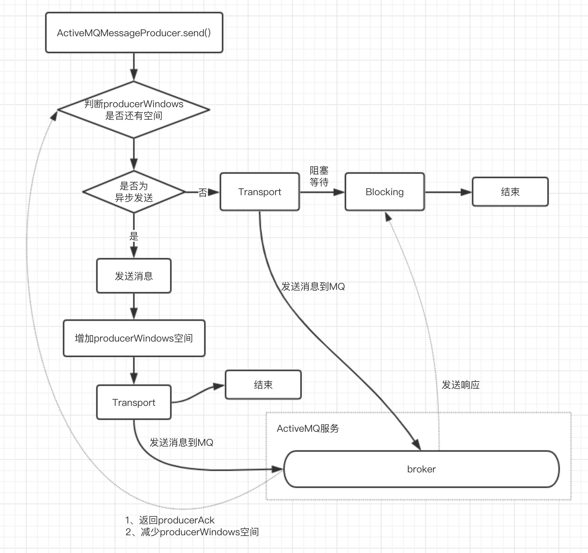

# ActiveMQ消息发送过程

### 一、消息同步发送和异步发送
ActiveMQ提供消息同步发送和异步发送到broker上。

**在同步发送过程中**，发送者发送一条消息到broker上后会阻塞等待，直到broker返回一个确认消息，表示发送的消息已经被broker处理。这个机制提供了消息的安全性保障，但是由于阻塞操作，性能会因此受到影响。

**在异步发送过程中**，发送者发送一条消息到broker上后无需等待broker的反馈，所以性能较高。但是可能会出现消息丢失的情况，所以使用异步发送的前提是在某些情况下允许消息丢失情况。

默认情况下，非持久化消息都是异步发送的，持久化消息在非事务模式下是同步发送的。

但是在开启事务的情况下，消息都是异步发送的。由于异步发送的效率相对较高，所以在发送持久化消息的时，建议开启事务会话。

除了持久化消息和非持久化消息的同步和异步特性以外，还可以通过下面三种方式开开启异步发送：
1、创建连接时，服务地址后加参数`jms.useAsyncSend`
```java
ConnectionFactory connectionFactory=new ActiveMQConnectionFactory("tcp://192.168.56.2:61616?
jms.useAsyncSend=true");
```
2、`ConnectionFactory`设置参数`useAsyncSend`
```java
((ActiveMQConnectionFactory) connectionFactory).setUseAsyncSend(true);
```
3、`Connection`设置参数`useAsyncSend`
```java
((ActiveMQConnection)connection).setUseAsyncSend(true);
```

### 二、消息发送过程


**ProducerWindowSize的含义：**
Producer每发送一次消息，统计一下发送的字节数，当自己数达到producerWindowSize值时，将会阻塞等待broker确认，之后才能发送。

主要用来约束在异步发送时producer端允许挤压的消息（尚未ACK）大小，且只对异步发送有意义。每次发送请求后，都会导致memoryUsage增加，当broker返回producerAck时，memoryUsage将会减少。

可通过一下方法设置：
1、brokerUrl设置
`tcp://host:616161?jms.producerWindowSize=1048576`
2、destination中设置，
`test-queue?producerWindowSize=1048576`

> 在`ActiveMQSession#send`内加了一个`synchronized`互斥锁，保证同一个producer的发送消息的顺序性


**Transport组装和启动过程**

在连接工厂`ActiveMQConnectionFactory`创建连接的时候创建了一个Transport，并且启动。
```java 
protected ActiveMQConnection createActiveMQConnection(String userName, String password) throws JMSException {
    if (brokerURL == null) {
        throw new ConfigurationException("brokerURL not set.");
    }
    ActiveMQConnection connection = null;
    try {
        Transport transport = createTransport();
        connection = createActiveMQConnection(transport, factoryStats);
        connection.setUserName(userName);
        connection.setPassword(password);
        configureConnection(connection);
        transport.start();
        if (clientID != null) {
            connection.setDefaultClientID(clientID);
        }
        return connection;
    } catch (JMSException e) {
        ...
    }
}

```

创建`Transport`过程

1、获取`TransportFactory`
`TransportFactory#findTransportFactory`内，根据连接URL获取scheme。在`META-INF/services/org/apache/activemq/transport/`文件夹下，以scheme为名称的文件（类似于Java SPI、Dubbo Extension）。由于我们连接时配置的协议为tcp，所以这里最终获取的是`TcpTransportFactory`。
```java
public static TransportFactory findTransportFactory(URI location) throws IOException {
    String scheme = location.getScheme();
    if (scheme == null) {
        throw new IOException("Transport not scheme specified: [" + location + "]");
    }
    TransportFactory tf = TRANSPORT_FACTORYS.get(scheme);
    if (tf == null) {
        // Try to load if from a META-INF property.
        try {
            tf = (TransportFactory)TRANSPORT_FACTORY_FINDER.newInstance(scheme);
            TRANSPORT_FACTORYS.put(scheme, tf);
        } catch (Throwable e) {
            throw IOExceptionSupport.create("Transport scheme NOT recognized: [" + scheme + "]", e);
        }
    }
    return tf;
}
```

2、通过`TcpTransportFactory`创建`TcpTransport`
```java
// TcpTransportFactory.java
public Transport doConnect(URI location) throws Exception {
    try {
        Map<String, String> options = new HashMap<String, String>(URISupport.parseParameters(location));
        if( !options.containsKey("wireFormat.host") ) {
            options.put("wireFormat.host", location.getHost());
        }
        WireFormat wf = createWireFormat(options);
        // 在 TcpTransportFactory内创建TcpTransport
        Transport transport = createTransport(location, wf);
        // 对 TcpTransport进行包装，最终形成一个调用链
        Transport rc = configure(transport, wf, options);
        IntrospectionSupport.extractProperties(options, "auto.");
        if (!options.isEmpty()) {
            throw new IllegalArgumentException("Invalid connect parameters: " + options);
        }
        return rc;
    } catch (URISyntaxException e) {
        throw IOExceptionSupport.create(e);
    }
}
```

3、对`TcpTransport`进行包装
```java
public Transport configure(Transport transport, WireFormat wf, Map options) throws Exception {
    transport = compositeConfigure(transport, wf, options);

    transport = new MutexTransport(transport);
    transport = new ResponseCorrelator(transport);

    return transport;
}
```

```java
public Transport configure(Transport transport, WireFormat wf, Map options) throws Exception {
    transport = compositeConfigure(transport, wf, options);

    transport = new MutexTransport(transport);
    transport = new ResponseCorrelator(transport);

    return transport;
}
```

```java
public Transport compositeConfigure(Transport transport, WireFormat format, Map options) {

    TcpTransport tcpTransport = transport.narrow(TcpTransport.class);
    IntrospectionSupport.setProperties(tcpTransport, options);

    Map<String, Object> socketOptions = IntrospectionSupport.extractProperties(options, "socket.");
    tcpTransport.setSocketOptions(socketOptions);

    if (tcpTransport.isTrace()) {
        try {
            transport = TransportLoggerSupport.createTransportLogger(transport, tcpTransport.getLogWriterName(), tcpTransport.isDynamicManagement(), tcpTransport.isStartLogging(), tcpTransport.getJmxPort());
        } catch (Throwable e) {
            LOG.error("Could not create TransportLogger object for: " + tcpTransport.getLogWriterName() + ", reason: " + e, e);
        }
    }

    boolean useInactivityMonitor = "true".equals(getOption(options, "useInactivityMonitor", "true"));
    if (useInactivityMonitor && isUseInactivityMonitor(transport)) {
        transport = createInactivityMonitor(transport, format);
        IntrospectionSupport.setProperties(transport, options);
    }

    // Only need the WireFormatNegotiator if using openwire
    if (format instanceof OpenWireFormat) {
        transport = new WireFormatNegotiator(transport, (OpenWireFormat)format, tcpTransport.getMinmumWireFormatVersion());
    }

    return super.compositeConfigure(transport, format, options);
}
```
最终形成的`transport`为：

ResponseCorrelator(MutexTransport(WriteTimeoutFilter(WireFormatNegotiator(InactivityMonitor(TcpTransport())))))

ResponseCorrelator：用于实现异步请求
MutexTransport：实现锁，表示同一时间只允许发送一个请求
WireFormatNegotiator：实现了客户端连接broker时，先发送协议信息，比如解析的版本号，是否使用缓存等
InactivityMonitor：用于连接成功后的心跳检查机制，客户端每10秒发送一次心跳信息，服务端每30秒读取一次心跳信息

实例化`TcpTransport`对象后，会创建socket连接用于写入到broker中
```java
public TcpTransport(WireFormat wireFormat, SocketFactory socketFactory, URI remoteLocation,
                        URI localLocation) throws UnknownHostException, IOException {
    this.wireFormat = wireFormat;
    this.socketFactory = socketFactory;
    try {
        // 创建socket连接
        this.socket = socketFactory.createSocket();
    } catch (SocketException e) {
        this.socket = null;
    }
    this.remoteLocation = remoteLocation;
    this.localLocation = localLocation;
    this.initBuffer = null;
    setDaemon(false);
}
```

**异步和同步区别：**
```java
public Object request(Object command) throws IOException {
    FutureResponse response = asyncRequest(command, null);
    return response.getResult();
}
```
同步方式发送其实也是调用异步请求，但是通过Future机制同步阻塞等待反馈。

### 三、持久化和非持久化原理
通常情况，非持久化消息存储在内存中，持久化消息存储在文件内。能够存储最大消息数设置在activemq.xml文件内`systemUsage`节点，配置了内存和磁盘的使用量。
```xml
<systemUsage>
    <systemUsage>
        <memoryUsage>
            <!-- 设置整个ActiveMQ节点的“可用内存限制”。这个值不能大于ActiveMQ本身设置的最大内存。其中percentOfJvmHeap表示百分比，占70%的堆内存 -->
            <memoryUsage percentOfJvmHeap="70" />
        </memoryUsage>
        <storeUsage>
            <!-- 表示ActiveMQ用于存储持久化消息的可用磁盘空间，limit必须设置 -->
            <storeUsage limit="100 gb"/>
        </storeUsage>
        <tempUsage>
            <!-- 一旦ActiveMQ服务节点存储达到memoryUsage最大限制后，非持久化的数据也会被存储到磁盘temp中，这是为了防止“数据洪峰”出现时，非持久化消息大量挤压导致内存耗尽的情况出现 -->
            <tempUsage limit="50 gb"/>
        </tempUsage>
    </systemUsage>
</systemUsage>
```
> 非持久化消息堆积到一定程度后，也就是内存消耗到设置的阈值后，消息会被存储到磁盘中。他与持久化消息不同的是，持久化消息在服务重启后可以恢复，而非持久化消息是不会被恢复

**ActiveMQ持久存储支持的类型：**

**1、KahaDB存储（默认存储方式）**
```xml
<persistenceAdapter>
    <kahaDB directory="${activemq.data}/kahadb"/>
</persistenceAdapter>
```
在data/kahadb目录下，会生成四个文件
* db.data：它是消息的索引文件，本质上是一个B-Tree（B树），使用B-Tree作为索引指向db-*.log里面存储的消息。
* db.redo：用来进行消息会恢复
* db-*.log：存储消息，由于消息是append到文件末尾的，所以存储相对较快。默认32M，达到阈值则会自动递增。
* lock：文件锁，表示当前获得kahadb读写权限的broker

**2、JDBC存储**
```xml
<persistenceAdapter>
    <jdbcPersistenceAdapter dataSource="#MySQL-DS" createTablesOnStartup="true" />
</persistenceAdapter>
```
`dataSource`指定的是持久化数据库的数据源，`createTablesOnStartup`指的是启动时候是否创建表，第一次启动时需要设置为`true`，之后改为`false`。
```xml
<!-- 数据源 -->
<bean id="Mysql-DS" class="org.apache.commons.dbcp.BasicDataSource" destroy-method="close">
    <property name="driverClassName" value="com.mysql.jdbc.Driver"/>
    <property name="url" value="jdbc:mysql://192.168.11.156:3306/activemq?relaxAutoCommit=true"/>
    <property name="username" value="root"/>
    <property name="password" value="root"/>
</bean>
```
> 需要依赖相应的jar包

缺点：JDBC存储在每次消息来的时候，都要对数据库进行读库和写库，对性能会有影响。

**3、JDBC Message Store With ActiveMQ Journal**
```xml
<persistenceAdapter>
    <journalPersistenceAdapterFactory dataSource="#MySQL-DS" 
            dataDirectory="activemq-data"/>
</persistenceAdapter>
```
为了解决JDBC存储带来的性能问题，ActiveMQ提供了Journal的方式，即高速缓存写入的技术。当消费端的消费能力和生产者的生产能力相当时，效率会提高。例如：当生产者发送1000条消息后，会将消息先写入到journal文件中，然后再批量同步到数据库内。消费者消费了journal文件内800条消息，那么journal只会将剩下的200条批量同步到数据库中。

**4、LevelDB存储**
```xml
<persistenceAdapter>
    <levelDB directory="activemq-data"/>
</persistenceAdapter>
```
LevelDB的性能优于KahaDB，但是官方已经不维护，推荐使用KahaDB


**5、Memory存储**
```xml
<broker persistent="false" ...>
    ...
</broker>
```
在`broker`节点设置`persistent`为`false`，消息将使用内存存储。
