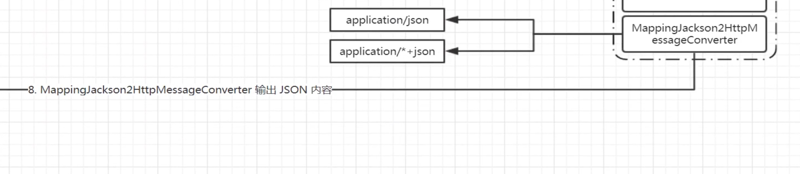

# Spring Webflux

### Reactive编程模型（Webflux原理）
Reactive，
* 非阻塞（同步/异步）
* 响应式（有数据变化时发生响应，为变化做反应）
* 观察者模式变种

与迭代器模式相似，迭代器是拉的模式（数据已经准备好，主动去拉取），Reactive是推的模式（数据准备好之后推送过来）。

Reactive不一定快，反而会更慢

Java并发编程的模型
* 非阻塞-同步
* 非阻塞-异步

Reactor认为：
* Callbacks是解决非阻塞的方案，但是他们之间很难组合，并且快速的将代码引导至"Callback Hell"的不归路
* Futures相对Callbacks相对好一点，但是也很难组合，不过CompletableFuture能够提升这方面的不足

Webflux的使用场景：长期异步执行，一旦提交，慢慢操作。

Spring Reactive推出来的意义：抛弃Servlet

> 流式编程

> Spring的事件， 发布和广播都是同步非阻塞（回调）

> 同步异步其实就是需不需要当时返回

> CompletionService
CompleableFuture

> join等待线程结束

> Flux.just()
.subscribeOn(Schedulers.elasic())
.subscribeOn(Schedulers.parallel())
.block();
.subscribe();

### Webflux的运用

异常处理：
* ExceptionHandler（Spring Boot可能没用）
* HandlerInterceptor（异常最好在这里处理）`org.springframework.web.servlet.HandlerInterceptor#afterCompletion`

Spring MVC REST 处理流程

Spring MVC REST 内容协商处理流程

