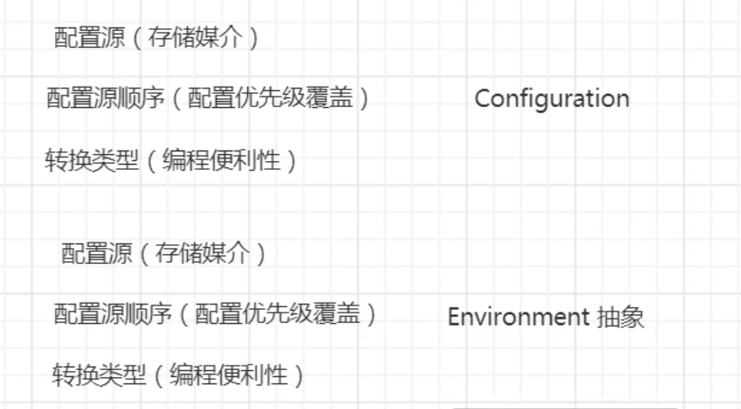

# Spring Cloud Config（配置管理）

国内知名项目
百度：DisConf
携程：Apollo
阿里：Nacos

国外的开源项目
Spring Cloud Config
Netfix Archaius
Apache Zookeeper

客户端

多配置文件
* httpClient自行读取，文本 -> properties
* Apache Commons Configuration
    * 提供了大多数常见类型的转换

    

`ConfigFileApplicationListener`

