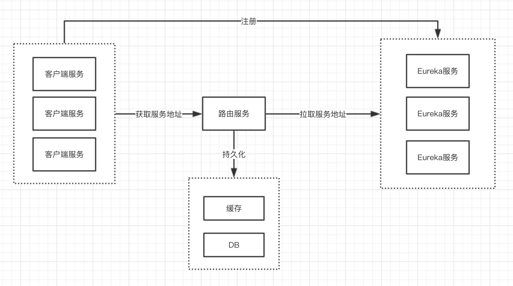

# Netflix Eureka（服务发现）

### 一、服务配置
1、增加maven依赖
```xml
<dependency>
    <groupId>org.springframework.cloud</groupId>
    <artifactId>spring-cloud-starter-netflix-eureka-server</artifactId>
</dependency>
```

2、application.properties
```properties
spring.application.name=eureka-server
server.port=9090
# 取消服务器自我注册，高可用时放开
eureka.client.register-with-eureka=false
# 注册中心的服务器，，高可用时放开
eureka.client.fetch-registry=false
eureka.client.serviceUrl.defaultZone=http://localhost:9090/eureka
```

高可用配置（相互复制）：
Eureka服务一：
```properties
spring.application.name=eureka-server
server.port=9090
# 取消服务器自我注册，高可用时放开
eureka.client.register-with-eureka=true
# 注册中心的服务器，，高可用时放开
eureka.client.fetch-registry=true
eureka.client.serviceUrl.defaultZone=http://localhost:9091/eureka
```
Eureka服务二：
```properties
spring.application.name=eureka-server
server.port=9091
# 取消服务器自我注册，高可用时放开
eureka.client.register-with-eureka=true
# 注册中心的服务器，，高可用时放开
eureka.client.fetch-registry=true
eureka.client.serviceUrl.defaultZone=http://localhost:9090/eureka
```


3、Eureka服务器引导类
```java
@SpringBootApplication
@EnableEurekaServer
public class SpringCloudEurekaApplication {

    public static void main(String[] args) {
        SpringApplication.run(SpringCloudEurekaApplication.class, args);
    }
}
```

## 二、客户端使用
1、引入依赖
```xml
<dependency>
    <groupId>org.springframework.cloud</groupId>
    <artifactId>spring-cloud-starter-netflix-eureka-client</artifactId>
</dependency>
```

2、application.properties
```properties
spring.application.name=eureka-client
server.port=8083
eureka.client.serviceUrl.defaultZone=http://localhost:9090/eureka,http://localhost:9091/eureka
```
客户端服务注册到Eureka服务器，以`spring.application.name`为key
通过`eureka.client.serviceUrl.defaultZone`配置Eureka服务地址，多个地址以`,`号隔开

### 三、Eureka理解
1、Eureka是拉的模式，客户端需要去拉取
2、Eureka 实例ID改变后，Eureka可能会出现两个服务地址有两个实例，会影响负载均衡
3、内存型的，客户端实例过多，可能引起Eureka服务不稳定，可以在Eureka服务和客户端服务之间增加一层路由，减少从Eureka服务器上拉取。


