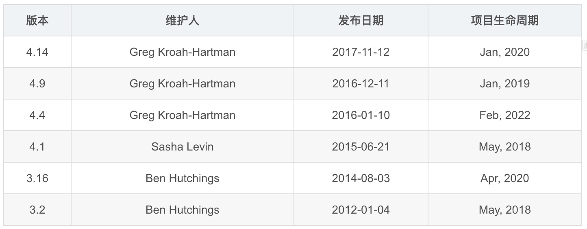

# 升级CentOS内核

[升级 CentOS 内核参考资料 1](https://www.howtoforge.com/tutorial/how-to-upgrade-kernel-in-centos-7-server/) 
[升级 CentOS 内核参考资料 2](https://www.jianshu.com/p/fdf6bb6c5b9c) 
[通过 /proc 虚拟文件系统读取或配置内核](https://www.ibm.com/developerworks/cn/linux/l-proc.html) 
[Linux 内核官网](https://www.kernel.org/) 
[CentOS 官网](https://www.centos.org/)

1. 关于 Linux 内核
Linux 内核分两种：官方内核（通常是内核开发人员用）和各大 Linux 发行版内核（一般用户常用）。

1.1 官方内核
在使用 Docker 时，发现其对 Linux 内核版本的最低要求是 3.10（这也刚好是 CentOS 7.2 的内核版本），但是在这个版本上有部分功能无法实现。目前 Linux 内核已经发布到 4.X（可以随时在 Linux 内核官网 查看当前版本），为了使用最新版本的内核，只好在安装 CentOS 7 后对内核进行升级。

当然，内核也不能选最新的，防止有尚未发现的 BUG。而且为了减少以后停止维护带来的麻烦，最好安装长期支持版本。各个版本的支持时间在 这个页面 查看。每个版本可能有四种类型，概述如下：

Prepatch：Prepatch 或 “RC” 内核是主要的内核预发行版本，主要针对内核开发人员和 Linux 爱好者。必须从源代码进行编译，并且通常包含必须在可以放入稳定版本之前进行测试的新功能。Prepatch 内核由 Linus Torvalds 维护和发布。
Mainline：Mainline 主线树由 Linus Torvalds 维护。这个版本的内核会引入所有新功能。新的 Mainline 内核每 2-3 个月发布一次。
Stable：每个主线内核被发布后，即被认为是“stable”。任何对 stable 内核的 BUG 修复都会从 Mainline 主线树中回溯并由指定的 stable 内核维护人员使用。 在下一个主线内核可用之前，通常只有几个 BUG 修复内核版本 - 除非它被指定为“longterm maintenance kernel（长期维护内核）”。stable 内核更新按需发布，通常每月 2-3 次。
Longterm：通常会提供几个“longterm maintenance”内核版本，用于修复旧版内核的 BUG。这些内核只会修复重大 BUG，并且不会频繁发布版本。
Longterm release 的内核：



1.2 各大 Linux 发行版内核
一般来说，只有从 kernel.org 下载并编译安装的内核才是官方内核。 
大多数 Linux 发行版提供自行维护的内核，可以通过 yum 或 rpm 等包管理系统升级。这些内核可能不再和 Linux 内核官方开发维护人员有关系了。通过这个由各大 Linux 发行版支持的仓库升级内核，通常来说更简单可靠，但是可选择的内核版本也更少。

使用 uname -r 区分你用的是官方内核还是 Linux 发行版内核，横线后面有任何东西都表示这不是官方内核：

```shell
# uname -r
3.10.0-514.26.2.el7.x86_64
```

2. 查看当前的内核版本
2.1 概述
Linux 只表示内核。各大 Linux 发行版（RedHat、Ubuntu、CentOS 等）在内核基础上集成了其他的一系列软件，按照各自的版本规则发布。例如 CentOS 7.2 中，通过 uname -r 查看内核版本时，会看到 3.10.0-514.26.2.el7.x86_64，表示对应的 Linux 内核版本是 3.10。

2.2 常用的查看内核信息的命令
2.2.1 uname
打印指定的系统信息。不带参数时，默认使用 -s 参数。 
参数： 
-a, –all：按照下面的顺序打印所有信息，如果 -p 和 -i 未知时排除掉。 
-s, –kernel-name：打印内核名字，一般就是 Linux。 
-n, –nodename：打印网络节点的主机名。 
-r, –kernel-release：打印内核发行版的版本。常用。3.10.0-514.26.2.el7.x86_64 
-v, –kernel-version：打印内核的版本。#1 SMP Tue Jul 4 15:04:05 UTC 2017 
-m, –machine：打印机器硬件名。 
-p, –processor：打印处理器名字或“unknown”。 
-i, –hardware-platform：打印硬件平台或“unknown”。 
-o, –operating-system：打印操作系统。 
–help：显示这个帮助并退出。 
–version：显示这版本信息并退出。

示例：
```
# uname -r
3.10.0-514.26.2.el7.x86_64
# uname -a
Linux VM_139_74_centos 3.10.0-514.26.2.el7.x86_64 #1 SMP Tue Jul 4 15:04:05 UTC 2017 x86_64 x86_64 x86_64 GNU/Linux
# cat /etc/redhat-release 
CentOS Linux release 7.2.1511 (Core) 
```

2.2.2 /proc 虚拟文件系统
内核空间和用户空间通过 /proc 虚拟文件系统可以通信。 
/proc 目录中包含一些目录和虚拟文件，这些虚拟文件可以向用户呈现内核信息或者从用户空间向内核发送信息。 
常用文件：

cpuinfo：标识了处理器的类型和速度
pci：显示在 PCI 总线上找到的设备
modules：当前加载到内核中的模块
version：系统版本及内核版本
示例：
```
# cat /proc/version 
Linux version 3.10.0-514.26.2.el7.x86_64 (builder@kbuilder.dev.centos.org) (gcc version 4.8.5 20150623 (Red Hat 4.8.5-11) (GCC) ) #1 SMP Tue Jul 4 15:04:05 UTC 2017
```

3. 备份数据
4. 升级内核
记得首先更新仓库：
```
yum -y update
```
-y 选项可以在每次需要确认时，自动使用 yes，节省时间。

4.1 启用 ELRepo 仓库
ELRepo 仓库是基于社区的用于企业级 Linux 仓库，提供对 RedHat Enterprise (RHEL) 和 其他基于 RHEL的 Linux 发行版（CentOS、Scientific、Fedora 等）的支持。 
ELRepo 聚焦于和硬件相关的软件包，包括文件系统驱动、显卡驱动、网络驱动、声卡驱动和摄像头驱动等。

启用 ELRepo 仓库：
```
# rpm --import https://www.elrepo.org/RPM-GPG-KEY-elrepo.org
# rpm -Uvh http://www.elrepo.org/elrepo-release-7.0-2.el7.elrepo.noarch.rpm
```

4.2 查看可用的系统内核包:
可以看到，只有 4.4 和 4.15 两个版本可以使用：

```
# yum --disablerepo="*" --enablerepo="elrepo-kernel" list available
Loaded plugins: fastestmirror, langpacks
elrepo-kernel                                                   | 2.9 kB  00:00:00     
elrepo-kernel/primary_db                                        | 1.7 MB  00:00:02     
Determining fastest mirrors
* elrepo-kernel: elrepo.org
Available Packages
kernel-lt.x86_64                           4.4.118-1.el7.elrepo            elrepo-kernel
kernel-lt-devel.x86_64                     4.4.118-1.el7.elrepo            elrepo-kernel
kernel-lt-doc.noarch                       4.4.118-1.el7.elrepo            elrepo-kernel
kernel-lt-headers.x86_64                   4.4.118-1.el7.elrepo            elrepo-kernel
kernel-lt-tools.x86_64                     4.4.118-1.el7.elrepo            elrepo-kernel
kernel-lt-tools-libs.x86_64                4.4.118-1.el7.elrepo            elrepo-kernel
kernel-lt-tools-libs-devel.x86_64          4.4.118-1.el7.elrepo            elrepo-kernel
kernel-ml.x86_64                           4.15.6-1.el7.elrepo             elrepo-kernel
kernel-ml-devel.x86_64                     4.15.6-1.el7.elrepo             elrepo-kernel
kernel-ml-doc.noarch                       4.15.6-1.el7.elrepo             elrepo-kernel
kernel-ml-headers.x86_64                   4.15.6-1.el7.elrepo             elrepo-kernel
kernel-ml-tools.x86_64                     4.15.6-1.el7.elrepo             elrepo-kernel
kernel-ml-tools-libs.x86_64                4.15.6-1.el7.elrepo             elrepo-kernel
kernel-ml-tools-libs-devel.x86_64          4.15.6-1.el7.elrepo             elrepo-kernel
perf.x86_64                                4.15.6-1.el7.elrepo             elrepo-kernel
python-perf.x86_64      
```

4.3 安装最新内核:
```
# yum --enablerepo=elrepo-kernel install kernel-ml
```
--enablerepo 选项开启 CentOS 系统上的指定仓库。默认开启的是 elrepo，这里用 elrepo-kernel 替换。

5. 设置 grub2
内核安装好后，需要设置为默认启动选项并重启后才会生效

5.1 查看系统上的所有可以内核：
```
# sudo awk -F\' '$1=="menuentry " {print i++ " : " $2}' /etc/grub2.cfg
0 : CentOS Linux (4.15.6-1.el7.elrepo.x86_64) 7 (Core)
1 : CentOS Linux (3.10.0-514.26.2.el7.x86_64) 7 (Core)
2 : CentOS Linux (3.10.0-327.el7.x86_64) 7 (Core)
3 : CentOS Linux (0-rescue-f9d400c5e1e8c3a8209e990d887d4ac1) 7 (Core)
```

5.2 设置 grub2
我的机器上存在 4 个内核（腾讯云的机器，不知道后面两个干嘛的），我们要使用 4.15 这个版本，可以通过 grub2-set-default 0 命令或编辑 /etc/default/grub 文件来设置。

1. 通过 grub2-set-default 0 命令设置：
其中 0 来自上一步的 awk 命令：

```
sudo grub2-set-default 0
```
2. 编辑 /etc/default/grub 文件
设置 GRUB_DEFAULT=0，表示使用上一步的 awk 命令显示的编号为 0 的内核作为默认内核：

```
# vi /etc/default/grub

> GRUB_TIMEOUT=5
> GRUB_DISTRIBUTOR="$(sed 's, release .*$,,g' /etc/system-release)"
> GRUB_DEFAULT=0
> GRUB_DISABLE_SUBMENU=true
> GRUB_TERMINAL_OUTPUT="console"
> GRUB_CMDLINE_LINUX="crashkernel=auto console=ttyS0 console=tty0 panic=5"
> GRUB_DISABLE_RECOVERY="true"
> GRUB_TERMINAL="serial console"
> GRUB_TERMINAL_OUTPUT="serial console"
> GRUB_SERIAL_COMMAND="serial --speed=9600 --unit=0 --word=8 --parity=no --stop=1"
```

5.3 生成 grub 配置文件并重启
下一步，通过 gurb2-mkconfig 命令创建 grub2 的配置文件，然后重启：

```
sudo grub2-mkconfig -o /boot/grub2/grub.cfg
sudo reboot
```
5.4 验证
通过 uname -r 查看，可以发现已经生效了。

```
# uname -r
4.15.6-1.el7.elrepo.x86_64
```

6. 删除旧内核（可选）
内核有两种删除方式：通过 yum remove 命令或通过 yum-utils 工具。

6.1 通过 yum remove 命令
查看系统中全部的内核：
```
# rpm -qa | grep kernel
kernel-tools-libs-3.10.0-514.26.2.el7.x86_64
kernel-ml-4.15.6-1.el7.elrepo.x86_64
kernel-3.10.0-327.el7.x86_64
kernel-tools-3.10.0-514.26.2.el7.x86_64
kernel-headers-3.10.0-514.26.2.el7.x86_64
kernel-3.10.0-514.26.2.el7.x86_64
```
删除旧内核的 RPM 包
```
yum remove kernel-tools-libs-3.10.0-514.26.2.el7.x86_64 kernel-3.10.0-327.el7.x86_64 kernel-tools-3.10.0-514.26.2.el7.x86_64 kernel-headers-3.10.0-514.26.2.el7.x86_64 kernel-3.10.0-514.26.2.el7.x86_64
```


6.2 通过 yum-utils 工具
如果安装的内核不多于 3 个，yum-utils 工具不会删除任何一个。只有在安装的内核大于 3 个时，才会自动删除旧内核。

6.2.1 安装
```
yum install yum-utils
```

6.2.2 删除
```
package-cleanup --oldkernels
```