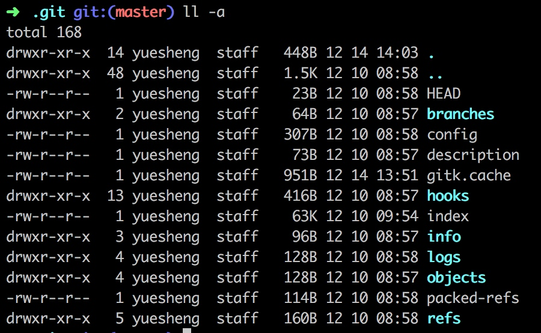
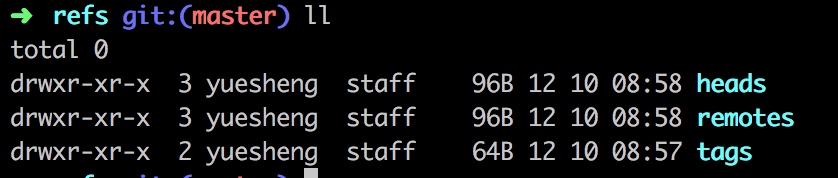

# Git 命令

* git --version
* git help
* git config
* git init


## Git安装
添加配置
git config [--local | --global | --system] user.name 'Your name'
git config [--local | --global | --system] user.email 'Your email'

查看配置
git config --list [--local | --global | --system]

> local：区域为本仓库
> global: 当前用户的所有仓库
> system: 本系统的所有用户

## 创建Git仓库
1、用Git之前已经有项目
```shell
cd 项目代码所在文件夹
git init
```

2、用git之前没有项目
```shell
cd 某个文件夹
git init your_project # 会在当前的文件夹下创建和项目名称相同的文件夹
cd your_project
```

## 项目中常用的git命令
> git 仓库中存在三个区域，工作空间 -> 暂存区 -> 版本历史

查看提交日志
git log
git log -n4 只显示具体提交条数
git log --all 查看所有分支的历史
git log --oneline 只显示提交信息
git log --graph 输出不同分支树状结构

查看当前仓库状态
git status 查看本地仓库的git状态

增加文件到暂存区
git add files 将文件提交到暂存区
git add -u  把已经被git追踪的文件提交到暂存区

提交
git commit -m 'commit message' 提交暂存区文件到本地仓库
git commit -a -m 'commit message' 
git commit -am 'commit message'

重命名
git mv source target 

git branch
git branch -av

git checkout temp
git checkout -b 

## .git文件夹


HEAD 当前工作的分支

config

refs



git cat-file -t acaaaa 看类型
git cat-file -p acaaaa 看内容

git仓库的对象
commit
tree
blob

find .git/objects -type f

git加入暂存区后，会增加一个blob文件，

分离头指针，HEAD指向的是某个commit，没有和分支绑定在一起的头指针（可能会丢失）

HEAD 可以指向分支，可以不指向commit

git diff 
git diff HEAD HEAD~1
git diff HEAD HEAD^

删除分支
git branch -d 分支名
git branch -D 分支名

修改最近的commit的message
git commit --amend

修改老旧commit的message
git rebase -i 需要修改的父亲id号
需要交互，

> 在本地commit没有提交到远程的可以使用rebase，如果提交到远端再做rebase会影响其他人

合并连续commit
git rebase -i 需要修改的父亲id号

合并不连续的commit
git rebase -i 需要修改的父亲id号
编辑文件，将不连续的复制到一起
可能会报错，需要按照提示命令，继续编辑
git rebase --continue

暂存区和HEAD比较
git diff --cached

工作区和暂存区比较
git diff 
git diff -- files （files是具体的文件）

让暂存区恢复成HEAD
git reset HEAD

让工作区恢复成暂存区
git checkout <files> 

git reflog

更新远程分支信息
git fetch origin

