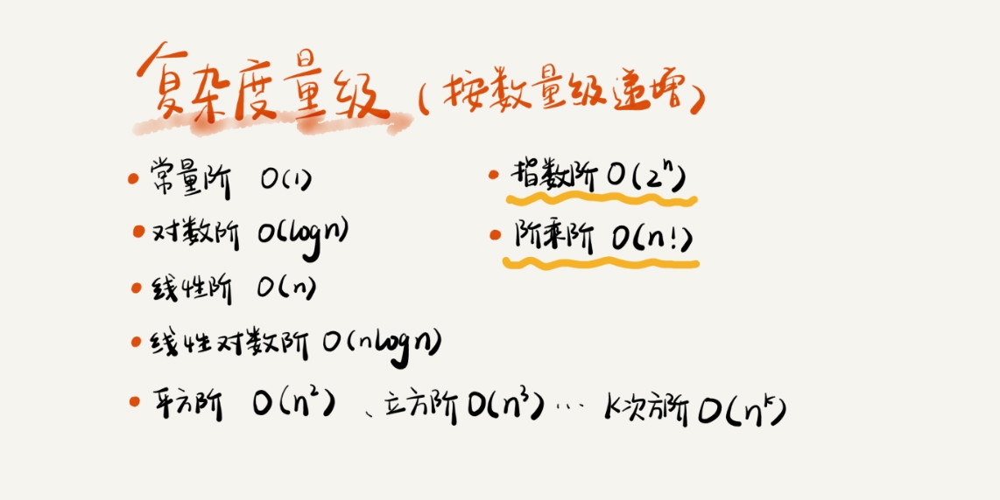
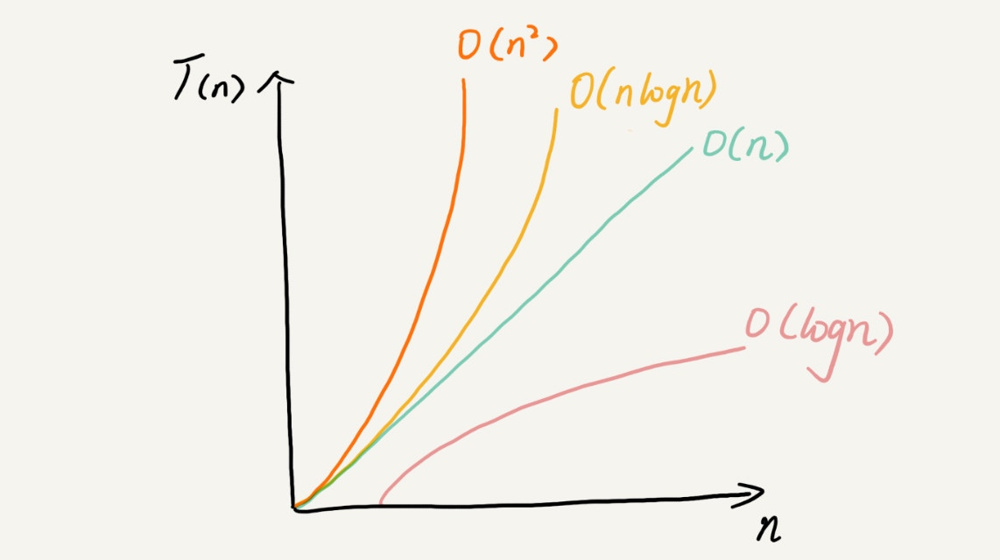

# 算法复杂度

> 复杂度分析是整个算法学习的精髓，只要掌握它，数据结构和算法的内容基本上就等于掌握了一半

## 为什么需要复杂度分析

当你进行复杂度分析时，你可以运行程序，通过统计、监控，得到算法的执行时间和占用内存。有些地方将这种方式称为：**事后统计法**。

这种评估方式是正确的，但是具有一下的局限性：
* 测试结果非常依赖测试环境
* 测试结果受测试数据规模影响很大

所以我们需要一个不用具体的测试数据来测试，就可以粗略的估算算法的执行效率的方法。也就是时间和控件复杂度分析方法。

## 大 O 复杂度表示法

假设每行代码在cpu中执行时间相同，记做unit_time。那么计算一段代码中所使用的时间就是每一行代码执行次数只和乘以每行执行时间。可以看出，执行时间和代码的执行次数成正比。假设数据规模为n，则时间公式为:
```
T(n) = O(f(n))
```
其中 **n** 表示数据规模，**f(n)** 为每一行代码执行次数的总和，大 **O** 表示代码执行时间和执行次数总和成正比关系。

这就是大O时间复杂度表示法，它不是代表代码真正的执行时间，而是代表代码执行时间随着数据规模增长的变化趋势，所以也叫做**渐进时间复杂度**，简称**时间复杂度**。

当 **n** 很大时，公式中的低阶、系数、常量将不会左右增长趋势，所以都可以忽略，我们只需要记录一个最大量级就可以。

## 时间复杂度的分析

### 分析时间复杂度的三种常见的方式

**1、只关注循环次数最多的一段代码**

大 O 复杂度的表示方法是表示一种变化的趋势。我们通常会省略公式中的低阶、系数、常数，只记录一个最大量级。**我们在分析算法或者一段代码的时间复杂度时，也只需要关注循环次数最多的那段代码。**该段代码执行次数的 n 的量级，就是整段要分析代码的时间复杂度。

**2、加法法则：总复杂度等于量级最多的那段代码的复杂度**

当分析的代码中，包含多段涉及 n 的代码片段。假设两段，f(n) 和 g(n)，抽象的公式如下：
```
T1(n) = O(f(n)), T2(n) = O(g(n))
T(n) = T1(n) + T2(n) = max(O(f(n)), O(g(n))) = O(max(f(n), g(n)))
```
也就是，总的时间复杂度等于量级最多的那段代码的复杂度。

**3、乘法法则：嵌套代码的复杂度等于嵌套内外代码复杂度的乘积**

当分析的代码中，包含嵌套。假设外层和内层的公式为f(n) 和 g(n)，抽象公式如下：
```
T1(n) = O(f(n)), T2(n) = O(g(n))
T(n) = T1(n) * T2(n) = O(f(n)) * O(g(n)) = O(f(n) * g(n))
```
也就是说，嵌套代码的时间复杂度等于嵌套内外复杂度的乘积。

### 几种常见时间复杂度实例分析


1、O(1)
2、O(logn)、O(nlogn)
3、O(m+n)、O(m*n)

## 空间复杂度分析


## 总结



