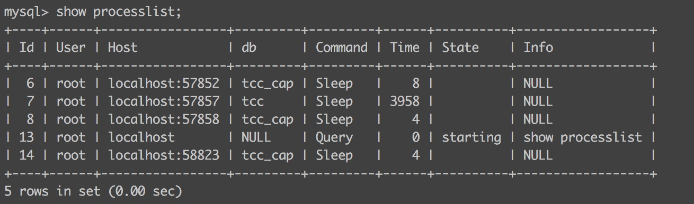
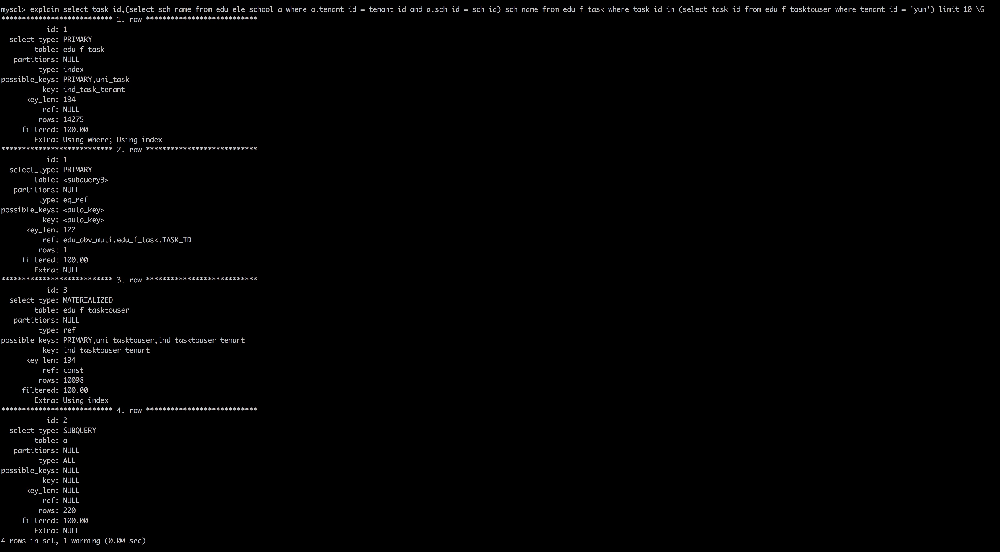
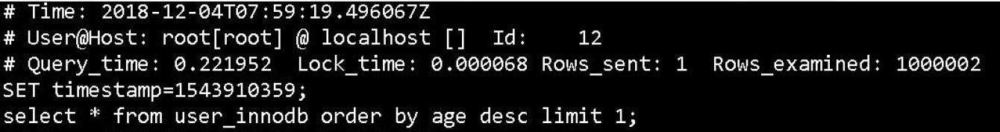

# MySQL知识体系梳理

## MySQL常用的存储引擎
InnoDB、MySIAM、Memory

## MySQL索引数据结构
采用了B+Tree，B+是一种特殊的平衡多路树（平衡树是代表所有的叶子节点都在同一层），查询采用的是左闭右开的形式，叶子节点是有序的，并且保存着前后的顺序引用。

## MySQL各存储引擎索引形式
1、InnoDB
InnoDB分为主键索引和非主键索引，主键索引的叶子节点包含所在行的所有数据，是聚合索引。非主键索引叶子节点只保存主键信息，如果需要查询其他信息，则需要再次到主键索引中根据主键信息进行查询。

2、MySIAM
MySIAM的索引中的叶子节点，都只保存了数据在磁盘中的位置，需要从文件中读取

## MySQL联合索引
MySQL索引采用最左匹配原则，将查询数据和索引中的数据从左到右，依次匹配，不能跳过。

联合索引的的选择原则
* 经常使用的列优先（最左匹配原则）
* 离散性大的列优先
* 宽度短的优先（最少空间原则，一页可以存更多的值）

覆盖索引：查询的数据就在索引的关键字中，则可以直接返回。覆盖索引可以减少数据库的IO，提高查询性能。

## InnoDB 和 MySIAM 区别
索引：InnoDB 主键索引是聚合索引
锁：InnoDB 支持行级锁，MySIAM 表级锁
事务：InnoDB 支持事务，MySIAM 不支持事务
MVCC：InnoDB 支持，MySIAM 不支持

## MySQL 查询语句流程

查询缓存 -> 查询优化器 -> 查询执行引擎 -> 返回结果

## MySQL 客户端/服务端通讯
> 全双工：双向通讯，发送数据的同时可以接收数据
> 半双工：双向通讯，只能接收或者发送数据，不能同时进行
> 单工：只能一方向另一方传送

MySQL 是采用“半双工”通信方式，客户端一旦发送数据，服务端接收完整的数据才能发起响应。客户端一旦开始接收响应，就无法发送指令。

MySQL每个连接都会存在状态，通过`show full processlist`或者`show processlist`查看。


连接状态如下：
* Sleep 线程正在等待客户端发送数据
* Query 连接线程正在执行查询
* Locked 线程正在等待表锁的释放
* Sorting result 线程正在对结果进行排序
* Sending data 向请求端返回结果集

可以通过`kill {id}`方式将连接杀掉

## 查询缓存
MySQL 如果开启查询缓存，则会将符合缓存的查询操作集和结果缓存，新来的查询将先查缓存，再查数据库。

MySQL 的查询缓存，可以简单的理解为 key-value 的数据结构，key 为查询 SQL，value 为结果集，查询 SQL 是大小写敏感的，不能有一点不一致。

MySQL 默认是关闭缓存的，可以在配置文件中设置`query_cache_type`，值有如下的选项：
* 0 不启用查询缓存（默认值）
* 1 启用查询缓存，只要符合查询缓存的要求，客户端的查询语句和记录集都会被缓存，供其他客户端使用，如果 SQL 中加入`SQL_NO_CACHE`将不会缓存
* 2 启用查询缓存，需要在查询语句中增加`SQL_CACHE`，则查询语句和记录集都会被缓存，供其他客户端使用

查询缓存的设置：
`query_cache_size`：设置查询缓存的大小，最小设置为 40k，默认是 1M，推荐设置为 64M/128M
`query_cache_limit`：设置缓存区最大可缓存的结果集，默认是 1M

查询缓存的使用情况查看：
`show status like 'Qcache%'`

不会缓存的情况：
* 查询语句中带有不确定的数据，例如时间函数，或者用户的函数，存储过程等
* 查询的结果集大于设置的限制（query_cache_limit）
* 对于InnoDB来说，当一个事务修改了表，在这个事务没有提交之前，这个表的所有查询都不会被缓存。因此，长事务会影响缓存的命中率
* 查询系统表
* 查询语句中不包含表

查询缓存的劣势：
* 查询语句之前，必须要先查询缓存是否命中，浪费计算资源
* 如果可以被缓存的查询语句执行结束，缓存中没有这个查询，则会讲查询和结果集加入缓存，带来额外的系统消耗
* 针对表的写入和更新数据时，将对表的所有数据缓存都设置为失效
* 如果查询缓存很大，或者碎片很多时，这个操作将会带来很大的系统开销

查询缓存的试用场景：
* 以读为主的业务，数据生成之后就不长改变的数据，例如门户类、新闻类、报表类、论坛类

## 查询优化
查询优化处理的三个阶段：
* 解析sql：通过lex词法分析，yacc语法分析将sql语句解析成解析树
* 预处理阶段：根据mysql的语法规则，进一步检查解析树。例如：检查表和列是否存在，解析名字和别名的设置，还会进行权限的验证
* 查询优化器：优化器的主要作用就是找到最优的执行计划

MySQL查询优化器是基于成本计算的原则，他会尝试各种执行计划，数据抽样的方式进行试验（随机的读取一个 4K 的数据块进行分析）。查找最有执行计划的规则
* 使用等价变化规则
    * 将`5 = 5 and a > 5`改为`a > 5`
    * 将`a < b and a = 5`改为`b > 5 and a = 5`
    * 基于联合索引，调整条件位置
* 优化 count、min、max 函数
    * min 只需找到索引的最左边
    * max 只需找到索引的最右边
    * MySIAM 引擎的 count(*)
* 覆盖索引的扫描
* 子查询的优化
* 提前终止查询
    * 用 limit 关键字或者使用不存在的条件
* in 的优化
    * 先进性排序，在进行二分法的查找

执行计划：
可以通过在查询 sql 前加入 explain 关键字查看执行计划



执行计划各列解释：
* id 查询的序列号，标示执行的顺序
    * id 相同，执行顺序从上往下
    * id 不同，如果有子查询，id 是依次递增的，id 越大执行优先级越高
    * id 既有相同也有不同的，id 相同可以认为是一组，执行顺序从上往下，不同组之间执行，id 越大执行优先级越高
* select_type 查询类型，主要用于区分普通查询、联合查询、子查询
    * SIMPLE：简单的 select 查询，不包括子查询或者 union
    * PRIMARY：查询包括子查询，最外层标记为 primary
    * SUBQUERY：表示 select 或者 where 列表中包含子查询
    * MATERIALIZED：表示 where 后面 in 条件的子查询
    * UNION：若第二个 select 出现在 union 之后，则被标记为 union
    * UNION RESULT：从 union 表获取结果的 select
* table 查询涉及到的表
    * 直接显示表名或者表的别名
    * <unionM,N> 由 ID 为 M,N 查询 union 产生的结果
    * <subqueryN> 由 ID 为 N 查询产生的结果
* type 访问的类型，SQL 查询优化的一个很重要的指标，结果值从好到坏依次为：system > const > eq_ref > ref > range > index > ALL
    * system：表只有一行记录（等同于系统表），const类型的特例，基本不会出现，可以忽略
    * const：表示通过索引一次就能找到，cost 用于比较 primary key 或者 unique 索引
    * eq_ref：唯一索引扫描，对于每个索引键，表中只有唯一一条记录匹配。常见于主键或者唯一索引扫描
    * ref：非唯一索引扫描，返回匹配某个单独值的所有行，本质是一种索引访问
    * range：只检索一个范围的行，使用一个索引来选择行
    * index：Full Index Scan，索引全表扫描，把索引从头到尾扫描一遍
    * ALL：Full Table Scan，遍历全表以找到匹配的行
* possible_keys 查询中可能使用的索引
* key 实际使用的索引
* rows 根据表统计信息或者索引的选用情况，大致估算一下找出所需行需要读取的行数
* filtered 指返回结果行占所需要扫描行的百分比，filtered 越大越好
* extra 额外信息
    * Using filesort：mysql 对数据使用一个外部的文件内容进行排序，而不是按照表内索引进行排序读取
    * Using temporary：使用临时表保存中间结果，也就是说 mysql 对查询结果排序时采用了临时表，常见于 order by 或者 group by
    * Using index：表示相应的 select 查询使用了覆盖索引，避免了访问表的数据行，效率高
    * Using where：使用了 where 过滤条件
    * select tables optimized away：基于索引优化的 MIN/MAX 操作或者 MySIAM 的 count(*) 操作，不必等到执行阶段在进行计算，查询执行计划生成的阶段既可完成优化

### 慢查询
如何定位慢查询
* 业务驱动
* 测试驱动
* 慢查询日志

慢查询日志的配置
```
show variables like 'slow_query_log'
set global slow_query_log = on
set global slow_query_log_file = '/var/lib/mysql/sql-slow.log'
set global log_queries_not_using_indexes = on
set global long_query_time = 0.1 ## 秒
```


慢查询参数解析：
* Time 日志记录时间
* User@Host：执行的用户及主机
* Query_time：查询消耗时间
* Lock_time：锁表时间
* Rows_send：发送给请求方的记录条数
* Rows_examined：语句扫描的记录条数
* SET timestamp：语句执行的时间点
* select ...：执行具体的语句

慢查询分析工具：
mysqldumpslow -t 10 -s at /usr/local/mysql/data/yueshengdeMacBook-Pro-slow.log

mysqlsla
pt-query-digest

## 事务隔离级别
* Read Uncommitted（读未提交）
    * 事务未提交，对其他事务可见。脏读、不可重复读、幻读
* Read Committed（读已提交）
    * 一个事务开启后，只能看到自己提交的事务所做的修改。不可重复读、幻读
* Repeatable Read（可重复读）
    * 同一个事务，多次读取同样的数据结果是一样的，这种隔离级别没有定义解决幻读的问题
* Serializable（串行化）
    * 最高的隔离级别，通过强制事务的串行执行

mysql 默认隔离级别是 Repeatable Read，通过锁和 MVCC 来解决幻读问题

## MySQL 中的锁机制
锁是管理不同事务对共享资源的并发访问

mysql 中存在表锁和行锁，他们区别为：
* 锁定粒度：表锁 > 行锁
* 加锁效率：表锁 > 行锁
* 冲突概率：表锁 > 行锁
* 并发能力：表锁 < 行锁

InnoDB 支持行锁和表锁，其中表锁是一种另类的行锁，是通过对所有索引进行加锁完成的。

只有通过索引条件来进行数据检索，InnoDB才会使用行锁，否则使用表锁，锁住索引的所有记录

表锁：lock tables xx read / write;

MySQL 中 InnoDB 锁的类型
* 共享锁（行锁）：Shared Locks
    * 又称为读锁，简称 S 锁，共享锁就是多个事务对同一数据可以共享一把锁，都能访问数据，但是不能修改
    * 加锁方式：`select * from users where id = 1 lock in share mode;`
* 排它锁（行锁）：Exclusive Locks
    * 又称写锁，简称 X 锁，排它锁不能和其他锁共存，一个事务获取一个数据的排他锁，其他事务就无法获取这个数据的锁（共享、排他），只有获取该数据的排他锁的事务才可以对该数据进行读取和修改，其他事务要读取数据可来自于快照。
    * 加锁方式
        * delete / update / insert 默认加 X 锁
        * select * from table_name where ... for update
* 意向共享锁（表锁）：Intention Shared Locks
    * 一个事务准备给数据行加上共享锁时，必须先获取意向共享锁，意向共享锁之间可以相互兼容
    * 意向锁是 InnoDB 数据操作前自动加入的，无需用户干预
* 意向排它锁（表锁）：Intention Exclusive Locks
    * 一个事务准备给数据加上排它锁时，必须先获取意向排它锁，意向排他锁之间不能项目兼容
    * 意义：当事务想去进行锁表时，先判断意向锁是否存在，如果存在就不能启用表锁
* 自增锁：AUTO-INC Locks
    * 针对自增列的一个特殊的标记别锁
    * `show variables like 'innodb_autoinc_lock_mode';`
    * 默认取值为1，代表连续，事务未提交，id永远丢失

行锁的算法：
* 记录锁 Record Locks
    * 锁住具体索引项
    * 当 sql 执行按照唯一性（primary key、 unique key）索引进行数据检索时，查询条件等值匹配且查询的数据是存在，这时 sql 语句加上的锁为记录锁，锁住具体的索引项
* 间隙锁 Gap Locks
    * 锁住数据不存在的区间（左开右开）
    * 当 sql 执行按照索引进行数据检索时，查询条件的数据不存在，这时 sql 语句加上的锁为间隙锁
* 临键锁 Next-key Locks
    * 锁住记录 + 区间（左开有闭）
    * 当 sql 执行按照索引进行数据检索时，查询条件为范围查找（between and、<、>等）并且有数据命中则此时 sql 语句加上的锁为临键锁

mysql 中的死锁：

死锁产生条件：多个事务都获取各自的锁，都在等待获取对方所持有的锁

避免死锁的方式：
* 类似业务逻辑以固定的顺序访问表和行
* 大事务拆成小事务，大事务容易产生死锁
* 在同一个事务中，尽量做到一次性锁定所有需要的资源
* 降低隔离级别
* 为表添加合理的索引

## MVCC
MVCC 是多版本并发控制，并发访问（读或者写）数据库时，对正在事务内的数据做多版本管理，
以达到避免写操作的阻塞，从而引起读操作的并发问题。

MVCC 操作流程
数据库的每行数据都会有两个额外的属性：数据行的操作版本号和删除版本号

具体增删改查的流程：
* 当事务开启时，会拿到全局的一个事务ID
* 当事务进入插入操作时，会将插入行的数据版本号设置为当前事务的id
* 当事务进行对数据修改时，会新增一行数据，将数据版本号设置为当前的id，原来的数据保留，直到事务提交，删除之前版本的数据
* 当事务进行对数据删除时，会新增一行数据，将数据删除版本号改为当前的id，原来的数据保留，直到事务提交，删除数据
* 当事务进行查询数据时
    * 只能查询数据版本号早于当前事务id的数据，这样确保数据要么是在当前事务开启之前就存在的，或者是当前事务修改的数据
    * 只能查询数据删除版本号要么为null，要么大于当前版本号，确保取出来的数据在事务开启事前没有被删除

## MySQL Undo/Redo Log
Undo Log （保证事务的原子性）指事务开始之前，在操作任何数据之前，首先将需要操作的数据备份到 Undo Log中，在事务发生回滚时，可以根据 Undo Log 恢复之前的数据

Redo Log （保证事务的持久性）指事务中操作的任何数据，将最新的数据备份到 Redo Log 中，它不是事务提交之后才会写的，是在事务的执行过程中，便开始写入 redo 中，具体罗盘策略可设置

## MySQL 的读写分离
如何实现 MySQL 的读写分离
* mysql 的读写分离基于主从架构，可以配置一主多从，然后我们单单只写主库，然后主库自动同步到从库

MySQL 主从复制原理
* 主从复制是基于 binlog 日志，主库将变更写入 binlog 日志中
* 然后从库连接主库，开启一个IO线程将主库中的 binlog 日志拷贝到本地，写入一个 relay 中继日志中
* 之后从库有个 sql 线程从中继日志中读取 binlog，根据执行 binlog 内容，也就是在本地执行一边 sql，确保本地数据和主库一致

MySQL 主从复制中，从库同步主库数据的过程是串行化操作，也就是说主库是并行的操作，在从库上会串行的执行。所以这是一个非常重要的点，由于从库从主库拷贝日志及串行化执行 SQL 的特点，在高并发的场景下，从库的数据会比主库数据慢一点。所以，经常存在，刚写入主库的数据，从库读不到，要过几十毫秒甚至几百毫秒才能查到。

而且这里还有另一个问题，当主库突然宕机，有些数据还没有同步数据到从库，会发出从库数据丢失。

针对这些情况，MySQL 提供了两种机制
* 半同步复制：解决主库数据丢失问题
    * 主库写入 binlog 后，就会强制立刻同步到从库中，从库讲日志写入到自己的 relay log 中，返回 ack 给主库，主库必须收到至少一个从库的 ack 之后才认为写操作成功
* 并行复制：解决从库同步延迟问题
    * 从库开启多个 sql 线程，对 relay log 内不同的库进行并行的同步

如果主从延迟较为严重，可以采用以下方式：
* 分库，将一个主库拆成多个主库，每个主库的写并发将会减少
* 打开 MySQL 并行复制，多个库并行复制，如果某一个库的写并发较高，并行复制还是没有意义
* 重写代码，插入的数据立马查询可能查询不到
* 如果插入的数据必须要立马查询，那么就将这类操作都在主库上执行，那么读写分离其实就没有意义了