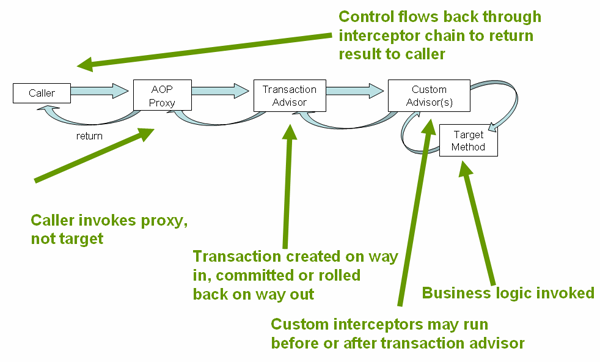
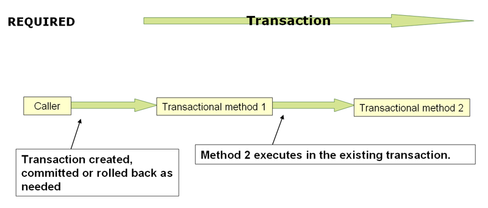
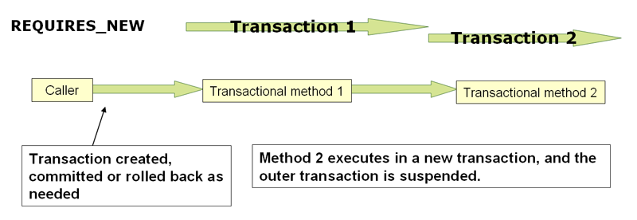

## 事务管理

Spring提供的一致性事务抽象模型优势

- 跨不同事务API的一致性编程模型，例如：JTA、JDBC、Hibernate、JPA
- 支持声明式事务管理
- 跟简单的编程事务管理API（相对于复杂的API，如JTA）
- 和Spring数据访问抽象集成

Spring事务特性和技术

- <a href="#Spring Framework的事务支持模型的优点">Spring Framework的事务支持模型的优点</a>（描述为什么要选择Spring事务，而非其他专有的API，如：Hibernate）
- <a href="#理解Spring Framework事务抽象">理解Spring Framework事务抽象</a>（概述了核心类，描述了`DataSource`如何从各种资源配置中获取实例）
- <a href="#资源与事务同步">资源与事务同步</a>（描述应用代码如何正确的创建、重用和释放资源）
- <a href="#声明式事务管理">声明式事务管理</a>（描述了对声明式事务的支持）
- <a href="#编程式事务管理">编程式事务管理</a>（描述了对编程式事务的支持）
- <a href="#事务绑定事件">事务绑定事件</a>（描述了如何在事务内使用应用事件）

### Spring Framework的事务支持模型的优点

传统上，Java EE开发人员有两种事务管理的选择：全局的和本地的，这两种方式都有很大的局限性。Spring Framework事务管理可以很好的解决这两种方式的缺点。

#### 全局事务

全局事务是允许对多个数据源事务进行管理，例如：关系型数据库和消息队列。应用程序可以通过JTA来管理全局事务（JTA是十分繁琐的API，部分原因是它的异常模型）。JTA中`UserTransaction`通常要从JNDI中获取，所以应用必须历来JNDI才能使用JTA。因为JTA只能在应用程序服务器环境中使用，所以它限制了应用程序代码的重用。

> JTA为什么限制引用程序代码重用？

以前，使用全局事务的首选是EJB CMT（Container Managed Transaction）。CMT是一种声明式的事务形式。尽管EJB CMT本身需要依赖JNDI，但是他消除了事务相关的JNDI的查找的需要。他减少了控制事物而编写的java代码，但是没有完全消除。CMT与JTA和服务器相互关联是它的一个重大的缺点，并且只能选择在EJB内实现业务逻辑才能使用。

#### 本地事务

本地事务是针对特定的资源，例如JDBC的连接。本第事务很容易使用，但是存在很大的缺点：不支持多事务资源。例如，本地事务的代码无法适用于全局JTA事务，因为应用服务不参与事务管理，他无法确定多资源的正确性。另外一个缺点是本地事务对编程模型是有侵入性的（这对大多数应用来说没太大关系，因为大多数应用都是单资源的）。

#### Spring Framework的一致性编程模型

Spring解决了全局事务和本地事务的缺点。他允许开发人员在任何环境中只需要使用一致的开发模型。你只需要编写一次代码，在不同环境的不同事务策略都可以运行。Spring提供了编程式事务和声明式事务。我们在大多数情况下，建议大部分用户使用声明式事务。

对于编程式事务，开发者使用时需要使用Spring Framework事务抽象，这个事务抽象可以在任何事务基础结构上运行。对于声明式事务，开发者只需要编写少量的代码，甚至不写代码来做到事务的管理，因此不需要依赖Spring Framework事务的API或者其他的事务API。

### 理解Spring Framework事务抽象

Spring事务抽象的关键是事务策略的概念。通过接口`org.springframework.transaction.PlatformTransactionManager`来去定义一个事务策略，接口代码如下：
```java
public interface PlatformTransactionManager {

    TransactionStatus getTransaction(TransactionDefinition definition) throws TransactionException;

    void commit(TransactionStatus status) throws TransactionException;

    void rollback(TransactionStatus status) throws TransactionException;
}
```
首先，它其实是一个服务提供者的接口（SPI），尽管你可以在代码中通过编程式事务使用它。但是。因为它是一个接口，所以在必要时，它可以更容易被模拟或存根。它和查找策略（例如JNDI）无关。在SpringIOC容器中，`PlatformTransactionManager`所有实现可以像定义任何其他对象（或者bean）一样被定义。即使你现在使用JTA，仅仅这个优点就使得他是一个更有价值的抽象，他可以让你比使用JTA时，更好的测试事务代码。

同样，和Spring设计理想保持一致，`TransactionException`是非检查型异常，可以被`PlatformTransactionManager`接口的所有方法抛出。事务基础设施失败几乎总是致命的。实际上，极少数的情况下，应用代码可以在事务故障中恢复，但是开发者还是可以选择去捕获和处理`TransactionException`。重点是开发人员不会被迫这样做。

`getTransaction()`根据`TransactionDefinition`对象，返回一个`TransactionStatus`对象。如果当前调用栈中存在匹配的事务则返回此事务，否则返回一个新的事务。The implication in this latter case is that, as with Java EE transaction contexts, a TransactionStatus is associated with a thread of execution.

`TransactionDefinition`接口的说明:
* Propagation（传播）：通常，在事务范围内执行的所有代码都在该事务内运行。但是，当一个事务方法被执行在一个已经存在事务上下文中，你可以指定该事务方法的行为。例如，代码可以被运行在已经存在的事务中（常见情况），或者这个已经存在的事务可以被挂起，然后新启一个事务。Spring提供所有的EJB CMT中事务传播选项。
* Isolation（隔离）：一个事务与另一个工作的事务的隔离程度。例如，一个事务是否可以看到另一个事务中没有提交的写操作。
* Timeout（超时）：事务可运行的时间，超过时间将会由底层事务基础设施自动回滚。
* Read-only status（只读状态）：当你的代码只进行读取操作而不做修改数据操作时，你可以使用只读的事务。只读事务在某些情况下是一个十分有效的优化操作，例如，使用Hibernate的时候。

这些设置反映了标准事务的概念。如果有必要，请参考讨论事务的隔离级别和其他核心事务概念的材料。理解这些概念，对于使用Spring框架和其他事务管理解决方式是十分必要的。

`TransactionStatus`接口为事务代码提供了一个种简单的方式来控制事务执行和查询事务状态。这些概念应该是熟悉的，因为他对所有事务api都是通用的。

```java
public interface TransactionStatus extends SavepointManager {

    boolean isNewTransaction();

    boolean hasSavepoint();

    void setRollbackOnly();

    boolean isRollbackOnly();

    void flush();

    boolean isCompleted();

}
```

在Spring中，无论你使用声明式还是编程式的事务管理器，定义一个正确的`PlatformTransactionManager`是十分有必要的。你通常使用依赖注入来定义他的实现。

`PlatformTransactionManager`实现通常需要他们的工作环境的知识：JDBC、JTA、Hibernate等等。下面将介绍你如何定义一个本地的`PlatformTransactionManager`实现（这是一个JDBC的例子）

你可以像下面这样定义一个JDBC的`DataSource`：
```xml
<bean id="dataSource" class="org.apache.commons.dbcp.BasicDataSource" destroy-method="close">
    <property name="driverClassName" value="${jdbc.driverClassName}" />
    <property name="url" value="${jdbc.url}" />
    <property name="username" value="${jdbc.username}" />
    <property name="password" value="${jdbc.password}" />
</bean>
```

然后，相关的`PlatformTransactionManager`bean的定义将会对`DataSource`定义持有一个引用，如下：
```xml
<bean id="txManager" class="org.springframework.jdbc.datasource.DataSourceTransactionManager">
    <property name="dataSource" ref="dataSource"/>
</bean>
```

如果你在Java EE容器中使用JTA，你将结合Spring的`JtaTransactionManager`，使用一个通过JNDI获得的容器`DataSource`。例如:
```xml
<?xml version="1.0" encoding="UTF-8"?>
<beans xmlns="http://www.springframework.org/schema/beans"
    xmlns:xsi="http://www.w3.org/2001/XMLSchema-instance"
    xmlns:jee="http://www.springframework.org/schema/jee"
    xsi:schemaLocation="
        http://www.springframework.org/schema/beans
        http://www.springframework.org/schema/beans/spring-beans.xsd
        http://www.springframework.org/schema/jee
        http://www.springframework.org/schema/jee/spring-jee.xsd">

    <jee:jndi-lookup id="dataSource" jndi-name="jdbc/jpetstore"/>

    <bean id="txManager" class="org.springframework.transaction.jta.JtaTransactionManager" />

    <!-- other <bean/> definitions here -->

</beans>
```

这个`JtaTransactionManager`不需要知道`DataSource`（或者其他特殊的资源），因为它使用的是全局的事务管理器基础设施。

### 资源与事务同步

现在应该清楚如何创建不同的事务管理器，以及他们如何连接到需要与事务同步的相关资源（例如，`DataSourceTransactionManager`，JDBC`DataSource`，`HibernateTransactionManager`Hibernate SessionFactory等）。本节将介绍应用程序代码（直接或者间接的使用诸如：JDBC、Hibernate、JPA等持久性API）如何确保正确的创建、重用和清理这些资源。本节还将介绍，事务同步是如何被相关`PlatformTransactionManager`触发的。

#### 高级同步方法

首选的方式


#### 低级同步方法

#### `TransactionAwareDataSourceProxy`

### 声明式事务管理

Spring AOP使Spring框架的声明式事务成为可能。但是，事务方面代码是随着Spring的发行版一起提供，并且可以用样板方式使用，即使不会AOP的概念也可以写出高效的事务代码。

Spring的声明式事务管理和EJB CMT很像，因此你可以讲事务的行为（或缺少他）指定到单个方法级别。如果有必要，你可以在事务上下文内设置一个`setRollbackOnly()`的调用。两种事务管理器（Spring 和 EJC CMT）类型的区别如下：
* 与绑定到JTA的EJB CMT不同，Spring框架的声明式事务管理适用于任何环境。他可以通过调整配置文件来使用JDBC、JPA或者Hibernate
* 你可以使用在任何类上应用Spring框架的声明式事务，而不仅仅是EJB等特殊的类
* Spring框架提供声明式的回滚规则，这是EJB没有的特性。编程式和声明式的回滚规则都被提供
* Spring框架可以让你通过AOP定制事务行为。例如：你可以在事务回滚的情况下插入定制的行为。你还可以增加任意的通知和事务通知。使用EJB CMT，除了`setRollbackOnly()`，你不可以改变容器事务管理器
* Spring框架不支持跨远程调用的事务上下文传播，就像高端应用服务器那样。如果你需要这个特性，我推荐你使用EJB。但是，在使用类似这个特性前需要仔细考虑，因为通常情况下，没有人希望事务跨远程调用。

>TransactionProxyFactoryBean在哪里？
>
>Spring 2.0及更高版本中的声明式事务配置与以前的Spring版本有很大不同。主要区别在于不再需要配置`TransactionProxyFactoryBean` beans。
>
>Spring 2.0之前的配置样式仍然是100％有效的配置。将新`<tx:tags/>`视为TransactionProxyFactoryBean代表您的定义bean。

回滚规则的概念是十分重要的。它可以让你这是哪些Exception（或者Throwable）会引起自动回滚。你可在配置中以声明的方式指定，而不是在java代码中。所以，尽管你仍然可以在`TransactionStatus`对象上调用`setRollbackOnly()`来回滚当前事务，但是你通常可以指定一个规则，如`MyApplicationException`必须回滚。这样的做法的重大意义是业务对象不再依赖于事务底层框架。例如，他们通常不需要引入Spring事务API或者其他Spring的API。

尽管EJB容器默认在发送系统异常（通常是一个运行时异常）时自动回滚，但是它没有在发送应用异常（一个和`java.rmi.RemoteException`不同的检查异常）时自动回滚。虽然Spring事务管理器默认和EJB容器一样（在非检查式异常下自动回滚），但是他可以进行有效的定制行为。

#### 理解Spring Framework的声明式事务实现

仅仅告诉你在你的类上注释`@Transactional`注解，在配置中增加`@EnableTransactionManagement`是不够的，还是希望你能理解他是如何工作的。为了提供一个更深入的理解，本节解释了在发生事务相关问题时，Spring框架声明式事务的基础框架内部是如何工作的。

关于Spring框架的声明式事务支持，最重要的概念是通过AOP代理启动这个支持，并且事务的通知建议由元数据（当前基于XML或者基于注解）驱动。AOP和事务元数据组合产生了AOP的代理，该代理使用一个`TransactionInterceptor`与适当的`PlatformTransactionManager`实现结合来驱动围绕方法调用的事务。

下面的图展示了事务代理调用方法的概念图：



#### 声明性事务实现的示例

配置事务的xml
```xml
<?xml version="1.0" encoding="UTF-8"?>
<beans xmlns="http://www.springframework.org/schema/beans"
    xmlns:xsi="http://www.w3.org/2001/XMLSchema-instance"
    xmlns:aop="http://www.springframework.org/schema/aop"
    xmlns:tx="http://www.springframework.org/schema/tx"
    xsi:schemaLocation="
        http://www.springframework.org/schema/beans
        http://www.springframework.org/schema/beans/spring-beans.xsd
        http://www.springframework.org/schema/tx
        http://www.springframework.org/schema/tx/spring-tx.xsd
        http://www.springframework.org/schema/aop
        http://www.springframework.org/schema/aop/spring-aop.xsd">

    <!-- this is the service object that we want to make transactional -->
    <bean id="fooService" class="x.y.service.DefaultFooService"/>

    <!-- the transactional advice (what 'happens'; see the <aop:advisor/> bean below) -->
    <tx:advice id="txAdvice" transaction-manager="txManager">
        <!-- the transactional semantics... -->
        <tx:attributes>
            <!-- all methods starting with 'get' are read-only -->
            <tx:method name="get*" read-only="true"/>
            <!-- other methods use the default transaction settings (see below) -->
            <tx:method name="*"/>
        </tx:attributes>
    </tx:advice>

    <!-- ensure that the above transactional advice runs for any execution
        of an operation defined by the FooService interface -->
    <aop:config>
        <aop:pointcut id="fooServiceOperation" expression="execution(* x.y.service.FooService.*(..))"/>
        <aop:advisor advice-ref="txAdvice" pointcut-ref="fooServiceOperation"/>
    </aop:config>

    <!-- don't forget the DataSource -->
    <bean id="dataSource" class="org.apache.commons.dbcp.BasicDataSource" destroy-method="close">
        <property name="driverClassName" value="oracle.jdbc.driver.OracleDriver"/>
        <property name="url" value="jdbc:oracle:thin:@rj-t42:1521:elvis"/>
        <property name="username" value="scott"/>
        <property name="password" value="tiger"/>
    </bean>

    <!-- similarly, don't forget the PlatformTransactionManager -->
    <bean id="txManager" class="org.springframework.jdbc.datasource.DataSourceTransactionManager">
        <property name="dataSource" ref="dataSource"/>
    </bean>

    <!-- other <bean/> definitions here -->

</beans>
```

上面`<tx:advice/>`设置目的为：所有的get开头方法设置为只读事务，其他方法默认事务。

>如果`PlatformTransactionManager`的bean的id为`transactionManager`，并且`<tx:advice/>`内的`transaction-manager`属性使用此`transactionManager`，那么可以省略`transaction-manager`属性，`transaction-manager`属性默认值为`transactionManager`

#### 声明性事务的回滚

推荐回滚的方式是在当前事务上下文中执行的代码抛出异常。Spring框架的事务底层代码捕获任何未处理的`Exception`，它冒泡调用堆栈并确定是否标记事务进行回滚。

默认情况，Spring框架的事务底层代码仅仅在运行情况、非检查异常下标记事务回滚。也就是说，抛出的异常是`RuntimeException`的一个子类实例。（默认，`Error`实例也会被回滚）。默认配置下，在一个事务方法中，检查型异常被抛出是不会导致回滚的。

> 默认配置下，Spring事务回滚仅仅会发生在抛出非检查型异常（`RuntimeException`的一个子类实例），`Error`实例也会被回滚。检查型异常是不会回滚事务的。

你可以配置`Exception`类型标记回滚事务，包括检查型异常，配置`rollback-for`：
```xml
<tx:advice id="txAdvice" transaction-manager="txManager">
    <tx:attributes>
    <tx:method name="get*" read-only="true" rollback-for="NoProductInStockException"/>
    <tx:method name="*"/>
    </tx:attributes>
</tx:advice>
```

如果你希望在某些异常发生时，不回滚事务，也可以配置`no-rollback-for`：
```xml
<tx:advice id="txAdvice">
    <tx:attributes>
    <tx:method name="updateStock" no-rollback-for="InstrumentNotFoundException"/>
    <tx:method name="*"/>
    </tx:attributes>
</tx:advice>
```

你还可以通过编码的方式进行回滚，但是这是有代码侵入性的，并且耦合Spring框架的事务代码
```java
    try {
        // some business logic...
    } catch (NoProductInStockException ex) {
        // trigger rollback programmatically
        TransactionAspectSupport.currentTransactionStatus().setRollbackOnly();
    }
}
```

#### 为不同的Bean配置不同的事务语义

考虑到你有很多service层的对象，并且你希望对每个service对象都有完全不同的事务配置。你可以使用不同的`pointcut`和`advice-ref`属性来定义独立的`<aop:advisor/>`元素。

作为一个比较点，首先假设你所有的service类都定义在`x.y.service`包下。使这个包或者子包内所有已`Service`结尾的类的实例都设置为默认的事务配置，你可以向下面这样写：
```xml
<?xml version="1.0" encoding="UTF-8"?>
<beans xmlns="http://www.springframework.org/schema/beans"
    xmlns:xsi="http://www.w3.org/2001/XMLSchema-instance"
    xmlns:aop="http://www.springframework.org/schema/aop"
    xmlns:tx="http://www.springframework.org/schema/tx"
    xsi:schemaLocation="
        http://www.springframework.org/schema/beans
        http://www.springframework.org/schema/beans/spring-beans.xsd
        http://www.springframework.org/schema/tx
        http://www.springframework.org/schema/tx/spring-tx.xsd
        http://www.springframework.org/schema/aop
        http://www.springframework.org/schema/aop/spring-aop.xsd">

    <aop:config>
        <aop:pointcut id="serviceOperation" expression="execution(* x.y.service..*Service.*(..))"/>
        <aop:advisor pointcut-ref="serviceOperation" advice-ref="txAdvice"/>
    </aop:config>

    <!-- these two beans will be transactional... -->
    <bean id="fooService" class="x.y.service.DefaultFooService"/>
    <bean id="barService" class="x.y.service.extras.SimpleBarService"/>

    <!-- ... and these two beans won't -->
    <bean id="anotherService" class="org.xyz.SomeService"/> <!-- (not in the right package) -->
    <bean id="barManager" class="x.y.service.SimpleBarManager"/> <!-- (doesn't end in 'Service') -->

    <tx:advice id="txAdvice">
        <tx:attributes>
            <tx:method name="get*" read-only="true"/>
            <tx:method name="*"/>
        </tx:attributes>
    </tx:advice>

    <!-- other transaction infrastructure beans such as a PlatformTransactionManager omitted... -->

</beans>
```

下面展示如何配置完全不同的两个类配置完全不同的事务设置：
```xml
<?xml version="1.0" encoding="UTF-8"?>
<beans xmlns="http://www.springframework.org/schema/beans"
    xmlns:xsi="http://www.w3.org/2001/XMLSchema-instance"
    xmlns:aop="http://www.springframework.org/schema/aop"
    xmlns:tx="http://www.springframework.org/schema/tx"
    xsi:schemaLocation="
        http://www.springframework.org/schema/beans
        http://www.springframework.org/schema/beans/spring-beans.xsd
        http://www.springframework.org/schema/tx
        http://www.springframework.org/schema/tx/spring-tx.xsd
        http://www.springframework.org/schema/aop
        http://www.springframework.org/schema/aop/spring-aop.xsd">

    <aop:config>
        <aop:pointcut id="defaultServiceOperation" expression="execution(* x.y.service.*Service.*(..))"/>
        <aop:pointcut id="noTxServiceOperation" expression="execution(* x.y.service.ddl.DefaultDdlManager.*(..))"/>
        <aop:advisor pointcut-ref="defaultServiceOperation" advice-ref="defaultTxAdvice"/>
        <aop:advisor pointcut-ref="noTxServiceOperation" advice-ref="noTxAdvice"/>
    </aop:config>

    <!-- this bean will be transactional (see the 'defaultServiceOperation' pointcut) -->
    <bean id="fooService" class="x.y.service.DefaultFooService"/>

    <!-- this bean will also be transactional, but with totally different transactional settings -->
    <bean id="anotherFooService" class="x.y.service.ddl.DefaultDdlManager"/>

    <tx:advice id="defaultTxAdvice">
        <tx:attributes>
            <tx:method name="get*" read-only="true"/>
            <tx:method name="*"/>
        </tx:attributes>
    </tx:advice>

    <tx:advice id="noTxAdvice">
        <tx:attributes>
            <tx:method name="*" propagation="NEVER"/>
        </tx:attributes>
    </tx:advice>

    <!-- other transaction infrastructure beans such as a PlatformTransactionManager omitted... -->

</beans>
```

#### `<tx:advice/>`的设置

这节概述你可以使用`<tx:advice/>`标签上的不同的事务设置。默认的`<tx:advice/>`设置：
* propagation : REQUIRED
* isolation : DEFAULT
* transaction : read-write
* timeout : 事务系统默认的时间，如果事务系统不支持也可以没有
* 任何RuntimeException触发回滚，且任何检查`Exception`不触发回滚

你可以改变这些默认配置。下面的表格总结了`<tx:method/>`标签在嵌套`<tx:advice/>`和`<tx:attributes/>`标签下的多种属性：

表格1. `<tx:method/>`设置

| Attribute | Required？ | Default | Description |
| --- | --- | --- | :-- |
| name | Yes |  | 与事务相关联的方法名称。可以使用通配符（*）来去表示多个方法（例如：`get*`,`handle*`,`on*Event`等等） |
| propagation | No | REQUIRED | 事务的传播级别 |
| isolation | No | DEFAULT | 事务的隔离级别。仅仅适用于传播级别`REQUIRED`或者`REQUIRED_NEW`设置下 |
| timeout | No | -1 | 事务超时时间（秒）。仅仅适用于传播级别`REQUIRED`或者`REQUIRED_NEW` |
| read-only | No | false | 读写与只读事务。仅对传播级别`REQUIRED`或者`REQUIRED_NEW` |
| rollback-for | No |  | 以逗号分隔的触发回滚的异常实例列表。例如：`com.foo.MyBusinessException,ServletException` |
| no-rollback-for | No |  | 以逗号分隔的不会触发回滚的异常实例列表。例如：`com.foo.MyBusinessException,ServletException` |

#### 使用`@Transactional`

对于事务配置，除了基于XML声明方式以外，你还可以使用基于注解方式。在Java源代码中声明的事务语义会使得这个声明更接近受影响的代码。这没有什么耦合的风险，被用于事务的代码几乎总是以这种方式部署。

> 标准的`javax.transaction.Transactional`注解也支持作为Spring自己注解的替代品

通过使用`@Transactional`注解提供的易用性最好通过示例来说明，如下：
```java
// the service class that we want to make transactional
@Transactional
public class DefaultFooService implements FooService {

    Foo getFoo(String fooName);

    Foo getFoo(String fooName, String barName);

    void insertFoo(Foo foo);

    void updateFoo(Foo foo);
}
```
使用在类级别上的这个注解表示在这个类里面所有方法采用默认的事务配置（包括他的子类）。或者，每个方法都可以单独使用注解。注意，一个类级别的注解不会被应用在类层次中的祖先类；在这种情况下，需要在本地重新声明方法才能参与子类级别的注释。

可以在`@Configuration`类上使用`@EnableTransactionManagement`注解，来使Spring上下文中定义的bean实例具有事务性。xml如下：
```xml
 <beans>

     <tx:annotation-driven/>

     <bean id="fooRepository" class="com.foo.JdbcFooRepository">
         <constructor-arg ref="dataSource"/>
     </bean>

     <bean id="dataSource" class="com.vendor.VendorDataSource"/>

     <bean id="transactionManager" class="org.sfwk...DataSourceTransactionManager">
         <constructor-arg ref="dataSource"/>
     </bean>

 </beans>
```

和xml相同的的java代码如下：
```java
@Configuration
 @EnableTransactionManagement
 public class AppConfig {

     @Bean
     public FooRepository fooRepository() {
         // configure and return a class having @Transactional methods
         return new JdbcFooRepository(dataSource());
     }

     @Bean
     public DataSource dataSource() {
         // configure and return the necessary JDBC DataSource
     }

     @Bean
     public PlatformTransactionManager txManager() {
         return new DataSourceTransactionManager(dataSource());
     }
 }
```

> 方法的可见性和`@Transactional`
> 当你使用代理时，你必须只能在`public`方法上应用`@Transactional`注解。
> 如果你在`protected`、`private`或者包可见的方法上使用`@Transactional`注解，代码不会报错，但是也不会起作用。
> 如果你需要在非公共（no-public）方法上使用，则可以考虑使用AspectJ。

你可以将`@Transactional`注解应用在接口、接口中的方法、类或者类中的公共方法上。然而，仅仅存在`@Transactional`注解是不能够激活事务的行为。`@Transactional`注解仅仅是元数据，他可以被运行的基础架构所消费，他可以使用元数据去配置合适的bean的事务行为。在上一个例子中，`<tx:annotation-driven/>`元素转换事务行为。

> Spring团队建议你仅仅在实体类（和实体类中的方法）上使用`@Transactional`注解，反对在接口上使用。
> 当然，你可以在接口（接口中的方法）上使用该注解，但是只有当你使用依赖接口的代理时，他才会工作。事实上，java的注解是不能从接口上继承过来的，如果你使用基于类的代理（proxy-target-class="true"）或者weaving-based aspect（mode="aspectj"），事务的设置是不能被代理和weaving基础设施识别的，并且对象不会被事务代理包装。

> 在代理模式（默认设置）下，只有拦截通过代理调用的外部方法。这就意味着自身的调用（事实上，就是目标对象的一个方法调用该对象的另一个方法）在运行时不会导致实际的实际的事务，即使被调用的方法被标记`@Transactional`。此外，代理必须被完全实例化后才能提供期望的行为，所以你不能在实例化代码中（例如，`@PostConstruct`）依赖这个特性。

如果你希望自身调用也被包装上事务，考虑使用AspectJ模式。在这种情况下，他一开始是没有代理的，目标类会在运行时被重新组装（即：修改字节码）使得任何类型的方法上都有`@Transactional`。

table2. 注解驱动事务设置

| XML Attribute | Annotation Attribute | Default | Description |
| --- | --- | --- | --- |
| transaction-manager | N/A | transactionManager | 事务管理器使用的名字。如果名字不为transactionManager，则必须填写 |
| mode | mode | proxy | 默认模式（代理）通过使用Spring的AOP框架处理被代理的注解bean（正如前面讨论，遵循代理语意，只适用于通过代理的方法调用）。另外一个可替换的模式（aspectj）通过Spring的AspectJ事务方面组织相关的类，通过修改任意目标类的字节码来进行方法的调用。AspectJ重组需要依赖spring-aspects.jar做到加载时重组（或者编译时重组）。（参考Spring的如何在加载时重组的配置。） |
| proxy-target | proxyTargetClass | false | 仅仅适用于`proxy`模式。控制对标注了`@Transactional`的类创建的事务代理类型。如果设置为`true`，则基于类的代理会被创建。如果设置为`false`或者被省略，则标准的jdk基于接口的代理被创建。（详细参看代理机制） |
| order | order | Ordered.LOWEST_PRECEDENCE | 定义使用`@Transactional`注解bean的事务通知顺序。（参考通知顺序） |

> 默认的处理`@Transactional`注解的通知模式是`proxy`，他仅仅允许拦截通过代理访问的请求。相同类的本地方法是不会被拦截的。更多的拦截高级模式，考虑`aspectj`模式，在编译或者加载的时候重组。

> `proxy-target-class`属性控制`@Transactional`注释的类的创建事务代理方式，设置为true，则使用基于类的代理方式，设置为false或者不设置，则使用jdk基于接口的代理方式。

> `@EnableTransactionManagement`和`<tx:annotation-driven/>`仅仅会在他们被定义的相同的应用上下文中寻找`@Transactional`注解。这就意味着，如果你将`annotation-driven`配置在一个`DispatcherServlet`的`WebApplicationContext`中，那么他只会在你的controller里面寻找`@Transactional`，而不会在你的service中寻找。

当为一个方法评估事务设置的时候，最先派生的问题具有优势。在下面的例子中，`DefaultFooService`类被注释了一个类级别的只读事务，但是在此类中`updateFoo(Foo)`方法上被注释了`@Transactional`注解，他讲优先于类级别的事务设置。
```java
@Transactional(readOnly = true)
public class DefaultFooService implements FooService {

    public Foo getFoo(String fooName) {
        // do something
    }

    // these settings have precedence for this method
    @Transactional(readOnly = false, propagation = Propagation.REQUIRES_NEW)
    public void updateFoo(Foo foo) {
        // do something
    }
}
```

**`@Transactional`设置**
`@Transactional`是元数据，设置一个接口、类或者方法必须由于事务语义（例如：方法被调用的时候必须启动一个新的只读事务，忽略其他已近存在的事务）。默认配置如下：
* 传播性（propagation） ： `PROPAGATION_REQUIRED`
* 隔离级别（isolation level）：`ISOLATION_DEFAULT`
* 事务（transaction）：read-write
* 超时时间（timeout）：事务系统默认，如果不支持则没有
* 任何`RuntimeException`触发回滚，任何检查的`Exception`不触发

table3. `@Transactional`设置

| Property | Type | Description |
| --- | --- | --- |
| value | String | 设置事务管理器时可选择的修饰词 |
| propagation | enum:Propagation | 可选择的事务传播设置 |
| isolation | enum:Isolation | 可选择的隔离级别。仅适用于转播模式为：`REQUIRED`或者`REQUIRED_NEW`。 |
| timeout | int(秒) | 事务超时时间。。仅适用于转播模式为：`REQUIRED`或者`REQUIRED_NEW`。 |
| readOnly | boolean | 读写模式或者只读模式。仅适用于转播模式为：`REQUIRED`或者`REQUIRED_NEW`。 |
| rollbackFor | `Throwable`子类的Class类型数组 | 必须回滚的异常类型数组 |
| rollbackForClassName | `Throwable`子类的Class类型名称数组 | 必须回滚的异常类型名称数组 |
| noRollbackFor | `Throwable`子类的Class类型数组 | 不会回滚的异常类型数组 |
| noRollbackForClassName | `Throwable`子类的Class类型名称数组 | 不会回滚的异常类型名称数组 |

目前，你无法明确控制事务名称，其中名称是指出现在事务监控里面（如果有可用的，例如weblogic的事务监控），和日志输出的事务名称。对声明式事务来说，事务名称通常是全限定类名 + `.` + 采用事务的方法名。泪如，如果方法`handlePayment(..)`在`BusinessService`类中开启一个事务，那么事务的名字可能是`com.example.BusinessService.handlePayment`。

**使用`@Transactional`的多事务管理器**
大部分Spring的应用只需要一个事务管理器，但是也有可能存在一个应用中需要依赖多个事务管理器。你可以通过`@Transactional`注解的`value`属性进行可选择的设置`PlatformTransactionManager`去使用。可以选择bean的名称或者事务管理器bean的qualifier。例如，使用限定符，你可以结合下面的java代码，它是通过声明在应用上下文中的事务管理器bean。
```java
public class TransactionalService {

    @Transactional("order")
    public void setSomething(String name) { ... }

    @Transactional("account")
    public void doSomething() { ... }
}
```
声明如下：
```xml
<tx:annotation-driven/>

<bean id="transactionManager1" class="org.springframework.jdbc.datasource.DataSourceTransactionManager">
    ...
    <qualifier value="order"/>
</bean>

<bean id="transactionManager2" class="org.springframework.jdbc.datasource.DataSourceTransactionManager">
    ...
    <qualifier value="account"/>
</bean>
```

这个示例中，`TransactionalService`的两个方法在不同的事务管理器下允许，通过`order`和`account`限定符区分。如果存在没有设置限定名的`PlatformTransactionManager`bean，`<tx:annotation-driven>`默认事务管理器（transactionManager）依然被使用。

**自定义快捷方式注解**
如果在很多不同的方法上面需要重复使用一些相同属性的`@Transactional`注解，Spring的元注解支持可以使你为这些特殊的使用情况定制自定义快捷方式注解。例如：
```java
@Target({ElementType.METHOD, ElementType.TYPE})
@Retention(RetentionPolicy.RUNTIME)
@Transactional("order")
public @interface OrderTx {
}

@Target({ElementType.METHOD, ElementType.TYPE})
@Retention(RetentionPolicy.RUNTIME)
@Transactional("account")
public @interface AccountTx {
}
```

根据这些注解，我们改写一下之前的例子：
```java
public class TransactionalService {

    @OrderTx
    public void setSomething(String name) { ... }

    @AccountTx
    public void doSomething() { ... }
}
```

在前面的例子中，我们使用了语法定义了事务管理器的限定符，但是我们还可以定义事务的传播行为、回滚规则、超时时间等等其他特性。

#### 事务的传播

本节讲描述在Spring中事务传播的一些语义。注意，本节不完全是事务传播的介绍。相反，我们阐述了Spring中事务传播的语义的细节。

在Spring管理的事务中，请注意事务在物理上和逻辑上的不同，以及传播设置是如何应用与这些差异的。

**理解`PROPAGATION_REQUIRED`**


`PROPAGATION_REQUIRED`强制需要一个物理上的事务，如果当前没有事务，则执行当前作用域的本地事务，或者加入一个存在的”外部“事务，这个事务是定义在一个更大的最用于中的事务。这是一个很好的默认值，在相同线程中公共的调用栈安排（）。

> 默认，加入外部范围的联合事务，会忽略本地隔离级别、超时时间或者只读标签。如果希望隔离级别声明被拒绝，当联合一个已经存在且不同隔离级别的事务，请考虑在事务管理器中将`validateExistingTransactions`标签设置为`true`。如此宽松的模式还可以拒绝只读的不匹配（即：一个内部的读写事务尝试去联合外部范围的一个只读事务）。

当传播设置为`PROPAGATION_REQUIRED`时，将为应用设置的每个应用的方法创建一个的逻辑事务作用域。外部事务作用域逻辑上独立于内部事务范围，所以每个这样的逻辑范围都可以确定`rollback-only`状态。在标准`PROPAGATION_REQUIRED`行为的情况下，所有这些范围都会被映射到相同的物理事务中。所以内部事务作用域上标记的`rollback-only`会影响外部事务实际提交的机会。

然而，这种情况，一个内部事务作用域设置了`rollback-only`标志，外部事务没有决定自己回滚，所以这次回滚（由内部事务作用域静默触发的）是意外的。此时会抛出`UnexpectedRollbackException`。这是被期望的行为以至于事务的调用者可以从来不被带偏去假设一个提交被执行当他没有。所以，如果当一个内部事务（外部调用者不知道）静默标记`rollback-only`事务，外部调用者仍然会调用提交。外部调用者会受到一个异常`UnexpectedRollbackException`，清楚的表明已经执行回滚。

> 下方错误如无特别说明错误指定是能引起回滚的错误：RuntimeException和Error
> 默认情况下，不同serviceA a方法调用serviceB b方法，serviceB b方法报错后，serviceA a方法会回滚。
> 如果serviceB b方法传播设置`Propagation.REQUIRES_NEW`，在serviceA中没有try-catch，或者重新throw一个新的Exception，serviceA的方法都会回滚。但是，如果serviceA中catch住没有抛出异常，则只有serviceB中方法会回滚，serviceA中方法不会回滚。

**理解`PROPAGATION_REQUIRES_NEW`**



**理解`PROPAGATION_NESTED`**


#### 事务操作的建议

#### 通过AspectJ来使用`@Transactional`

### 编程式事务管理

#### 使用`TransactionTemplate`

#### 使用`PlatformTransactionManager`

### 在编程式和声明式事务管理之间进行选择


### 事务绑定事件

### 应用程序服务器特定的集成

#### IBM WebSphere

#### Oracle WebLogic Server

### 解决常见问题

#### 对特定的数据源使用错误的事务管理器

### 更深层次的资源

## DAO支持

## 使用JDBC进行数据访问

## ORM（对象关系型映射）数据访问


参考 [Spring Framework 5.1.4.RELEASE 官方文档