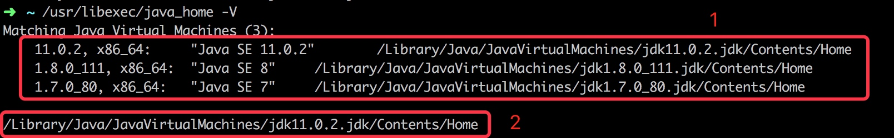

# Mac开发问题

## Mac修改Eclipse启动jdk
打开`Eclipse.app`，找到`/Users/yuesheng/work/dev/EOS/primeton/platform/ide/eclipse/Eclipse.app/Contents/Info.plist`文件，在里面设置jdk版本。

## Mac查看所有已经安装jdk版本及默认使用jdk版本
使用命令：`/usr/libexec/java_home -V`

其中1代表Mac上已经安装的所有jdk的版本列表；2代表mac中默认使用的jdk版本。