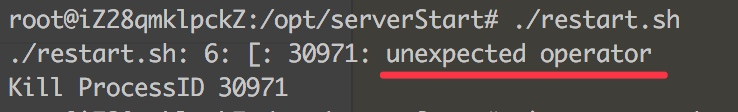

# Ubuntu系统问题

shell脚本if判断报错`unexpected operator`，脚本如下
```shell
#!/bin/sh
APP_NAME=/opt/serverStart

tpid=`ps -ef | grep $APP_NAME | grep -v grep | grep -v kill | grep -v restart | awk '{print $2}'`

if [ "$tpid" = "" ]; then
    echo 'no server start'
else
    echo 'Kill ProcessID '$tpid
    kill -9 $tpid
    sleep 5
fi

cd $APP_NAME
nohup ./startServer.sh > nohup.out 2>&1 &
```


原因：Ubuntu默认sh是连接到dash，dash和bash不兼容，导致会报错。
解决方式：
第一种：使用bash执行脚本，`bash restart.sh`
第二种：修改sh默认连接，`sudo dpkg-reconfigure dash`，选择`no`
第三种：dash判断字符串相等时，使用`=`代替`==`