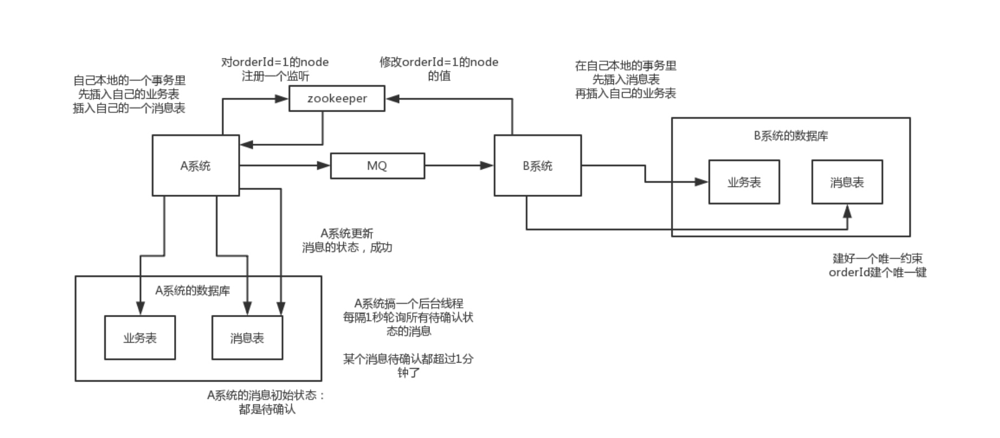

# 分布式问题梳理

## 为什么要使用分布式
随着项目发展，单体架构应用会面临如下问题：
* 业务增长
    * 随着业务不断扩张，访问量增加，响应时间缓慢，单体架构无法支撑业务
* 代码冗余
    * 所有的服务都在写一起，服务之间调用耦合
    * 代码重复，每个业务模块代码内存在大量的重复代码
    * 代码稍有改动，可能会影响其他模块，需要做全面测试，发布和部署成本较大
* 开发团队扩大
    * 随着团队扩大，人员技术栈不同，不好管理
    * 项目不同模块所面临过的问题不同，采用具体解决技术也可能不同，无法针对某个模块进行技术升级

使用分布式的好处：
* 代码
    * 将系统拆分，将公共服务拆出来，将会降低服务的耦合，减小业务服务的开发复杂度
    * 每个系统可以根据自己业务特点，选择适合的技术，只要提供的上层接口不变即可
    * 各个系统升级不再担心影响其他系统，可以安心上下线
* 团队
    * 大团队拆分成小团队，易于团队管理
    * 每个小团队只需要关心自己负责的子系统
    * 各个团队直接不再会有责任不明确情况

分布式和微服务区别：
* 微服务是一种颗粒度更小的分布式
* 分布式强调的是系统级别的，微服务强调的是服务级别

## 分布式事务
分布式的解决方案：
* XA 方案
* TCC 方案
* 本地消息表
* 可靠消息最终一致性方案
* 最大努力通知方案

### XA 方案
这是一种两阶段提交方案，引入了一个事务管理器概念，负责协调多个数据库（资源管理器）的事务。事务管理器先问数据库是否准备好？如果所有的数据库都返回 ok，那么就正式提交事务，在每个数据库上执行；如果有一个数据库返回的是不是 ok，那么则发起回滚。

这种方案适合单块应用里，跨多个库的事务操作，而且严重依赖于数据库层面上来搞定复杂的事务操作，效率比较低，不适合高并发的场景。可以使用`Spring + JTA`来搞定。而且在实际应用场景下，某个系统内部跨多个库操作，是不合规的，每个服务只能操作自己的库。

### TCC 方案
TCC 全称是 Try、Confirm、Cancel
* Try 阶段：这个阶段是对各个服务资源进行检测以及对资源进行锁定和预留
* Confirm 阶段：这个阶段说的是在各个服务当中执行实际操作
* Cancel 阶段：如果在任何一个服务的业务方法执行错误，那么在这里需要进行补偿，就是执行已经执行成功的业务逻辑操作进行回滚

这个方案主要是事务回滚操作需要自己写代码来回滚和补偿，代码较多，维护比较难。适用于资金相关的强一致性事务操作，确保事务要么一起成功，要么失败回滚。

### 本地消息表
本地消息表方案是国外ebay搞出来的一套思想。大致流程如下：
* A 系统在执行本地事务的同时，插入一条消息到本地消息表中
* 接着 A 系统将这条消息发送到 MQ 中
* B 系统接收到 MQ 消息后，查看本地消息表是否已经消费了这条消息，如果消费，则回滚
* B 系统如果没有消费，则执行本地事务的同时，插入一条消息到本地消息表。
* B 系统如果成功执行事务，则更新本地消息表，并且通知 A 系统
* 如果 B 系统处理失败了，则不会更新本地消息表，也就不会通知 A 系统
* A 系统定期去查询本地消息表，找到未消费的消息，继续发送 MQ，让 B 系统再次处理

这个方案保证了最终的一致性，哪怕 B 系统执行失败了，B 系统也会不停的重试，直到成功。这个方案严重依赖数据库，高并发场景下性能存在性能问题，可扩展性不高

### 可靠消息最终一致性
这个方案，就干脆不用本地消息表了，直接用 MQ 来实现业务，比如阿里的 RocketMQ 就支持事务消息。
* A 系统发送 prepared 消息到 mq，如果这个消息发送失败了，则不执行事务操作
* prepared 消息发送成功，A 系统执行本地事务，如果成功，则告诉 mq 发送确认消息，如果失败，则告诉 mq 回滚消息
* mq 定期轮训 prepared 消息，回调 A 系统的接口，A 系统查询本地事务事务执行成功，如果执行成功则告诉 mq 发送确认小时，如果本地事务执行失败则告诉 mq 回滚消息。这是为了防止本地事务执行成功，但是 mq 消息没有确认
* 如果 B 系统执行失败，就不停的尝试，如果依旧失败，则回滚业务，通知 A 系统，进行回滚；或者发送报警，有人工干预，手动回滚

### 最大努力通知方案
具体执行如下：
* A 系统执行事务完成后，发送 mq 消息
* 这里有个专门消费 mq 消息的最大努力尝试服务，将消息存放在本地数据库中，或者放在内存队列中，接着调用 B 系统的接口
* 如果 B 系统执行成功就 ok 了，如果 B 系统执行失败，则进行最大努力的尝试，不行就回滚

## 分布式锁
分布式锁实现方式有：
* 数据库
* redis
* zookeeper

区别：
* 数据库和 redis 都需要通过不停的去查询尝试，zookeeper 有通知机制。
* 获取锁的服务，如果挂了之后，数据库和 redis 实现的分布式锁需要等待超时时间结束，才可以释放，zk 的临时节点会在session结束删除，无需等待

### 数据库实现
### redis 实现
### zookeeper 实现

## 接口的幂等性
幂等性是指多次发起同一个请求，要保证每次请求的结果一致，类似于一个订如果发起多起扣款操作，那么只能有一次扣款成功。

保证幂等性可以根据具体业务来操作，常用的有如下：
* 数据库的唯一性键约束
* redis 唯一键约束
* zookeeper 唯一节点约束
* 状态机，类似于订单设置多个状态，状态修改必须满足条件

## 分布式 Session
分布式 Session 的解决方案有如下：
* 完全不用 session
    * JWT + Token 
* tomcat + redis
    * 配置单台 redis
    * 根据 redis 哨兵，配置 redis 集群
    * 和容器耦合
* spring session + redis

## 分布式缓存
### 缓存的雪崩
### 缓存的击穿

## 分布式限流

## 分布式负载均衡